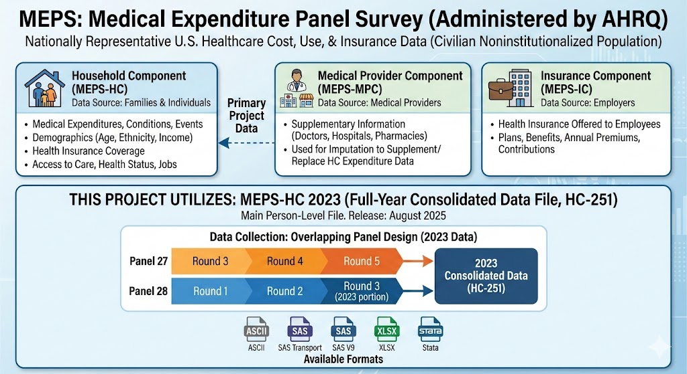

<!-- anchor tag for back-to-top links -->
<a name="readme-top"></a>

<!-- HEADER IMAGE  -->

<!-- SHORT SUMMARY  -->


## 📋 Table of Contents
<ol>
  <li>
    <a href="#-summary">Summary</a>
    <ul>
      <li><a href="#️-built-with">Built With</a></li>
    </ul>
  </li>
  <li>
    <a href="#-motivation">Motivation</a>
  </li>
  <li>
    <a href="#️-data">Data</a>
  </li>
  <li>
    <a href="#-data-preprocessing">Data Preprocessing</a>
  </li>
  <li>
    <a href="#-exploratory-data-analysis-eda">Exploratory Data Analysis (EDA)</a>
  </li>
  <li>
    <a href="#-modeling">Modeling</a>
    <ul>
      <li><a href="#-baseline-models">Baseline Models</a></li>      
      <li><a href="#️-hyperparameter-tuning">Hyperparameter Tuning</a></li>
      <li><a href="#-final-model">Final Model</a></li>
    </ul>
  </li>
  <li>
    <a href="#-project-structure">Project Structure</a>
  </li>
  <li>
    <a href="#️-getting-started">Getting Started</a>
    <ul>
      <li><a href="#-virtual-environments">Virtual Environments</a></li>
    </ul>
  </li>
  <li>
    <a href="#️-license">License</a>
  </li>
  <li>
    <a href="#-credits">Credits</a>
  </li>
</ol>


## 🎯 Summary
### 🛠️ Built With
- [![Python][Python-badge]][Python-url]
- [![Pandas][Pandas-badge]][Pandas-url]
- [![Matplotlib][Matplotlib-badge]][Matplotlib-url] 
- [![Seaborn][Seaborn-badge]][Seaborn-url]
- [![scikit-learn][scikit-learn-badge]][scikit-learn-url]
- [![Jupyter Notebook][JupyterNotebook-badge]][JupyterNotebook-url]

<p align="right">(<a href="#readme-top">back to top</a>)</p>


## 💡 Motivation
<p align="right">(<a href="#readme-top">back to top</a>)</p>


## 🗂️ Data
The **Medical Expenditure Panel Survey (MEPS)** is the most complete source of data on the cost and use of health care and health insurance coverage in the United States. MEPS is administered by the **Agency for Healthcare Research and Quality (AHRQ)** and is a set of large-scale surveys designed to produce nationally representative estimates for the U.S. civilian noninstitutionalized population.

MEPS is comprised of three components:
- **Household Component (MEPS-HC):** Collects comprehensive data from families and individuals on medical expenditures, conditions, and events; demographics (e.g., age, ethnicity, and income); health insurance coverage; access to care; health status; and jobs held. 
- **Medical Provider Component (MEPS-MPC):** Collects supplementary information from medical providers (doctors, hospitals, pharmacies, etc.). Primarily used as an imputation source to supplement or replace household-reported expenditure information in the HC data files.
- **Insurance Component (MEPS-IC):** Collects data from employers on the health insurance coverage offered to their employees. This includes information on the number and types of private health insurance plans offered, benefits, annual premiums, and contributions. 

**MEPS-HC 2023**  
This project utilizes the MEPS Household Component Full-Year Consolidated Data File (HC-251) for 2023, henceforth referred to as MEPS-HC 2023. This is the main person-level file. The data was collected using the standard MEPS overlapping panel design, combining information from Rounds 3, 4, and 5 of Panel 27, and Rounds 1, 2, and the 2023 portion of Round 3 of Panel 28. Released in August 2025, the data is available in ASCII, SAS transport, SAS V9, XLSX, and Stata file formats.

MEPS-HC 2023 data contains **18,919 individuals** and **1,374 variables**.  



**Target Variable**  
The target variable is **total annual medical expenditures** in 2023 (`TOTEXP23`). This variable aggregates payments for healthcare services from 10 distinct sources, including:
- Out-of-Pocket: Direct payments by individuals or families.
- Private Insurance: Payments from private health plans.
- Public & Other Sources: Medicare, Medicaid, TRICARE, VA, Workers’ Compensation, and other federal/state funds.

`TOTEXP23` reflects the total money received by the health care system from all these contributors on behalf of that person throughout the calender year 2023. It is derived from both household interviews and medical provider records, even adjusting those amounts when the household initially missed the fact that insurers paid a large, negotiated discount.  

**Feature Selection**  
A subset of features was selected from MEPS-HC 2023 to balance predictive power, interpretability, and data completeness. These features encompass key drivers of healthcare costs, including demographics, socioeconomic status, health conditions, chronic illnesses, healthcare utilization, and insurance coverage. Features were selected based on the following criteria:
- **Predictive Power:** Includes major determinants of spending such as age, chronic conditions, and utilization patterns.
- **Data Quality:** Prioritizes variables with low missingness to minimize imputation artifacts.
- **Interpretability:** Maintains a feature set suitable for explaining model decisions.
- **Manageability:** Limits the scope to ~30–35 high-impact variables, ensuring a focused analysis.

**Features**
| Category | Variable | Description |
| :--- | :--- | :--- |
| **Demographics** | `AGE23X` | Age in years. |
| | `SEX` | Sex (male/female). |
| | `RACEV2X` | Race/ethnicity (collapsed categories). |
| | `REGION23` | Census region. |
| | `MARRY23X` | Marital status. |
| **Socioeconomic Status** | `EDUCYR` | Years of education when first entered MEPS. |
| | `POVCAT23` | Family income as % of poverty line (categorical). |
| | `INSCOV23` | Health insurance coverage indicator. |
| | `EMPST53` | Employment status (Round 5/3). |
| **Health** | `RTHLTH53` | Perceived health status (Round 5/3). |
| | `MNHLTH53` | Perceived mental health status (Round 5/3). |
| | `WLKLIM31` | Limitation in physical functioning (Round 3/1). |
| | `ACTLIM31` | Any limitation work/housework/school (Round 3/1). |
| | `COGLIM31` | Cognitive limitations (Round 3/1). |
| | `DIABDX_M18` | Diabetes diagnosis. |
| | `HIBPDX` | High blood pressure diagnosis (>17). |
| | `CHOLDX` | High cholesterol diagnosis (>17). |
| | `ASTHDX` | Asthma diagnosis. |
| | `CHDDX` | Coronary heart disease diagnosis (>17). |
| | `ARTHDX` | Arthritis diagnosis (>17). |
| | `EMPHDX` | Emphysema diagnosis (>17). |
| **Healthcare Utilization** | `OBTOTV23` | Number of office-based provider visits 2023. |
| | `OPDRV23` | Number of outpatient dept physician visits. |
| | `ERTOT23` | Number of emergency room visits. |
| | `IPDIS23` | Number of hospital discharges. |
| | `RXTOT23` | Number of prescription meds incl refills. |
| | `HHTOTD23` | Number of home health provider days. |
| **Insurance Details** | `PRVEV23` | Ever have private insurance during 2023. |
| | `MCREV23` | Ever have Medicare during 2023 (edited). |
| | `MCDEV23` | Ever have Medicaid/SCHIP during 2023 (edited). |
| | `UNINS23` | Uninsured all of 2023. |

**Sample Weights**  
MEPS-HC 2023 includes survey sample weights (`PERWT23F`) to adjust for the complex survey design (stratification, clustering, oversampling) and non-response. This machine learning project utilizes these weights in model training to correct for the survey's intentional oversampling of specific subgroups (e.g., the elderly, low-income), preventing the model from being biased toward these groups and ensuring it learns relationships that are true for the general population.

**MEPS Resources**
| Resource | Description | Link |
| :--- | :--- | :--- |
| Data | MEPS-HC 2023 Full Year Consolidated Data File (HC-251). | [Visit Page](https://meps.ahrq.gov/mepsweb/data_stats/download_data_files_detail.jsp?cboPufNumber=HC-251) |
| Full Documentation | Technical details on data collection, variable editing, and survey sampling. | [View PDF](docs/h251doc.pdf) |
| Codebook | Variables, labels, coding schemes, and frequencies. | [View PDF](docs/h251cb.pdf) |
| MEPS Overview | Background on MEPS components and larger survey history. | [Visit Page](https://meps.ahrq.gov/mepsweb/about_meps/survey_back.jsp) |

<p align="right">(<a href="#readme-top">back to top</a>)</p>


## 🧹 Data Preprocessing
<p align="right">(<a href="#readme-top">back to top</a>)</p>


## 🔍 Exploratory Data Analysis (EDA)
<p align="right">(<a href="#readme-top">back to top</a>)</p>


## 🧠 Modeling

### 📏 Baseline Models  
<p align="right">(<a href="#readme-top">back to top</a>)</p>

### 🎛️ Hyperparameter Tuning  
<p align="right">(<a href="#readme-top">back to top</a>)</p>

### 🏆 Final Model
<p align="right">(<a href="#readme-top">back to top</a>)</p>


## 📂 Project Structure
```text
├── notebooks/               # Jupyter Notebooks 
│   └── medical_cost_prediction.ipynb  # Preprocessing, EDA, model training, evaluation, tuning and selection
│
├── app/                     # Web application source code
│   └── app.py               # Main application file
│
├── models/                  # Models and pipelines (ignored by Git)
│   ├── model.joblib         # Trained final model  
│   └── pipeline.joblib      # Pipeline with model and preprocessing
│
├── data/                    # Raw and processed datasets (ignored by Git)
│   └── h251.sas7bdat        # Medical cost dataset (SAS V9 format)
│
├── figures/                 # Generated figures (ignored by Git)
│   ├── eda/                 # Exploratory data analysis visualizations
│   ├── training/            # Training curves and learning rates
│   ├── evaluation/          # Model performance plots
│   └── tuning/              # Hyperparameter tuning results
│
├── assets/                  # Images and other assets for README
│   └── header.png           # Project header image
│
├── tests/                   # Software testing for web application
│   ├── unit/                # Unit tests
│   ├── integration/         # Integration tests
│   └── e2e/                 # End-to-end tests
│
├── docs/                    # Project documentation and references
│   └── git_conventions.md   # Conventions for Git commit messages 
│
├── requirements.txt         # Production dependencies 
├── requirements-train.txt   # Training dependencies 
├── requirements-test.txt    # Test dependencies 
│
├── README.md                # Project overview 
├── LICENSE                  # MIT License
└── .gitignore               # Files and directories excluded from version control
```

<p align="right">(<a href="#readme-top">back to top</a>)</p>


## ⚙️ Getting Started

### Virtual Environments
This project uses two isolated environments to keep application dependencies lightweight for production deployment.

**Training Environment** (`.venv-train`)
- **Requirements File:** `requirements-train.txt`
- **Purpose:** Model development (preprocessing, EDA, training, evaluation, tuning, selection)
- **Key Libraries:** `jupyterlab`, `pandas`, `matplotlib`, `seaborn`, `scikit-learn`

**Application Environment** (`.venv-app`)
- **Requirements Files:** 
    - `requirements.txt`: Web application dependencies for production deployment (used by deployment platforms)
    - `requirements-test.txt`: Inherits from `requirements.txt` and adds `pytest` for local testing
- **Purpose:** Run and test the web application 
- **Key Libraries:** `fastapi`, `gradio`, `scikit-learn`

**Note:** Both environments use the same version of `scikit-learn` to ensure model consistency across training and deployment.

<p align="right">(<a href="#readme-top">back to top</a>)</p>


## ©️ License
<p align="right">(<a href="#readme-top">back to top</a>)</p>


## 👏 Credits
This project was made possible with the help of the following resources:
- **Dataset**: The model is trained on the Medical Expenditure Panel Survey (MEPS), specifically the 2023 Full Year Consolidated Data File, provided by the [Agency for Healthcare Research and Quality (AHRQ)](https://meps.ahrq.gov/data_stats/download_data_files_detail.jsp?cboPufNumber=HC-251).
- **Data infographic**: Generated using [Gemini 3 Pro Image](https://deepmind.google/models/gemini-image/pro/) via the [Gemini app](https://gemini.google.com/app) by Google.

<p align="right">(<a href="#readme-top">back to top</a>)</p>


<!-- MARKDOWN LINKS -->
[Python-badge]: https://img.shields.io/badge/python-3670A0?style=for-the-badge&logo=python&logoColor=ffdd54
[Python-url]: https://www.python.org/
[Pandas-badge]: https://img.shields.io/badge/pandas-%23150458.svg?style=for-the-badge&logo=pandas&logoColor=white
[Pandas-url]: https://pandas.pydata.org/
[Matplotlib-badge]: https://img.shields.io/badge/Matplotlib-%23DDDDDD?style=for-the-badge&logo=data:image/svg+xml;base64,PD94bWwgdmVyc2lvbj0iMS4wIiBlbmNvZGluZz0iVVRGLTgiPz4KPHN2ZyB4bWxucz0iaHR0cDovL3d3dy53My5vcmcvMjAwMC9zdmciIHdpZHRoPSIxODAiIGhlaWdodD0iMTgwIiBzdHJva2U9ImdyYXkiPgo8ZyBzdHJva2Utd2lkdGg9IjIiIGZpbGw9IiNGRkYiPgo8Y2lyY2xlIGN4PSI5MCIgY3k9IjkwIiByPSI4OCIvPgo8Y2lyY2xlIGN4PSI5MCIgY3k9IjkwIiByPSI2NiIvPgo8Y2lyY2xlIGN4PSI5MCIgY3k9IjkwIiByPSI0NCIvPgo8Y2lyY2xlIGN4PSI5MCIgY3k9IjkwIiByPSIyMiIvPgo8cGF0aCBkPSJtOTAsMnYxNzZtNjItMjYtMTI0LTEyNG0xMjQsMC0xMjQsMTI0bTE1MC02MkgyIi8+CjwvZz48ZyBvcGFjaXR5PSIuOCI+CjxwYXRoIGZpbGw9IiM0NEMiIGQ9Im05MCw5MGgxOGExOCwxOCAwIDAsMCAwLTV6Ii8+CjxwYXRoIGZpbGw9IiNCQzMiIGQ9Im05MCw5MCAzNC00M2E1NSw1NSAwIDAsMC0xNS04eiIvPgo8cGF0aCBmaWxsPSIjRDkzIiBkPSJtOTAsOTAtMTYtNzJhNzQsNzQgMCAwLDAtMzEsMTV6Ii8+CjxwYXRoIGZpbGw9IiNEQjMiIGQ9Im05MCw5MC01OC0yOGE2NSw2NSAwIDAsMC01LDM5eiIvPgo8cGF0aCBmaWxsPSIjM0JCIiBkPSJtOTAsOTAtMzMsMTZhMzcsMzcgMCAwLDAgMiw1eiIvPgo8cGF0aCBmaWxsPSIjM0M5IiBkPSJtOTAsOTAtMTAsNDVhNDYsNDYgMCAwLDAgMTgsMHoiLz4KPHBhdGggZmlsbD0iI0Q3MyIgZD0ibTkwLDkwIDQ2LDU4YTc0LDc0IDAgMCwwIDEyLTEyeiIvPgo8L2c+PC9zdmc+
[Matplotlib-url]: https://matplotlib.org/
[Seaborn-badge]: https://img.shields.io/badge/seaborn-%230C4A89.svg?style=for-the-badge&logo=seaborn&logoColor=white
[Seaborn-url]: https://seaborn.pydata.org/
[scikit-learn-badge]: https://img.shields.io/badge/scikit--learn-%23F7931E.svg?style=for-the-badge&logo=scikit-learn&logoColor=white
[scikit-learn-url]: https://scikit-learn.org/stable/
[JupyterNotebook-badge]: https://img.shields.io/badge/Jupyter-F37626.svg?style=for-the-badge&logo=Jupyter&logoColor=white
[JupyterNotebook-url]: https://jupyter.org/
