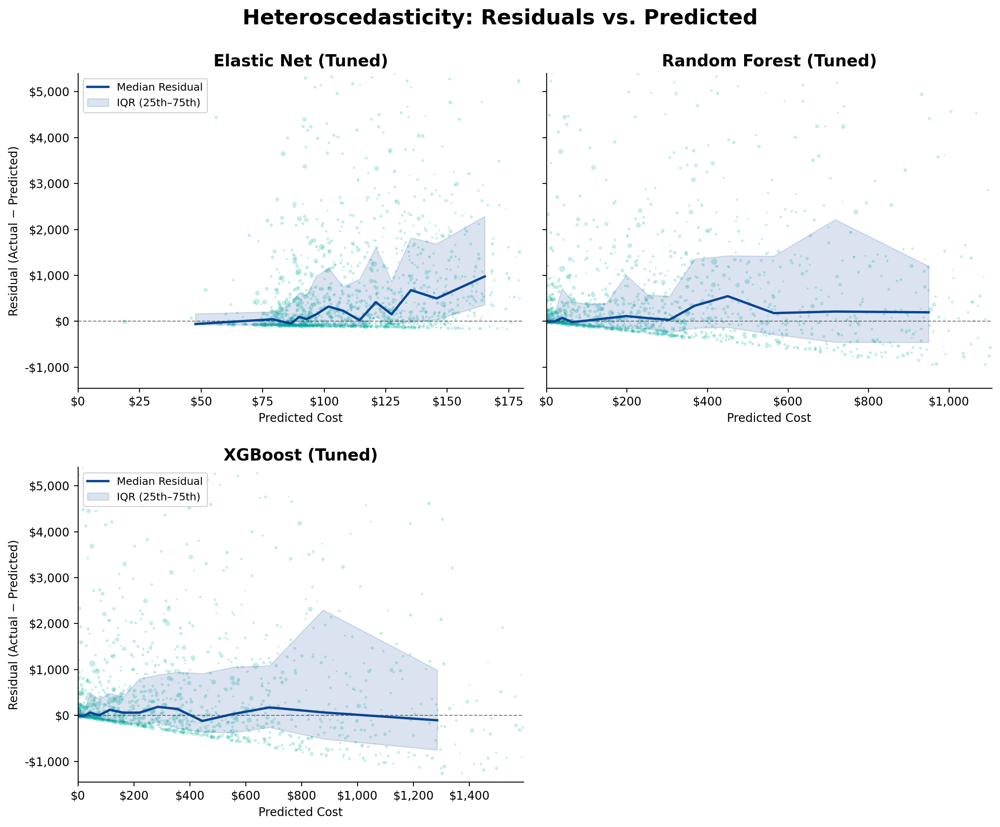
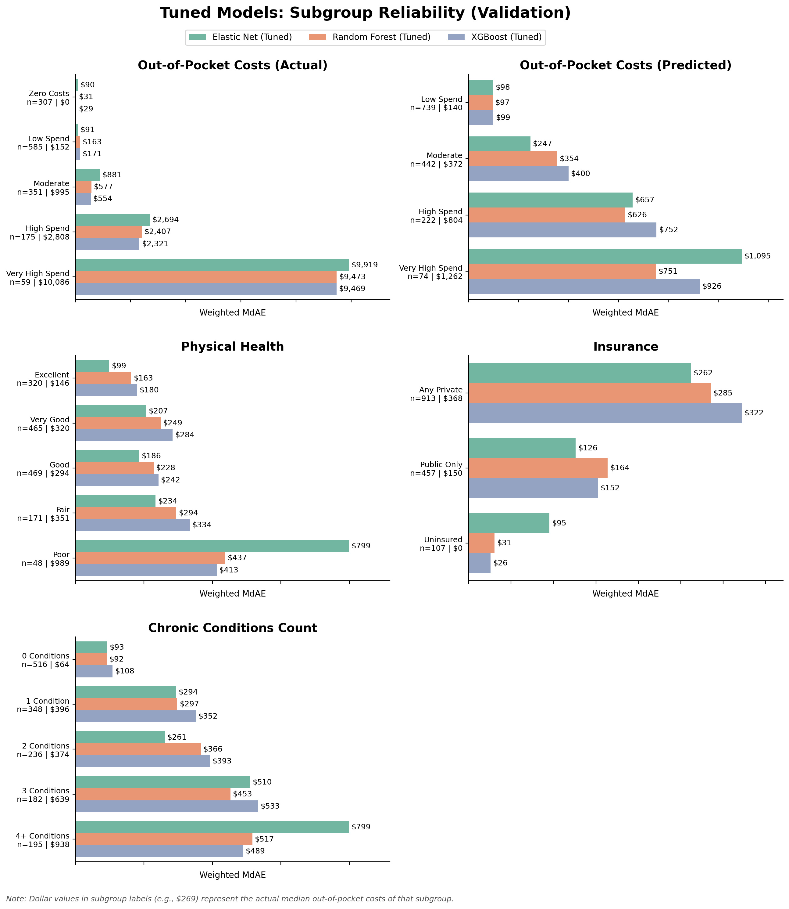
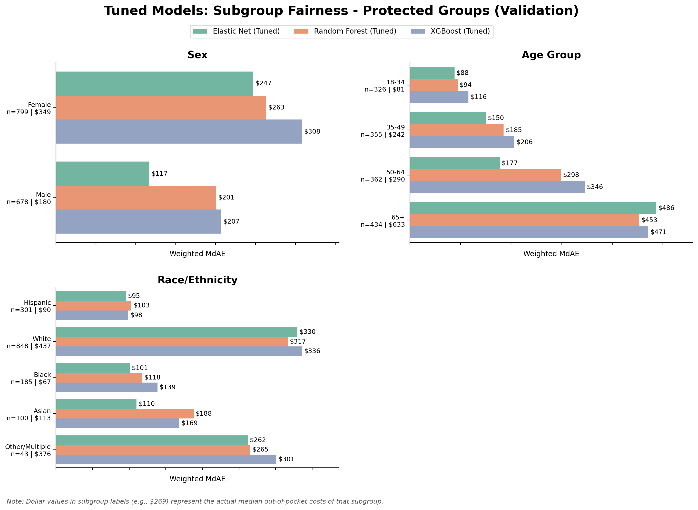
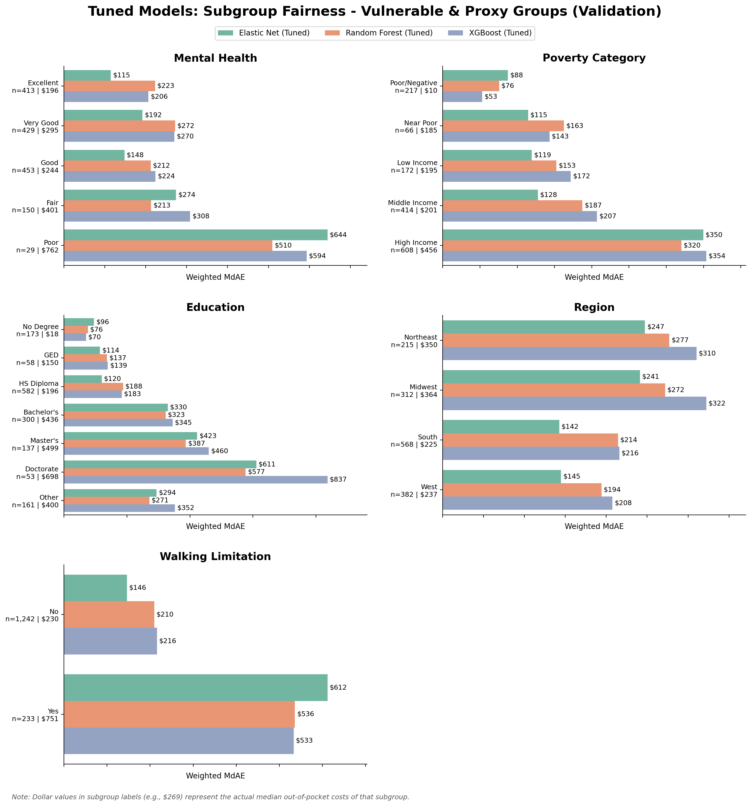
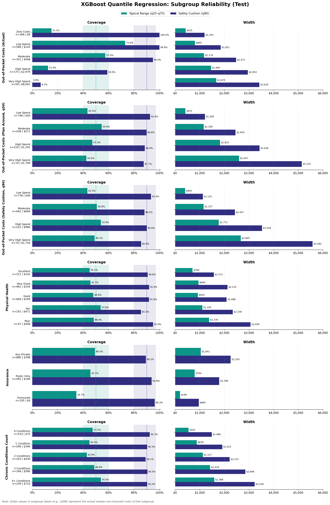
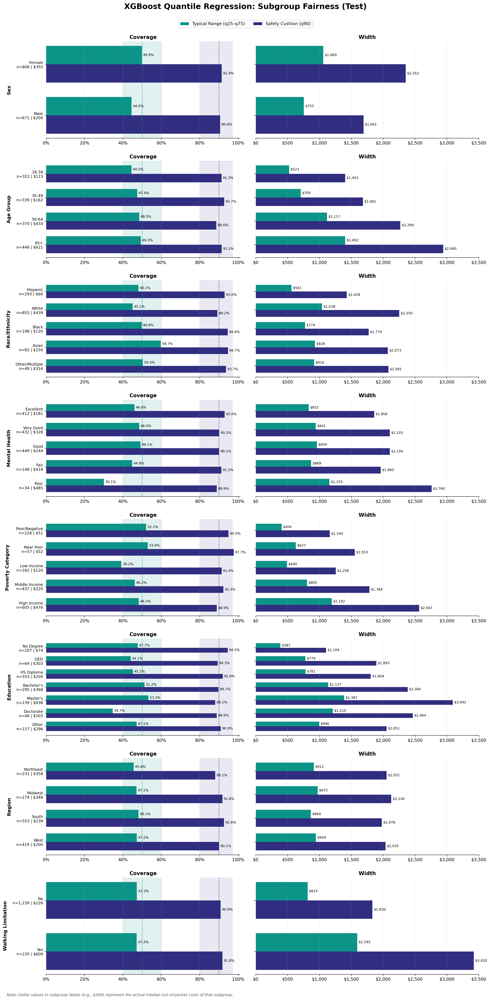

<!-- anchor tag for back-to-top links -->
<a id="readme-top"></a>

<!-- HEADER IMAGE  -->


<!-- SHORT SUMMARY  -->


## 📋 Table of Contents
<ol>
  <li>
    <a href="#-summary">Summary</a>
  </li>
  <li>
    <a href="#-motivation">Motivation</a>
  </li>
  <li>
    <a href="#️-data">Data</a>
  </li>
  <li>
    <a href="#-exploratory-data-analysis">Exploratory Data Analysis</a>
  </li>
  <li>
    <a href="#-data-preprocessing">Data Preprocessing</a>
  </li>
  <li>
    <a href="#-modeling">Modeling</a>
    <ul>
      <li><a href="#-baseline-models">Baseline Models</a></li>      
      <li><a href="#️-hyperparameter-tuning">Hyperparameter Tuning</a></li>
      <li><a href="#-final-model">Final Model</a></li>
    </ul>
  </li>
  <li>
    <a href="#-project-structure">Project Structure</a>
  </li>
  <li>
    <a href="#️-getting-started">Getting Started</a>
    <ul>
      <li><a href="#installation-and-setup">Installation and Setup</a></li>
      <li><a href="#production-deployment">Production Deployment</a></li>
    </ul>
  </li>
  <li>
    <a href="#️-license">License</a>
  </li>
  <li>
    <a href="#-credits">Credits</a>
  </li>
  <li>
    <a href="#-appendix">Appendix</a>
    <ul>
      <li><a href="#candidate-features">Candidate Features</a></li>      
      <li><a href="#distributions">Distributions</a></li>        
      <li><a href="#feature-target-relationships">Feature-Target Relationships</a></li>      
      <li><a href="#outlier-analysis">Outlier Analysis</a></li>      
      <li><a href="#llm-benchmarking">LLM Benchmarking</a></li>      
      <li><a href="#heteroscedasticity">Heteroscedasticity</a></li>      
      <li><a href="#tuned-models-reliability--fairness">Tuned Models: Reliability & Fairness</a></li>      
      <li><a href="#xgboost-quantile-regression-reliability--fairness">XGBoost Quantile Regression: Reliability & Fairness</a></li>      
    </ul>
  </li>
</ol>


## 🎯 Summary
End-to-end machine learning project to predict annual out-of-pocket healthcare costs from MEPS 2023 survey data. The modeling workflow now selects **XGBoost Quantile Regression** as the final MVP model, returning a plan-around estimate (`q50`), a typical range (`q25`-`q75`), and a safety cushion (`q90`) instead of a single point forecast.

On the locked holdout test set, the final model passes the product-facing release gates: plan-around MdAE is **$240** (95% CI: $215-$279), typical-range coverage is **47.3%**, and safety-cushion coverage is **91.0%**. The planned app should present these outputs as budgeting guidance with scope disclaimers, current-dollar adjustment, planning notice for subgroups with prediction uncertainty, and privacy-preserving aggregate monitoring.

🛠️ **Built With**
- [![Python][Python-badge]][Python-url]
- [![Pandas][Pandas-badge]][Pandas-url]
- [![Matplotlib][Matplotlib-badge]][Matplotlib-url] 
- [![Seaborn][Seaborn-badge]][Seaborn-url]
- [![scikit-learn][scikit-learn-badge]][scikit-learn-url]
- [![DVC][DVC-badge]][DVC-url]
- [![MLflow][MLflow-badge]][MLflow-url]

<p align="right">(<a href="#readme-top">Back to Top</a>)</p>


## 💡 Motivation
**The Problem:** Healthcare pricing is a "black box." While insurance portals show prices for individual treatments (e.g., an MRI), consumers lack tools to predict their total expected costs for the year. Existing calculators are often too generic (ignoring health conditions) or too complex (requiring specific procedure codes).

**Our Solution:** A personalized forecasting tool based on accessible inputs. Users simply enter demographic and health details such as age, insurance status, and chronic conditions to receive a cost estimate for the upcoming year. This empowers users to make data-driven decisions for FSA/HSA contributions and emergency planning.

**How It Works:** The web app is powered by a machine learning model trained on the Medical Expenditure Panel Survey (MEPS), the gold standard for U.S. healthcare data. By analyzing what people with similar demographic and health profiles actually spent, our model learns real-world cost patterns and translates them into actionable financial insights without requiring complex medical records.

<p align="right">(<a href="#readme-top">Back to Top</a>)</p>


## 🗂️ Data


The **Medical Expenditure Panel Survey (MEPS)**, administered by **AHRQ**, is the gold standard for U.S. healthcare cost and usage data. It provides nationally representative estimates for the **U.S. civilian noninstitutionalized population**, combining household reports with validated medical provider and insurance data.

Utilized the **2023 Full-Year Consolidated Data File (HC-251)**:
- **Sample Size:** 18,919 individuals
- **Variables:** 1,374 variables

**Target Variable**  
The target variable is **total out-of-pocket health care costs in 2023** (`TOTSLF23`), including copays, deductibles, and uncovered services. The goal is to facilitate financial planning and healthcare budgeting. By estimating next year's out-of-pocket costs, users can make data-driven decisions about FSA/HSA contributions and better prepare for their financial exposure. For uninsured users, out-of-pocket costs approximate total costs.  

<details>
<summary>ℹ️ <strong>U.S. Healthcare Costs Explained</strong> <i>(click to expand)</i></summary>


</details>
<br>

<a id="main-candidate-features"></a>**Candidate Features**  
Selected 26 features out of 1,374 MEPS variables based on consumer accessibility (no record-checking required), timing (beginning-of-year data to prevent leakage) and expected predictive power. 
- **Demographics:** Age, Sex, Region, Marital Status, Family Size.
- **Socioeconomics:** Education, Poverty Category, Employment Status.
- **Health Profile:** Insurance, Self-Rated Physical/Mental Health, Smoking Status, Usual Source of Care.
- **Chronic Conditions:** Hypertension, High Cholesterol, Diabetes, Heart Disease, Stroke, Cancer, Arthritis, Asthma.
- **Limitations:** Difficulties with Daily Living, Walking, Cognitive Tasks, Joint Pain.

[🔗 **See Candidate Features**](#candidate-features)

**Sample Weights**  
Incorporated MEPS survey weights during training to account for the complex survey design and non-response. This corrects for the intentional oversampling of specific subgroups (e.g., elderly and low-income), ensuring model estimates remain representative of the general U.S. population.

**MEPS Resources**
| Resource | Description | Link |
| :--- | :--- | :--- |
| Data | MEPS-HC 2023 Full Year Consolidated Data File (HC-251). | [Visit Page](https://meps.ahrq.gov/mepsweb/data_stats/download_data_files_detail.jsp?cboPufNumber=HC-251) |
| Full Documentation | Technical details on data collection, variable editing, and survey sampling. | [View PDF](docs/h251doc.pdf) |
| Codebook | Variables, labels, coding schemes, and frequencies. | [View PDF](docs/h251cb.pdf) |
| MEPS Overview | Background on MEPS components and larger survey history. | [Visit Page](https://meps.ahrq.gov/mepsweb/about_meps/survey_back.jsp) |

<p align="right">(<a href="#readme-top">Back to Top</a>)</p>


## 🔍 Exploratory Data Analysis
Analyzed distributions and relationships to inform data preprocessing, feature engineering, and modeling decisions.  

<a id="main-distributions"></a>**Distributions (Univariate EDA)**  

**Key Insights:**
- **Target Variable:** Identified a zero-inflated (22.3%) and extremely right-skewed distribution where the top 20% of spenders drive 79.3% of costs (see Lorenz curve above).
- **Sample Weights:** Verified survey weights represent ~260M adults and confirmed weighting is essential for population-level representativeness.
- **Numerical Features:** Visualized distribution of age, family size, and self-reported health, informing robust median-based imputation for right-skewed and discrete features. [🔗 **See Histograms**](#numerical-distributions)
- **Categorical Features:** Revealed 66% hold private insurance, suggesting costs will be driven by plan-specific cost-sharing. Identified oversampling of healthy and low socio-economic status individuals, confirming the importance of sample weights. [🔗 **See Bar Plots**](#categorical-distributions)
- **Binary Features:** Identified high prevalence of joint pain (45%), high blood pressure (32%), and high cholesterol (31%), while severe conditions such as cancer (11%), coronary heart disease (5%), and stroke (4%) are more sparse. [🔗 **See Bar Plots**](#binary-distributions)

<a id="main-relationships"></a>**Relationships (Bivariate EDA)** 

**Key Insights:**
- **Correlations:** Spearman rank correlations (see heatmap above) revealed age (0.30) and poverty category (0.26) as primary cost correlates, alongside arthritis, high cholesterol, and joint pain (~0.22).
- **Numerical Features vs. Target:** Visualized feature-target relationships, revealing age as the primary cost driver and a negative relationship with family size likely due to shared family insurance limits. [🔗 **See Scatter Plots**](#numerical-feature-target-relationships)
- **Categorical Features vs. Target:** Grouped box plots revealed higher out-of-pocket spending for individuals with high income, high education, and private insurance, suggesting financial access drives healthcare utilization. [🔗 **See Grouped Box Plots**](#categorical-feature-target-relationships)
- **Binary Features vs. Target:** Identified high-prevalence "global drivers" (arthritis) vs. high-severity "local triggers" (cancer), and confirmed a massive "utilization hurdle" where women and people with a usual source of care spend more. [🔗 **See Grouped Box Plots**](#binary-feature-target-relationships)

<a id="main-outliers"></a>**Data Quality & Outliers**  
Conducted deep-dive diagnostics in [notebooks/1_eda_and_preprocessing.ipynb](notebooks/1_eda_and_preprocessing.ipynb) to ensure data integrity:
- **Duplicates**: Verified the absence of duplicate records based on the ID column, complete rows, and all columns except ID.
- **Outliers**: Detected univariate outliers with 3SD and 1.5 IQR methods and multivariate outliers with an isolation forest (5% contamination). Profiled outliers by comparing out-of-pocket costs and feature distributions between inliers and outliers. Confirmed that outliers represent legitimate high risk profiles rather than data errors, and retained all outliers to preserve the model's ability to predict extreme out-of-pocket costs.<br>[🔗 **See Outlier Analysis**](#outlier-analysis)

**Modeling Strategy**  
Based on EDA-driven insights, decided to implement sample weights for population representativeness and align models with the Median Absolute Error (MdAE) success metric through tailored loss functions, target log transformation, and polynomial features to effectively handle the zero-inflated, heavy-tailed cost distribution.


## 🧹 Data Preprocessing
Utilized a hybrid workflow to bridge interactive exploration with production reproducibility. Logic was prototyped in [notebooks/1_eda_and_preprocessing.ipynb](notebooks/1_eda_and_preprocessing.ipynb), migrated to [scripts/preprocess.py](scripts/preprocess.py) for automation, and orchestrated by [DVC](https://dvc.org/) (via `dvc.yaml`) for data lineage. To reproduce the preprocessing stage:
  ```bash
  dvc repro preprocess
  ```

**Data Preparation Workflow**  
To ensure a seamless transition from raw survey data to live application predictions, the preprocessing workflow follows a structured three-step process:

**Step 1: Data Preparation** (via `scripts/preprocess.py`)  
This stage converts the raw MEPS data to the clean format expected by the inference pipeline. These steps are primarily for data cleaning and population filtering:
- **Data Loading:** Imports the MEPS-HC 2023 SAS data as a pandas DataFrame.
- **Variable Selection:** Filters 29 essential columns (target variable, candidate features, ID, sample weights) from the original 1,374 columns.
- **Target Population Filtering:** Filters rows for adults with positive person weights (14,768 out of 18,919 respondents).
- **Data Type Handling:** Converts ID to string and sets as index.
- **Missing Value Standardization:** Recovers missing values from survey skip patterns and converts MEPS-specific missing codes to `np.nan`.
- **Binary Feature Standardization:** Standardizes binary features to 0/1 encoding.
- **Stateless Feature Engineering:** Creates a recent life transition feature and collapses sparse categories (e.g., recent divorce, job loss) into stable parent categories.
- **Train-Validation-Test Split:** Splits data into training (80%), validation (10%), and test (10%) sets using a distribution-informed stratified split to balance zero-inflation and the extreme tail of the target variable.

**Step 2: Inference Pipeline** (via `src/pipeline.py`)  
Once the raw data is cleaned and prepared, the `preprocess.py` script *calls* a Scikit-learn pipeline that is used for both training and inference (Web UI and API), ensuring absolute consistency across all environments.


- **Standardization:** Normalizes categorical inputs. Accepts both numeric codes (e.g. 0/1) and string labels (e.g. no/yes). 
- **Validation & Imputation:** Implements a `MissingValueChecker` to catch required fields and a `RobustSimpleImputer` for median/mode-based imputation.
- **Medical Feature Derivation:** Calculates aggregate chronic condition and functional limitation counts to capture health burden.
- **Scaling & Encoding:** Implements a `ColumnTransformer` with `RobustStandardScaler` and `RobustOneHotEncoder`.


**Step 3: Data Persistence** (via `scripts/preprocess.py`)  
 This stage is used during training. It verifies the preprocessed data (e.g., absence of missing, infinite, or constant values, unique IDs), merges features with target and sample weights, and stores them as `.parquet` files.


<p align="right">(<a href="#readme-top">Back to Top</a>)</p>


## 🧠 Modeling
Utilized **MLflow** for experiment tracking to ensure all training runs were reproducible and comparable. To maintain a clean separation between development and production, MLflow tracking was exclusively integrated into the [reproducible scripts](scripts/), while [Jupyter notebooks](notebooks/) were reserved for quick prototyping and exploration.

### 📏 Baseline Models  
Evaluated a diverse set of baseline model architectures to identify candidates for hyperparameter tuning.

| Model | MdAE | Overfitting | MAE | R² |
| :--- | :--- | :--- | :--- | :--- |
| **Elastic Net** | **$163** | +6.6% | $1,044 | -0.12 |
| Linear Regression | $219 | +4.8% | $998 | -0.06 |
| Random Forest | $232 | +9.6% | **$958** | -0.04 |
| *Median (Benchmark)* | *$248* | *0.0%* | *$1,041* | *-0.10* |
| Decision Tree | $271 | **+1.5%** | $971 | -0.03 |
| XGBoost | $281 | +98.0% | $961 | 0.00 |
| Support Vector Machine | $291 | +190.7% | $1,027 | -0.03 |
| *LLM (Benchmark)* | *$518* | *N/A* | *$1,168* | **0.04** |

<sub>*Note:* Metrics on validation set; Overfitting represents the percentage MdAE difference (Val - Train).</sub>

**Key Insights:**  
- **Baseline Champion:** Elastic Net achieved the best median accuracy ($163 MdAE) with minimal overfitting (+6.6%), showing that regularized linear models are highly effective at denoising medical features.
- **Overfitting:** While advanced non-linear models like XGBoost and SVM are highly capable in theory, they exhibited extreme overfitting (+98% to +191%) out-of-the-box, confirming that healthcare cost data is highly noisy and requires heavy regularization.
- **LLM Benchmark:** Compared performance of specialized ML models against a general intelligence LLM ("Why not just ask Gemini?"). All specialist models significantly outperformed the generalist LLM (Gemini 3 Flash), with the best-performing baseline (Elastic Net) achieving a 3.2x improvement in predictive performance over Gemini (reducing MdAE from $518 to $163). This demonstrates added value of specialist ML models, which capture numerical cost nuances that general reasoning cannot. 🔗 [**See LLM Benchmarking Details**](#llm-benchmarking)
- **Metric Paradox (MdAE vs. MAE vs. R²):** The massive gap between Median Error (MdAE ≈ $200) and Mean Error (MAE ≈ $1,000) reflects the extreme heavy-tail of U.S. healthcare costs. While the LLM captures the most variance (best R²) by identifying high-cost "black swan" profiles through medical reasoning, it lacks precision for the majority of typical profiles.

**Selected Finalists:**  
1. **Elastic Net:** The baseline champion; especially good for typical cost profiles.
2. **XGBoost:** The promising candidate; captures complex, non-linear clinical interactions but prone to "chasing noise" without aggressive tuning.
3. **Random Forest:** The robust ensemble; uses bagging to average out noise and prevent the extreme overfitting seen in sequential boosting.

<p align="right">(<a href="#readme-top">Back to Top</a>)</p>


### 🎛️ Hyperparameter Tuning  
Conducted hyperparameter optimization for the three selected finalists using a custom randomized search framework with 50 iterations per model, tracked via MLflow.

**Tuning Methodology**  
- **Search Strategy:** Manual loop with `ParameterSampler` (instead of `RandomizedSearchCV`) to ensure correct `sample_weight` routing through nested `TransformedTargetRegressor` and `Pipeline` wrappers, and to evaluate weighted MdAE explicitly on the validation set.
- **Target Transform:** All models train on `log1p`-transformed costs via `TransformedTargetRegressor`, stabilizing the heavy-tailed distribution while predicting in raw dollars.
- **Scoring:** Weighted Median Absolute Error (MdAE) on raw-dollar validation predictions as the primary selection criterion.
- **Model-Specific Configurations:**
  - **Elastic Net:** `Pipeline` with second-degree `PolynomialFeatures` + `ElasticNet`. Tuned `alpha` (regularization strength, log-uniform 0.01–1.0), `l1_ratio` (L1/L2 penalty mix, uniform 0.0–1.0), and `interaction_only` (squared terms on/off).
  - **Random Forest:** `RandomForestRegressor` with `criterion="absolute_error"`. Tuned `n_estimators` (200–400), `max_depth` (8–25), `min_samples_split` (20–150), `min_samples_leaf` (10–80), `max_features` (sqrt/log2/30%–70%), and `max_samples` (60%–100%).
  - **XGBoost:** `XGBRegressor` with `objective="reg:absoluteerror"`. Tuned `n_estimators` (400–800), `max_depth` (3–10), `learning_rate` (log-uniform 0.01–0.2), `min_child_weight` (1–20), `subsample` (60%–100%), `colsample_bytree` (50%–100%), and L1/L2 penalties `reg_alpha`/`reg_lambda` (uniform 0–5).

| Model | MdAE | Overfitting | MAE | R² |
| :--- | :---: | :---: | :---: | :---: |
| *Median (Benchmark)* | *$248* | *0.0%* | *$1,041* | *-0.10* |
| *LLM (Benchmark)* | *$518* | *N/A* | *$1,168* | **0.04** |
| Elastic Net (Baseline) | $163 | +6.6% | $1,044 | -0.12 |
| **Elastic Net (Tuned)** | **$159** | +7.9% | $1,051 | -0.13 |
| Random Forest (Baseline) | $232 | +9.6% | $958 | -0.04 |
| Random Forest (Tuned) | $228 | **+3.8%** | $964 | -0.05 |
| XGBoost (Baseline) | $281 | +98.0% | $961 | 0.00 |
| XGBoost (Tuned) | $242 | +6.2% | **$954** | -0.02 |

<sub>*Note:* Metrics on validation set; Overfitting represents the percentage MdAE difference (Val - Train).</sub>

**Key Insights:**
- **Tuned Champion:** Elastic Net remains the overall leader in median accuracy ($159 MdAE), confirming that regularized linear models are extremely competitive for typical cost profiles.
- **Taming the Tail:** Hyperparameter tuning successfully "tamed" XGBoost, reducing its extreme overfitting from +98% to just +6% while simultaneously improving validation error.
- **Overfitting:** Tuning successfully brought the generalization gap below 10% for all models, ensuring stable performance across both training and unseen data.
- **Heteroscedasticity:** All models exhibit "fan-shaped" error spread, underestimating high out-of-pocket costs. While Elastic Net is the median accuracy leader, its limited prediction range ($217 max) prevents differentiating high spenders. Tree models (XGB/RF) maintain near-zero bias across a wider range, providing better calibration for high-risk identification. 🔗 [**See Heteroscedasticity Analysis**](#heteroscedasticity)

<a id="main-fairness-audit"></a>**Model Reliability & Fairness**  
To ensure responsible deployment, evaluated model reliability and fairness across subgroups using stratified error analysis (weighted MdAE) for all tuned models across 13 dimensions. The analysis included both protected demographic groups (e.g., sex, age, race/ethnicity) and vulnerable groups (e.g., mental health, income, education levels).
- **Reliability:** While Elastic Net performs best overall and excels in low-complexity segments, tree-based models (XGB/RF) perform better in high-complexity segments (uninsured, poor physical health, 4+ chronic conditions), reducing prediction error by ~50% compared to Elastic Net for these populations.
- **Fairness:** All tuned models show similar subgroup error patterns across protected and vulnerable groups. This suggests the main disparities are driven by healthcare cost variance, utilization patterns (e.g., reproductive care, age-related complexity), and feature limits rather than one model architecture introducing a distinct algorithmic bias. Furthermore, the models actually perform better for several marginalized groups (e.g., Hispanic, Black, low income, low education). 

🔗 **[See Detailed Reliability & Fairness Analysis](#tuned-models-reliability--fairness)**

<p align="right">(<a href="#readme-top">Back to Top</a>)</p>

### 🏆 Final Model
**Decision:** Use **XGBoost Quantile Regression** as the final model artifact behind the MVP product release.

**Why Quantile Regression?**  
While the tuned Elastic Net achieves the best single-point MdAE, heteroscedasticity analysis as well as subgroup reliability and fairness analysis revealed that Elastic Net's compressed prediction range ($217 max) cannot differentiate high-risk users, and all point-estimate models systematically underpredict extreme costs. Rather than selecting a single "best" point-estimate model, the final architecture shifts to multi-quantile prediction to communicate cost uncertainty directly to users.

**Model Architecture**  
The final model reuses the hyperparameters from the best tuned XGBoost point-estimate (which demonstrated the widest prediction range and best high-risk calibration among tuned models), switching only the objective from `reg:absoluteerror` to `reg:quantileerror` with four quantile levels (`q25`, `q50`, `q75`, `q90`). Predictions are postprocessed to enforce non-negativity and monotonicity (`q25 ≤ q50 ≤ q75 ≤ q90`).

**User-Facing Outputs:**
- **Plan-around estimate** (`q50`): The median prediction (what users should budget for).
- **Typical range** (`q25`–`q75`): The interquartile range (the range most users will fall within).
- **Safety cushion** (`q90`): The 90th percentile (a conservative upper bound to help budget for a bad year).

**Release Gate Metrics (Test)**
| Metric | Estimate (95% CI) | Release Gate | Product Target | Status |
| :--- | ---: | ---: | ---: | :---: |
| Plan-around MdAE (`q50`) | $240 [$215, $279] | < $500 | < $350 | Pass |
| Typical-range coverage (`q25`-`q75`) | 47.3% [44.0%, 50.6%] | 45%-55% | 50% | Pass |
| Safety-cushion coverage (`q90`) | 91.0% [89.2%, 92.6%] | 85%-95% | 90% | Pass |
| Typical-range width (`q25`-`q75`) | $912 [$875, $955] | < $1,500 | < $1,000 | Pass |
| Safety-cushion width (`q50`-`q90`) | $2,032 [$1,964, $2,108] | < $3,500 | < $2,500 | Pass |

**Launch Decision**
- **Decision:** Launch XGBoost quantile regression as the MVP model, with guardrails. Frame the product as a budgeting aid for individual out-of-pocket cost planning, not as a bill estimate, procedure-price tool, or medical advice.
- **Evidence:** The model passes every product-facing release gate on the unseen test set: `q50` MdAE is **$240**, `q25`-`q75` coverage is **47.3%**, `q90` coverage is **91.0%**, `q25`-`q75` width is **$912**, and `q50`-`q90` width is **$2,032**. It also improves on naive population baselines for every user-facing output: plan-around skill is **9.8%**, typical-range interval skill is **11.2%**, and safety-cushion skill is **15.6%**.
- **Prediction Output:** Show `q50` as the plan-around estimate, `q25`-`q75` as the typical range, and `q90` as the safety cushion. Do not present a single point estimate.
- **Reliability & Fairness Audit:** The final subgroup audit supports launch. Predicted-risk tiers remain usable and there is no broad demographic fairness failure. The main limitation is rare actual tail spending that is only visible after the year is observed. Typical-range undercoverage appears for uninsured users, users with a doctorate degree, poor mental health, and low income.<br>🔗 [**See Final Model Reliability & Fairness Audit**](#xgboost-quantile-regression-reliability--fairness)
- **Launch Conditions:** Ship only with range-based predictions, a scope disclaimer, 2023-to-current-dollar adjustment, a planning notice for subgroups with prediction uncertainty, and privacy-preserving aggregate monitoring. Name high predicted costs and uninsured status in the planning note because they are informative and directly tied to budgeting. For low income, poor mental health, and doctorate degree typical-range undercoverage, show only the generic planning note and do not name the subgroup to avoid stigmatization.
- **Monitoring:**  Track aggregate app health, completion rate, input drift, prediction drift, missingness, q50 distribution, q25-q75 width, q90 safety cushion, and high-uncertainty flags. Broad slices such as insurance status, poverty category, mental health, and chronic-condition count can explain shifts, but they cannot measure calibration without observed annual costs. Do not calibrate on app user data, because outcome collection would sacrifice user privacy.

**Example Prediction Output**  
High cost profile: 68-year-old, uninsured, multiple chronic conditions
>
> **Your Estimated Out-of-Pocket Costs for Next Year**
>
> - 💰 **Plan around:** $1,350
> - 📊 **Typical range:** $520-$2,400
> - 🛡️ **Safety cushion:** budget up to $5,200
>
> Use the plan-around number as a reasonable midpoint for budgeting. The typical range shows where about half of people with similar profiles fall. The safety cushion gives extra room for a higher-cost year.
>
> **Planning note**  
> Costs for profiles like yours can vary a lot from year to year. This estimate falls in a higher-cost range, and because you are uninsured, out-of-pocket costs can be harder to predict. The plan-around amount and typical range are useful starting points, but for budgeting decisions, plan closer to the safety cushion.
>
> <details>
> <summary><strong>What's driving your estimate</strong> <i>(click to expand)</i></summary>
> These factors had the largest effect on your plan-around estimate:<br>
> - 🔼 Your age (68): +$480<br>
> - 🔼 Diabetes: +$370<br>
> - 🔼 Uninsured: +$310<br>
> - 🔼 High blood pressure: +$180<br>
> - 🔽 "Good" physical health: -$90<br><br>
> </details>
>
> <details>
> <summary><strong>How you compare to others</strong> <i>(click to expand)</i></summary>
> - Your plan-around estimate: $1,350<br>
> - Typical American: $248<br>
> - Typical for ages 65+: $608<br>
> </details>
> <br>
>
> **About this estimate**  
> This is a planning estimate, not a bill estimate. It is based on 2023 national survey data and adjusted to current dollars. It does not include premiums, over-the-counter costs, family totals, or procedure prices. New diagnoses, accidents, hospitalizations, and plan-specific billing details can make actual costs higher.

**Medical Inflation Adjustment**  
The app adjusts all user-facing dollar amounts from 2023 to current dollars using a medical care inflation factor. This adjustment applies to the plan-around estimate, typical range, safety cushion, national and age-group benchmarks, and SHAP dollar impacts. The factor is calculated from [Bureau of Labor Statistics medical care data](https://data.bls.gov/timeseries/CUUR0000SAM).

<p align="right">(<a href="#readme-top">Back to Top</a>)</p>


## 📂 Project Structure
```text
├── notebooks/                         # Jupyter notebooks 
│   ├── 1_eda_and_preprocessing.ipynb  # EDA, preprocessing, and pipeline development
│   ├── 1_eda_and_preprocessing.py     # Script version (generated via Jupytext)
│   ├── 2_modeling.ipynb               # Model training, evaluation, and tuning
│   └── 2_modeling.py                  # Script version (generated via Jupytext)
│
├── scripts/                           # Reproducible pipeline scripts
│   ├── preprocess.py                  # Production-ready data preprocessing
│   ├── benchmark_llm.py               # LLM prediction benchmark
│   ├── train_baseline.py              # Baseline model training
│   ├── tune_elastic_net.py            # Hyperparameter tuning for Elastic Net
│   ├── tune_random_forest.py          # Hyperparameter tuning for Random Forest
│   ├── tune_xgboost.py                # Hyperparameter tuning for XGBoost
│   ├── train_xgboost_quantile.py      # Quantile model training
│   └── build_app_artifacts.py         # Generate cost benchmarks and prediction metadata
│
├── src/                               # Core packages source code
│   ├── constants.py                   # Feature lists
│   ├── display.py                     # Notebook and UI display labels/styles
│   ├── modeling.py                    # Core model training and evaluation functions
│   ├── params.py                      # Hyperparameter search configuration
│   ├── pipeline.py                    # Preprocessing and prediction pipelines
│   ├── stats.py                       # Weighted statistics and stratification helpers
│   └── transformers.py                # Custom scikit-learn transformers
│
├── app/                               # (Planned) Web application source code
│   └── data/
│       ├── cost_benchmarks.json       # Cost comparison for app users
│       └── prediction_metadata.json   # Prediction warning cutoff
│
├── models/                            # Trained model artifacts (ignored by Git)
│
├── data/                              # Raw and processed datasets (ignored by Git)
│   └── h251.sas7bdat.dvc              # DVC pointer for MEPS 2023 dataset (SAS V9 format)
│
├── figures/                           # Generated figures
│   ├── eda/                           # Distribution and relationship plots
│   ├── evaluation/                    # Model evaluation plots
│   └── outliers/                      # Outlier analysis plots
│
├── assets/                            # Images and other README assets
│   ├── header.png                     # Header image
│   ├── infographic_healthcare_costs.png  # U.S. healthcare cost explainer
│   ├── infographic_meps_data.jpg      # MEPS data overview infographic
│   └── pipeline.svg                   # Inference pipeline architecture diagram
│
├── tests/                             # (Planned) test suite
│   ├── unit/                          # (Planned) Unit tests
│   ├── integration/                   # (Planned) Integration tests
│   └── e2e/                           # (Planned) End-to-end tests
│
├── docs/                              # Project documentation and resources
│   ├── references/                    # MEPS documentation, codebook, and data dictionary
│   ├── research/                      # Background research
│   ├── specs/                         # PRD and tech specs
│   │   ├── product_requirements.md
│   │   └── technical_specifications.md
│   └── workflow/                      # Git conventions
│
├── pyproject.toml                     # Project configuration and dependencies
├── requirements.txt                   # Proxy for production dependencies
├── requirements-train.txt             # Training dependencies
├── requirements-test.txt              # Test dependencies
├── .env.example                       # Template for environment variables
│
├── dvc.yaml                           # Preprocessing and modeling pipeline definitions
├── dvc.lock                           # Hash-based data lineage lockfile
├── .dvc/                              # DVC configuration
│
├── README.md                          # Project overview
├── AGENTS.md                          # Instructions for AI agents
├── LICENSE                            # MIT License
└── .gitignore                         # Files and directories excluded from version control
```

<p align="right">(<a href="#readme-top">Back to Top</a>)</p>


## ⚙️ Getting Started

### Installation and Setup
This project uses three isolated virtual environments to keep application dependencies lightweight. In all three setups, the project is installed as a local package, ensuring that the `src/` module can be reliably imported from any folder.

**1. Training Environment (`.venv-train`)**
- **Purpose:** Model development (preprocessing, EDA, training, evaluation, tuning).
- **Setup:**
  ```bash
  python -m venv .venv-train
  source .venv-train/bin/activate  # or .venv-train\Scripts\activate on Windows
  pip install -r requirements-train.txt
  ```
- **Import Logic:** This environment uses an **editable install** (`-e .[train]`). Changes you make to `src/` are instantly available in your notebooks without re-installation.

**2. Application Environment (`.venv-app`)**
- **Purpose:** Run and test the web application.
- **Setup:**
  ```bash
  python -m venv .venv-app
  source .venv-app/bin/activate  # or .venv-app\Scripts\activate on Windows
  pip install -r requirements.txt
  ```
- **Import Logic:** This environment installs the project as a **regular package** (`.[app]`). This mirrors the production environment, allowing the app to reliably import from `src/` regardless of where it is launched.

**3. Testing Environment (`.venv-test`)**
- **Purpose:** Web App/API testing using unit, integration, and end-to-end tests with `pytest`.
- **Setup:**
  ```bash
  python -m venv .venv-test
  source .venv-test/bin/activate  # or .venv-test\Scripts\activate on Windows
  pip install -r requirements-test.txt
  ```
- **Import Logic:** This environment uses an **editable install** (`-e .[app,test]`). It combines both the application dependencies and the testing tools, allowing you to run tests against your latest code.

**4. Data Management (DVC)**
- **Purpose:** Version control for local data and reproducibility of preprocessing and modeling.
- **Workflow:**
  - **Run Full Pipeline:** To execute all stages (preprocessing through baseline modeling):
    ```bash
    dvc repro
    ```
  - **Run Specific Stages:**
    - `dvc repro preprocess`: Reproduce only the data preparation, feature engineering, and preprocessing.
    - `dvc repro baseline`: Reproduce baseline model training (will re-run `preprocess` if data or script changed).

#### Production Deployment 
The project is optimized for deployment on Hugging Face. When you connect your repository to Hugging Face Spaces (or any platform using `requirements.txt`), it automatically runs:
```bash
pip install -r requirements.txt
```
Because `requirements.txt` contains `. [app]`, the platform installs the project itself as a package. This ensures your application can always find the `src` module regardless of the working directory.

<p align="right">(<a href="#readme-top">Back to Top</a>)</p>


## ©️ License
This project is licensed under the [MIT License](LICENSE).

<p align="right">(<a href="#readme-top">Back to Top</a>)</p>


## 👏 Credits
This project was made possible with the help of the following resources:
- **Dataset**: [2023 Full Year Consolidated Data File (HC-251)](https://meps.ahrq.gov/data_stats/download_data_files_detail.jsp?cboPufNumber=HC-251) from the [Medical Expenditure Panel Survey (MEPS)](https://meps.ahrq.gov/mepsweb/), provided by the [Agency for Healthcare Research and Quality (AHRQ)](https://www.ahrq.gov/).
- **Medical Inflation Data**: [Consumer Price Index for All Urban Consumers (CPI-U) Medical Care series](https://data.bls.gov/timeseries/CUUR0000SAM) from the [U.S. Bureau of Labor Statistics (BLS)](https://www.bls.gov/cpi/).
- **Images**: 
  - Header: The [header image](./assets/header.png) was generated using [GPT Image 1.5](https://openai.com/index/new-chatgpt-images-is-here/) via the [ChatGPT app](https://chatgpt.com/) by OpenAI. 
  - Infographics: The [MEPS data infographic](./assets/infographic_meps_data.jpg) and the [U.S. healthcare costs infographic](./assets/infographic_healthcare_costs.png) were generated using [Gemini 3 Pro Image](https://deepmind.google/models/gemini-image/pro/) via the [Gemini app](https://gemini.google.com/app) by Google.
- **AI Coding Assistant**: [Antigravity](https://antigravity.google/) by Google and [Codex](https://openai.com/codex/) by OpenAI.

<p align="right">(<a href="#readme-top">Back to Top</a>)</p>


<!-- APPENDIX -->
## 📎 Appendix

### Candidate Features
**Feature Selection**  
Candidate features were selected from MEPS-HC 2023 based on the following criteria:
- **Consumer Accessibility:** Users can answer from memory without looking up records, ensuring the model is usable in a consumer-facing app.
- **Beginning-of-Year Data:** To enable the app to be used during Open Enrollment for predicting *upcoming* costs, only variables measured at the beginning of the year (`31` suffix) or stable traits are used to prevent data leakage.
- **Predictive Power:** Features have established significance in healthcare cost literature.

These 26 candidate features will be further reduced based on importance scores to meet the UX goal of a form completion time of less than 90 seconds.

**Candidate Features**
| Label | Variable | Description | Data Type | Value Range |
| :--- | :--- | :--- | :--- | :--- |
| Age | `AGE23X` | Age as of Dec 31, 2023. | Numerical (Int) | 0–85 |
| Sex | `SEX` | Biological sex. | Binary (Int) | 1=Male, 2=Female |
| Region | `REGION23` | Census region. | Nominal (Int) | 1=Northeast, 2=Midwest, 3=South, 4=West |
| Marital Status | `MARRY31X` | Status at beginning of year. | Nominal (Int) | 1=Married, 2=Widowed, 3=Divorced, 4=Separated, 5=Never Married |
| Poverty Category | `POVCAT23` | Family income relative to poverty line. | Ordinal (Int) | 1=Poor, 2=Near Poor, 3=Low Income, 4=Middle Income, 5=High Income |
| Family Size | `FAMSZE23` | Number of related persons residing together. | Numerical (Int) | 1–14 |
| Education | `HIDEG` | Highest degree attained. | Ordinal (Int) | 1=No Degree, 2=GED, 3=HS Diploma, 4=Bachelor's, 5=Master's, 6=Doctorate, 7=Other |
| Employment Status | `EMPST31` | Status at beginning of year. | Nominal (Int) | 1=Employed, 2=Job to return to, 3=Job during reference period, 4=Not employed |
| Insurance | `INSCOV23` | Coverage status. | Nominal (Int) | 1=Any Private, 2=Public Only, 3=Uninsured |
| Usual Source of Care | `HAVEUS42` | Regular doctor or clinic. | Binary (Int) | 1=Yes, 2=No |
| Physical Health | `RTHLTH31` | Self-rated physical health. | Numerical (Int) | 1=Excellent, 2=Very Good, 3=Good, 4=Fair, 5=Poor |
| Mental Health | `MNHLTH31` | Self-rated mental health. | Numerical (Int) | 1=Excellent, 2=Very Good, 3=Good, 4=Fair, 5=Poor |
| Smoker | `ADSMOK42` | Currently smokes cigarettes. | Binary (Int) | 1=Yes, 2=No |
| ADL Help | `ADLHLP31` | Needs help with activities of daily living (personal care, bathing, dressing). | Binary (Int) | 1=Yes, 2=No |
| IADL Help | `IADLHP31` | Needs help with instrumental activities of daily living (paying bills, taking medications, doing laundry). | Binary (Int) | 1=Yes, 2=No |
| Walking Limitation | `WLKLIM31` | Difficulty walking or climbing stairs. | Binary (Int) | 1=Yes, 2=No |
| Cognitive Limitation | `COGLIM31` | Confusion or memory loss. | Binary (Int) | 1=Yes, 2=No |
| Joint Pain | `JTPAIN31_M18` | Pain/stiffness in past year. | Binary (Int) | 1=Yes, 2=No |
| Hypertension | `HIBPDX` | Diagnosed with high blood pressure. | Binary (Int) | 1=Yes, 2=No |
| High Cholesterol | `CHOLDX` | Diagnosed with high cholesterol. | Binary (Int) | 1=Yes, 2=No |
| Diabetes | `DIABDX_M18` | Diagnosed with diabetes. | Binary (Int) | 1=Yes, 2=No |
| Heart Disease | `CHDDX` | Diagnosed with coronary heart disease. | Binary (Int) | 1=Yes, 2=No |
| Stroke | `STRKDX` | Diagnosed with stroke. | Binary (Int) | 1=Yes, 2=No |
| Cancer | `CANCERDX` | Diagnosed with cancer or malignancy. | Binary (Int) | 1=Yes, 2=No |
| Arthritis | `ARTHDX` | Diagnosed with arthritis. | Binary (Int) | 1=Yes, 2=No |
| Asthma | `ASTHDX` | Diagnosed with asthma. | Binary (Int) | 1=Yes, 2=No |

<p align="right">(<a href="#main-candidate-features">Back to Candidate Features</a> | <a href="#readme-top">Back to Top</a>)</p>


### Distributions
<a id="numerical-distributions"></a>


Table of population statistics for all numerical features:
| Feature         | Count       | Mean  | Std   | Min  | 25%  | 50%  | 75%  | Max  |
|-----------------|-------------|-------|-------|------|------|------|------|------|
| Age             | 259,681,066 | 48.32 | 18.54 | 18.0 | 32.0 | 47.0 | 63.0 | 85.0 |
| Family Size     | 259,568,347 | 2.88  | 1.59  | 1.0  | 2.0  | 2.0  | 4.0  | 14.0 |
| Physical Health | 258,917,544 | 2.37  | 1.04  | 1.0  | 2.0  | 2.0  | 3.0  | 5.0  |
| Mental Health   | 258,635,089 | 2.26  | 1.03  | 1.0  | 1.0  | 2.0  | 3.0  | 5.0  |

<p align="right">(<a href="#main-distributions">Back to EDA</a> | <a href="#readme-top">Back to Top</a>)</p>

<a id="categorical-distributions"></a>


<p align="right">(<a href="#main-distributions">Back to EDA</a> | <a href="#readme-top">Back to Top</a>)</p>

<a id="binary-distributions"></a>


<p align="right">(<a href="#main-distributions">Back to EDA</a> | <a href="#readme-top">Back to Top</a>)</p>


### Feature-Target Relationships
<a id="numerical-feature-target-relationships"></a>


<p align="right">(<a href="#main-relationships">Back to EDA</a> | <a href="#readme-top">Back to Top</a>)</p>

<a id="categorical-feature-target-relationships"></a>


<p align="right">(<a href="#main-relationships">Back to EDA</a> | <a href="#readme-top">Back to Top</a>)</p>

<a id="binary-feature-target-relationships"></a>


<p align="right">(<a href="#main-relationships">Back to EDA</a> | <a href="#readme-top">Back to Top</a>)</p>


### Outlier Analysis
**1. Outlier Detection:** Utilized an Isolation Forest (5% contamination) to identify multivariate outliers in training data.  
**2. Outlier Profiling:** Compared out-of-pocket costs and feature distributions between inliers and outliers.  
**3. Outlier Treatment:** Retained all outliers as legitimate "High Comorbidity" health profiles essential for robust tail-risk prediction.

**Cost Concentration**  
While outliers are only 1.1x more likely to cross the median cost threshold, they are **3.4x more likely** to be in the Top 1% of spenders.


<p align="right">(<a href="#main-outliers">Back to EDA</a> | <a href="#readme-top">Back to Top</a>)</p>


### LLM Benchmarking
To ensure a rigorous "High-Bar" benchmark, the LLM (Gemini 3 Flash) was evaluated using the following strategy:
- **System Prompt:** Configured the LLM with a specialized expert persona and precise U.S.-specific medical cost definitions (explicitly distinguishing copays/deductibles from premiums) to evaluate out-of-pocket cost reasoning.
- **Unstructured Feature Profiles:** Translated tabular features into clear, bulleted profiles. To establish a fair baseline, missing values were intentionally omitted rather than imputed, testing the LLM's performance on the same "incomplete" data.
- **Prompt Batching:** Evaluated profiles in batches of 25 per prompt using structured JSON schema validation to ensure absolute metric consistency across the entire validation set (n=1,425).

To reproduce the LLM benchmark:
1. **Configure API Key:** Create a `.env` file in the root directory (refer to [`.env.example`](.env.example)).
2. **Run Script:**
   ```bash
   python scripts/benchmark_llm.py
   ```

<p align="right">(<a href="#-baseline-models">Back to Baseline Models</a> | <a href="#readme-top">Back to Top</a>)</p>


### Heteroscedasticity

**Key Insights:**
- **Fan-Shaped Errors:** Error spread widens with predicted cost across all models, reflecting the inherent unpredictability of rare, expensive medical events. Residuals skew heavily upward, confirming systematic underprediction of extreme costs.
- **Elastic Net's Limited Range:** With a max prediction of only $217, Elastic Net treats the population as uniformly low-risk; its median residual trends upwards with its predictions, confirming systematic underestimation.
- **XGBoost Differentiates Best:** XGBoost predictions span up to $2,114 (~10× Elastic Net, ~1.7× Random Forest), demonstrating superior separation of low- and high-cost individuals.
- **Tree Model Calibration:** RF and XGBoost maintain near-zero median residuals across most predictions, with an inverted-U uncertainty pattern: the IQR peaks at mid-range, then narrows at the highest predictions, indicating well-calibrated high-cost estimates.

<p align="right">(<a href="#️-hyperparameter-tuning">Back to Hyperparameter Tuning</a> | <a href="#readme-top">Back to Top</a>)</p>


### Tuned Models: Reliability & Fairness
Performed stratified error analysis to evaluate model reliability across subgroups for all three tuned models (Elastic Net, Random Forest, XGBoost) and detect algorithmic bias. The audit uses weighted Median Absolute Error (MdAE) as the primary metric across 13 dimensions.

**Reliability**  
Reliability analysis examines whether models maintain consistent accuracy across subgroups like different cost tiers, health profiles, and insurance types. It identifies populations where one architecture outperforms others.


**Key Insights:**
- **Actual Costs:** Models converge at the Top 5% (~$9,500 MdAE), highlighting the data's noise limit. Elastic Net struggles with Zero Costs ($90 vs. ~$30 for tree models) due to linear assumptions.
- **Predicted Costs:** Random Forest is the most precise for "Very High Spend" predictions ($751 MdAE vs. $1,095 for Elastic Net), proving better calibration for high-risk identification.
- **Health & Chronic Conditions:** Error rises with clinical complexity. Tree models plateau around $500 MdAE for 4+ conditions, capturing the "cost saturation effect," while Elastic Net jumps to $799.
- **Insurance:** Elastic Net produces 3–4× the error of tree models for the Uninsured ($95 vs. ~$30), failing to capture near-zero spending constraints.

**Fairness**  
Fairness analysis evaluates whether models produce systematically different prediction errors for protected demographic groups (sex, age, race/ethnicity) and vulnerable populations (low income, education, mental health, walking limitation). The goal is to verify that no model architecture introduces algorithmic bias and that error patterns are driven by data characteristics rather than model algorithm.



**Key Insights:**
- **Sex:** Consistent Female/Male disparity (~1.5×) across architectures reflects utilization variance (e.g., reproductive care), not algorithmic bias.
- **Age:** Error increases 4–6× for older compared to young adults, reflecting clinical complexity.
- **Race/Ethnicity:** Error is highest for White populations and lower for several minority groups, avoiding disparate impact against minorities.
- **Socioeconomic Status (Income/Education):** Models perform better for low compared with high education and income. This is likely because higher socioeconomic groups have larger spending variance and more complex insurance cost-sharing structures. 
- **Walking/Mental Health:** Higher errors for populations with walking limitations and poor mental health. Elastic Net performs better without limitations and for excellent mental health, tree models perform better in case of high clinical complexity.
- **Region:** Smallest disparity dimension, with slightly lower errors in South and West.
- **Cross-Model Pattern:** Similar subgroup error patterns appear across model architectures, which makes a model-specific fairness failure less likely. The models achieve lower prediction error for several marginalized groups. 

<p align="right">(<a href="#main-fairness-audit">Back to Hyperparameter Tuning</a> | <a href="#readme-top">Back to Top</a>)</p>


### XGBoost Quantile Regression: Reliability & Fairness
Extended the stratified error analysis to evaluate the final XGBoost Quantile Regression model on the untouched test set. Unlike the tuned model analysis (which uses point-estimate MdAE), this audit evaluates the quality of **prediction intervals** using coverage and width metrics. The audit checks the **typical range** (`q25`-`q75`) and **safety cushion** (`q90`) across the same reliability and fairness subgroups. Overall coverage uses release gates (45%-55% for the typical range; 85%-95% for the safety cushion), while subgroup review bands are wider diagnostic ranges (40%-60% and 80%-97%) for groups with sufficient sample size (`n >= 30`). Groups outside these bands are flagged for review.

**Reliability**  
Reliability analysis examines test set coverage and interval width across cost tiers, health profiles, and insurance types. It identifies where the model's prediction intervals are too narrow (undercoverage) or too wide (impractical for budgeting).


**Key Insights:**
- **Actual Cost Tiers:** Rare high-cost years remain the biggest predictability caveat. Actual High spenders have 12.4% typical-range coverage and 59.0% safety-cushion coverage; actual Very High spenders have 0.0% and 6.7%, respectively. Zero- and low-cost actual groups are heavily overprotected by the safety cushion (100.0% and 99.9%).
- **Predicted Cost Tiers:** Deployable risk tiers behave much better because they are known at prediction time. Predicted plan-around cost tiers keep typical-range coverage inside the subgroup review band (42.6%-54.6%), and predicted safety-cushion tiers keep `q90` coverage inside the review band (85.6%-93.4%).
- **Risk Communication:** Safety-cushion widths increase monotonically with predicted risk, from $1,125 in the predicted `q90` Low tier to $5,582 in the predicted `q90` Very High tier. This supports communicating wider uncertainty bands for higher-risk users.
- **Subgroup Reliability:** Physical health, chronic conditions, private insurance, and public insurance groups remain within subgroup review bands. Uninsured users are the main watchlist group: typical-range coverage is low at 34.7%, while safety-cushion coverage is conservative at 96.3%.

**Fairness**  
Fairness analysis evaluates whether the model's prediction intervals provide equal coverage and practical widths across protected and vulnerable demographic groups on the unseen test set.


**Key Insights:**
- **Protected Groups:** Sex, age, race/ethnicity, region, and walking limitation groups do not show systematic undercoverage on the final test audit.
- **Coverage Limitations:** Poor mental health has low typical-range coverage (30.1%), as do low income (39.2%) and doctorate degree holders (34.7%). Near-poor income users show safety-cushion overcoverage (97.7%). These are reporting caveats and candidates for future validation on newer MEPS datasets, not evidence of broad demographic fairness failure.
- **Prediction Usefulness:** Several low-cost groups have wide prediction intervals despite in-band coverage, including good physical health, good mental health, Asian respondents, and the West region. This is a practical-budgeting caveat rather than a safety failure.
- **Planning Notice:** Show a planning note for predicted `q90` in the top 20%, uninsured users, and subgroups with typical-range undercoverage. Name high predicted costs and uninsured in the planning note, but use neutral generic wording to avoid stigmatization for poor mental health, low income, and doctorate degree subgroups: "Costs for profiles like yours can vary a lot from year to year. The plan-around amount and typical range are useful starting points, but for budgeting decisions, plan closer to the safety cushion." Near-poor income shows safety-cushion overcoverage, so it should not trigger safety-cushion guidance by itself.
- **Audit Verdict:** The subgroup audit supports launch. Predicted-risk tiers remain usable for deployment, and there is no broad demographic fairness failure. The main limitation is rare actual tail spending that is only visible after the year is observed.

<p align="right">(<a href="#-final-model">Back to Final Model</a> | <a href="#readme-top">Back to Top</a>)</p>


<!-- MARKDOWN LINKS -->
[Python-badge]: https://img.shields.io/badge/python-3670A0?style=for-the-badge&logo=python&logoColor=ffdd54
[Python-url]: https://www.python.org/
[Pandas-badge]: https://img.shields.io/badge/pandas-%23150458.svg?style=for-the-badge&logo=pandas&logoColor=white
[Pandas-url]: https://pandas.pydata.org/
[Matplotlib-badge]: https://img.shields.io/badge/Matplotlib-%23DDDDDD?style=for-the-badge&logo=
[Matplotlib-url]: https://matplotlib.org/
[Seaborn-badge]: https://img.shields.io/badge/seaborn-%230C4A89.svg?style=for-the-badge&logo=seaborn&logoColor=white
[Seaborn-url]: https://seaborn.pydata.org/
[scikit-learn-badge]: https://img.shields.io/badge/scikit--learn-%23F7931E.svg?style=for-the-badge&logo=scikit-learn&logoColor=white
[scikit-learn-url]: https://scikit-learn.org/stable/
[DVC-badge]: https://img.shields.io/badge/DVC-13ADC7?style=for-the-badge&logo=dvc&logoColor=white
[DVC-url]: https://dvc.org/
[MLflow-badge]: https://img.shields.io/badge/MLflow-0194E2?style=for-the-badge&logo=MLflow&logoColor=white
[MLflow-url]: https://mlflow.org/

