<!-- anchor tag for back-to-top links -->
<a id="readme-top"></a>

<!-- HEADER IMAGE  -->


<!-- SHORT SUMMARY  -->


## 📋 Table of Contents
<ol>
  <li>
    <a href="#-summary">Summary</a>
  </li>
  <li>
    <a href="#-motivation">Motivation</a>
  </li>
  <li>
    <a href="#️-data">Data</a>
  </li>
  <li>
    <a href="#-exploratory-data-analysis">Exploratory Data Analysis</a>
  </li>
  <li>
    <a href="#-data-preprocessing">Data Preprocessing</a>
  </li>
  <li>
    <a href="#-modeling">Modeling</a>
    <ul>
      <li><a href="#-baseline-models">Baseline Models</a></li>      
      <li><a href="#️-hyperparameter-tuning">Hyperparameter Tuning</a></li>
      <li><a href="#-final-model">Final Model</a></li>
    </ul>
  </li>
  <li>
    <a href="#-project-structure">Project Structure</a>
  </li>
  <li>
    <a href="#️-getting-started">Getting Started</a>
    <ul>
      <li><a href="#installation-and-setup">Installation and Setup</a></li>
      <li><a href="#production-deployment">Production Deployment</a></li>
    </ul>
  </li>
  <li>
    <a href="#️-license">License</a>
  </li>
  <li>
    <a href="#-credits">Credits</a>
  </li>
  <li>
    <a href="#-appendix">Appendix</a>
    <ul>
      <li><a href="#candidate-features">Candidate Features</a></li>      
      <li><a href="#distributions">Distributions</a></li>        
      <li><a href="#feature-target-relationships">Feature-Target Relationships</a></li>      
      <li><a href="#outlier-analysis">Outlier Analysis</a></li>      
      <li><a href="#llm-benchmarking">LLM Benchmarking</a></li>      
      <li><a href="#model-reliability--fairness-audit">Model Reliability & Fairness Audit</a></li>      
    </ul>
  </li>
</ol>


## 🎯 Summary
Currently developing an end-to-end machine learning application to predict annual out-of-pocket healthcare costs. Initial phase: authoring [Product Requirements](./docs/specs/product_requirements.md) and [Technical Specifications](./docs/specs/technical_specifications.md) for a user-centric system design (task completion time <90s). Engineering the ML pipeline to translate complex survey data (MEPS) into personalized budgeting insights.

🛠️ **Built With**
- [![Python][Python-badge]][Python-url]
- [![Pandas][Pandas-badge]][Pandas-url]
- [![Matplotlib][Matplotlib-badge]][Matplotlib-url] 
- [![Seaborn][Seaborn-badge]][Seaborn-url]
- [![scikit-learn][scikit-learn-badge]][scikit-learn-url]
- [![DVC][DVC-badge]][DVC-url]
- [![MLflow][MLflow-badge]][MLflow-url]

<p align="right">(<a href="#readme-top">Back to Top</a>)</p>


## 💡 Motivation
**The Problem:** Healthcare pricing is a "black box." While insurance portals show prices for individual treatments (e.g., an MRI), consumers lack tools to predict their total expected costs for the year. Existing calculators are often too generic (ignoring health conditions) or too complex (requiring specific procedure codes).

**Our Solution:** A personalized forecasting tool based on accessible inputs. Users simply enter demographic and health details such as age, insurance status, and chronic conditions to receive a cost estimate for the upcoming year. This empowers users to make data-driven decisions for FSA/HSA contributions and emergency planning.

**How It Works:** The web app is powered by a machine learning model trained on the Medical Expenditure Panel Survey (MEPS), the gold standard for U.S. healthcare data. By analyzing what people with similar demographic and health profiles actually spent, our model learns real-world cost patterns and translates them into actionable financial insights without requiring complex medical records.

<p align="right">(<a href="#readme-top">Back to Top</a>)</p>


## 🗂️ Data
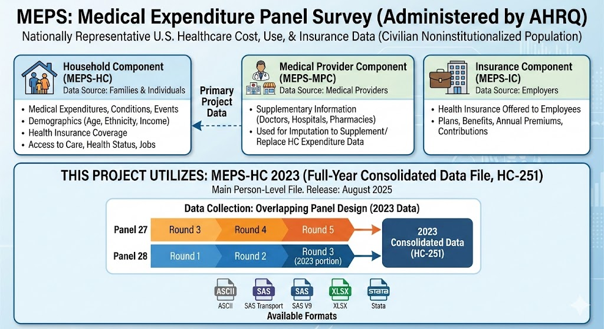

The **Medical Expenditure Panel Survey (MEPS)**, administered by **AHRQ**, is the gold standard for U.S. healthcare cost and usage data. It provides nationally representative estimates for the **U.S. civilian noninstitutionalized population**, combining household reports with validated medical provider and insurance data.

Utilized the **2023 Full-Year Consolidated Data File (HC-251)**:
- **Sample Size:** 18,919 individuals
- **Variables:** 1,374 variables

**Target Variable**  
The target variable is **total out-of-pocket health care costs in 2023** (`TOTSLF23`), including copays, deductibles, and uncovered services. The goal is to facilitate financial planning and healthcare budgeting. By estimating next year's out-of-pocket costs, users can make data-driven decisions about FSA/HSA contributions and better prepare for their financial exposure. For uninsured users, out-of-pocket costs approximate total costs.  

<details>
<summary>ℹ️ <strong>US Healthcare Costs Explained</strong> (click to expand)</summary>

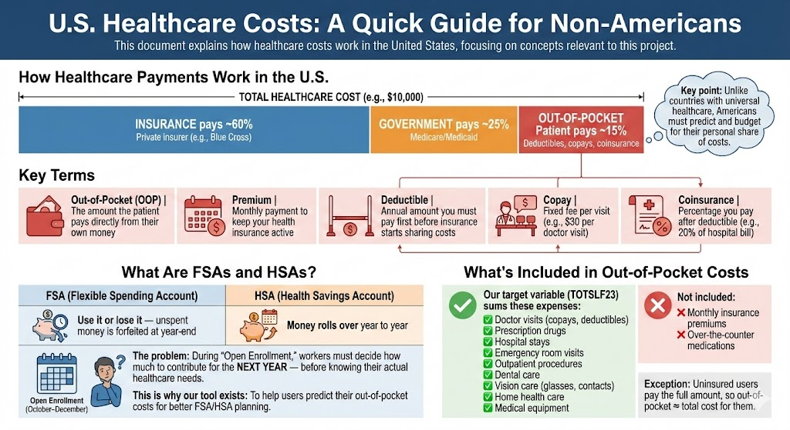
</details>
<br>

<a id="main-candidate-features"></a>**Candidate Features**  
Selected 26 features out of 1,374 MEPS variables based on consumer accessibility (no record-checking required), timing (beginning-of-year data to prevent leakage) and expected predictive power. 
- **Demographics:** Age, Sex, Region, Marital Status, Family Size.
- **Socioeconomics:** Education, Poverty Category, Employment Status.
- **Health Profile:** Insurance, Self-Rated Physical/Mental Health, Smoking Status, Usual Source of Care.
- **Chronic Conditions:** Hypertension, High Cholesterol, Diabetes, Heart Disease, Stroke, Cancer, Arthritis, Asthma.
- **Limitations:** Difficulties with Daily Living, Walking, Cognitive Tasks, Joint Pain.

[🔗 **See Candidate Features**](#candidate-features)

**Sample Weights**  
Incorporated MEPS survey weights during training to account for the complex survey design and non-response. This corrects for the intentional oversampling of specific subgroups (e.g., elderly and low-income), ensuring model estimates remain representative of the general U.S. population.

**MEPS Resources**
| Resource | Description | Link |
| :--- | :--- | :--- |
| Data | MEPS-HC 2023 Full Year Consolidated Data File (HC-251). | [Visit Page](https://meps.ahrq.gov/mepsweb/data_stats/download_data_files_detail.jsp?cboPufNumber=HC-251) |
| Full Documentation | Technical details on data collection, variable editing, and survey sampling. | [View PDF](docs/h251doc.pdf) |
| Codebook | Variables, labels, coding schemes, and frequencies. | [View PDF](docs/h251cb.pdf) |
| MEPS Overview | Background on MEPS components and larger survey history. | [Visit Page](https://meps.ahrq.gov/mepsweb/about_meps/survey_back.jsp) |

<p align="right">(<a href="#readme-top">Back to Top</a>)</p>


## 🔍 Exploratory Data Analysis
Analyzed distributions and relationships to inform data preprocessing, feature engineering, and modeling decisions.  

<a id="main-distributions"></a>**Distributions (Univariate EDA)**  
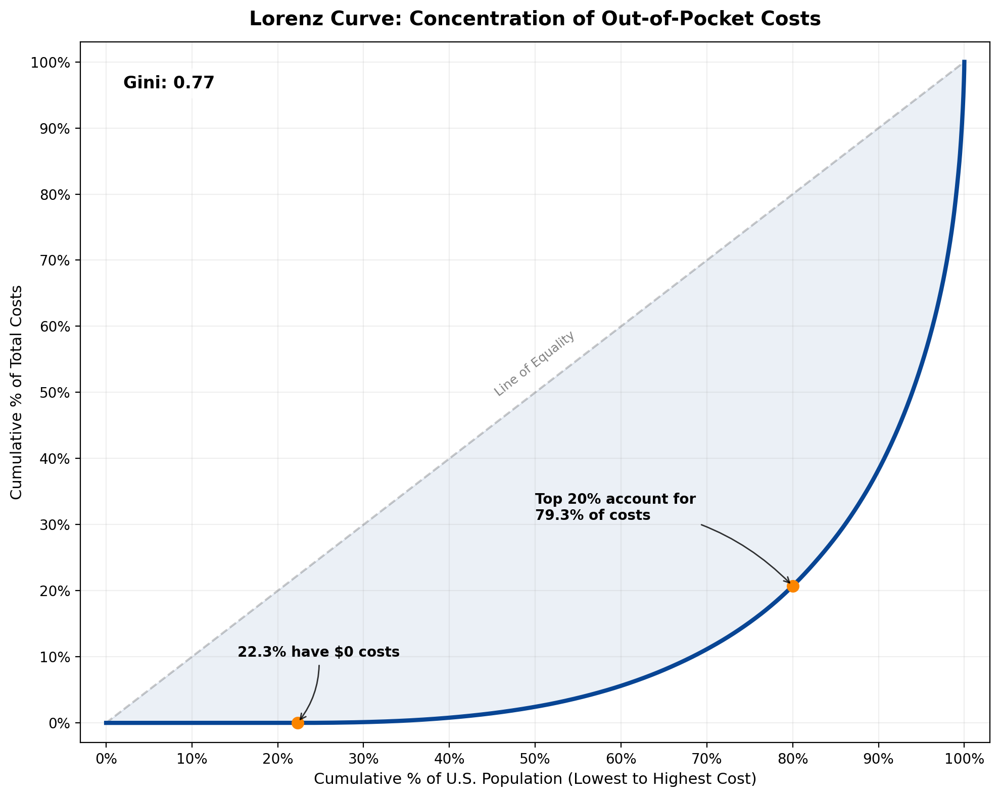
**Key Insights:**
- **Target Variable:** Identified a zero-inflated (22.3%) and extremely right-skewed distribution where the top 20% of spenders drive 79.3% of costs (see Lorenz curve above).
- **Sample Weights:** Verified survey weights represent ~260M adults and confirmed weighting is essential for population-level representativeness.
- **Numerical Features:** Visualized distribution of age, family size, and self-reported health, informing robust median-based imputation for right-skewed and discrete features. [🔗 **See Histograms**](#numerical-distributions)
- **Categorical Features:** Revealed 66% hold private insurance, suggesting costs will be driven by plan-specific cost-sharing. Identified oversampling of healthy and low socio-economic status individuals, confirming the importance of sample weights. [🔗 **See Bar Plots**](#categorical-distributions)
- **Binary Features:** Identified high prevalence of joint pain (45%), high bood pressure (32%), and high cholesterol (31%), while severe conditions such as cancer (11%), coronary heart disease (5%), and stroke (4%) are more sparse. [🔗 **See Bar Plots**](#binary-distributions)

<a id="main-relationships"></a>**Relationships (Bivariate EDA)** 
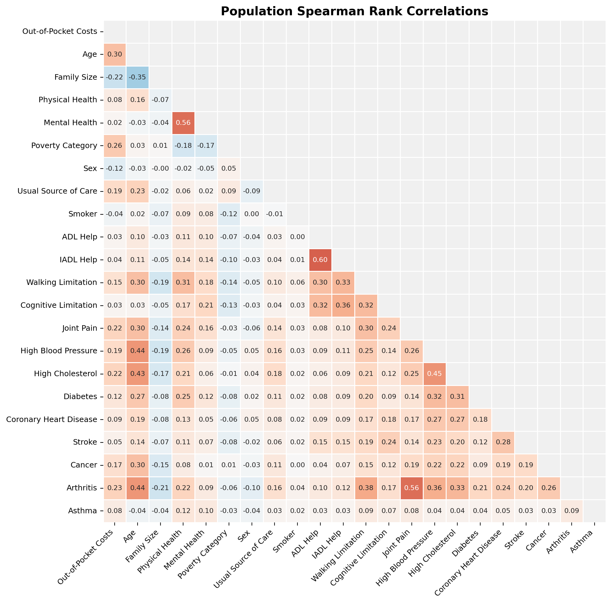
**Key Insights:**
- **Correlations:** Spearman rank correlations (see heatmap above) revealed age (0.30) and poverty category (0.26) as primary cost correlates, alongside arthritis, high cholesterol, and joint pain (~0.22).
- **Numerical Features vs. Target:** Visualized feature-target relationships, revealing age as the primary cost driver and a negative relationship with family size likely due to shared family insurance limits. [🔗 **See Scatter Plots**](#numerical-feature-target-relationships)
- **Categorical Features vs. Target:** Grouped box plots revealed higher out-of-pocket spending for individuals with high income, high education, and private insurance, suggesting financial access drives healthcare utilization. [🔗 **See Grouped Box Plots**](#categorical-feature-target-relationships)
- **Binary Features vs. Target:** Identified high-prevalence "global drivers" (arthritis) vs. high-severity "local triggers" (cancer), and confirmed a massive "utilization hurdle" where women and people with a usual source of care spend more. [🔗 **See Grouped Box Plots**](#binary-feature-target-relationships)

**Modeling Strategy**  
Based on EDA-driven insights, decided to implement sample weights for population representativeness and align models with the Median Absolute Error (MdAE) success metric through tailored loss functions, target log transformation, and polynomial features to effectively handle the zero-inflated, heavy-tailed cost distribution.


## 🧹 Data Preprocessing
Utilized a hybrid workflow to bridge interactive exploration with production reproducibility. Logic was prototyped in [notebooks/1_eda_and_preprocessing.ipynb](notebooks/1_eda_and_preprocessing.ipynb), migrated to [scripts/preprocess.py](scripts/preprocess.py) for automation, and orchestrated by [DVC](https://dvc.org/) (via `dvc.yaml`) for data lineage. To reproduce the preprocessing stage:
  ```bash
  dvc repro preprocess
  ```

**Data Preparation Workflow**  
To ensure a seamless transition from raw survey data to live application predictions, the preprocessing workflow follows a structured three-step process:

**Step 1: Data Preparation** (via `scripts/preprocess.py`)  
This stage converts the raw MEPS data to the clean format expected by the inference pipeline. These steps are primarily for data cleaning and population filtering:
- **Data Loading:** Imports the MEPS-HC 2023 SAS data as a pandas DataFrame.
- **Variable Selection:** Filters 29 essential columns (target variable, candidate features, ID, sample weights) from the original 1,374 columns.
- **Target Population Filtering:** Filters rows for adults with positive person weights (14,768 out of 18,919 respondents).
- **Data Type Handling:** Converts ID to string and sets as index.
- **Missing Value Standardization:** Recovers missing values from survey skip patterns and converts MEPS-specific missing codes to `np.nan`.
- **Binary Feature Standardization:** Standardizes binary features to 0/1 encoding.
- **Stateless Feature Engineering:** Creates a recent life transition feature and collapses sparse categories (e.g., recent divorce, job loss) into stable parent categories.
- **Train-Validation-Test Split:** Splits data into training (80%), validation (10%), and test (10%) sets using a distribution-informed stratified split to balance zero-inflation and the extreme tail of the target variable.

**Step 2: Inference Pipeline** (via `src/pipeline.py`)  
Once the raw data is cleaned and prepared, the `preprocess.py` script *calls* a Scikit-learn pipeline that is used for both training and inference (Web UI and API), ensuring absolute consistency across all environments.

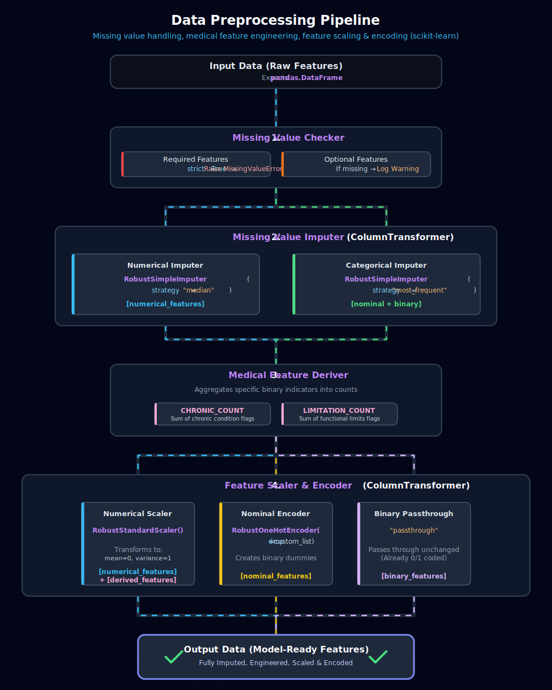

- **Standardization:** Normalizes categorical inputs. Accepts both numeric codes (e.g. 0/1) and string labels (e.g. no/yes). 
- **Validation & Imputation:** Implements a `MissingValueChecker` to catch required fields and a `RobustSimpleImputer` for median/mode-based imputation.
- **Medical Feature Derivation:** Calculates aggregate chronic condition and functional limitation counts to capture health burden.
- **Scaling & Encoding:** Implements a `ColumnTransformer` with `RobustStandardScaler` and `RobustOneHotEncoder`.


**Step 3: Data Persistence** (via `scripts/preprocess.py`)  
 This stage is used during training. It verifies the preprocessed data (e.g., absence of missing, infinite, or constant values, unique IDs), merges features with target and sample weights, and stores them as `.parquet` files.

<a id="main-outliers"></a>**Exploratory Phase** (via `notebooks/1_eda_and_preprocessing.ipynb`):  
Additional steps explored in notebook without being implemented in production script.
- **Handling Duplicates**: Verified the absence of duplicates based on the ID column, complete rows, and all columns except ID.
- **Handling Outliers**: Detected univariate outliers with 3SD and 1.5 IQR methods and multivariate outliers with an isolation forest (5% contamination). Profiled outliers by comparing out-of-pocket costs and feature distributions between inliers and outliers. Confirmed that outliers represent legitimate high risk profiles rather than data errors, and retained all outliers to preserve the model's ability to predict extreme out-of-pocket costs. [🔗 **See Outlier Analysis**](#outlier-analysis)

<p align="right">(<a href="#readme-top">Back to Top</a>)</p>


## 🧠 Modeling
Utilized **MLflow** for experiment tracking to ensure all training runs were reproducible and comparable. To maintain a clean separation between development and production, MLflow tracking was exclusively integrated into the [reproducible scripts](scripts/), while [Jupyter notebooks](notebooks/) were reserved for quick prototyping and exploration.

### 📏 Baseline Models  
Evaluated a diverse set of baseline model architectures to identify candidates for hyperparameter tuning.

| Model | MdAE | Overfitting | MAE | R² |
| :--- | :--- | :--- | :--- | :--- |
| **Elastic Net** | **$163.17** | +6.6% | $1043.55 | -0.12 |
| Linear Regression | $219.21 | +4.8% | $997.77 | -0.06 |
| Random Forest | $231.59 | +9.6% | **$958.46** | -0.04 |
| *Median Benchmark* | *$248.00* | *0.0%* | *$1040.80* | *-0.10* |
| Decision Tree | $271.00 | **+1.5%** | $971.44 | -0.03 |
| XGBoost | $280.81 | +98.0% | $961.00 | 0.00 |
| Support Vector Machine | $291.24 | +190.7% | $1026.52 | -0.03 |
| *LLM (Gemini 3 Flash)* | *$518.00* | *N/A* | *$1168.23* | **0.04** |

<sub>MdAE, MAE, and R² are evaluated on the validation set; Overfitting represents the percentage MdAE difference between the training and validation sets.</sub>

**Key Insights:**  
- **Linear Stability:** Regularized linear models (Elastic Net) proved highly effective at denoising medical features, achieving the best median accuracy (MdAE) with minimal overfitting (+6.6%).
- **Overfitting:** While advanced non-linear models like XGBoost and SVM have highly capable in theory, they exhibited extreme overfitting (+98% to +191%) out-of-the-box, confirming that healthcare cost data is highly noisy and requires heavy regularization.
- **Metric Paradox (MdAE vs. MAE vs. R²):** The massive gap between Median Error (MdAE ≈ $200) and Mean Error (MAE ≈ $1,000) reflects the extreme heavy-tail of US healthcare costs. While the LLM captures the most variance (best R²) by using clinical reasoning to identify high-cost "black swan" profiles, it struggles to pin down precise dollar amounts. Specialized ML models (Elastic Net) achieve 3.2x better performance for the typical user (MdAE), making them far superior budgeting tools despite their lower R² scores.

**Selected Finalists:** 
1. **Elastic Net:** Selected as the highly stable baseline champion for median accuracy.
2. **XGBoost:** Selected for its ability to capture complex, non-linear health interactions, though it requires aggressive regularization during tuning to close the overfitting gap.
3. **Random Forest:** Selected as a robust ensemble learner that naturally resists the severe overfitting seen in XGBoost.

**LLM Benchmark**  
Benchmarked performance against a general-purpose LLM (Gemini 3 Flash) to demonstrate added value of a specialized ML model over a general intelligence LLM ("Why not just ask Gemini?").

- **Rigorous Strategy:** Converted structured data into natural-language user profiles to test the LLM's clinical reasoning on the same validation data set.
- **The Result:** All specialized ML baselines significantly outperformed the general-purpose LLM, with the best-performing baseline (Elastic Net) achieving a 3.2x improvement in predictive performance over Gemini (reducing MdAE from $518 to $163). This confirms that domain-specific training captures numerical cost nuances that general reasoning cannot.

🔗 [**See LLM Benchmarking Details**](#llm-benchmarking)

<p align="right">(<a href="#readme-top">Back to Top</a>)</p>

### 🎛️ Hyperparameter Tuning  
Conducted extensive hyperparameter optimization using randomized search for the most promising model architectures derived from baseline model evaluation (Elastic Net, Random Forest, and XGBoost). 

<a id="main-fairness-audit"></a>**Model Reliability & Fairness Audit**  
To ensure responsible deployment, performed a reliability and fairness audit using stratified error analysis for all tuned models. The fairness audit included both legally protected groups (e.g., Sex, Age, Race) and vulnerable groups (e.g., mental health, income, education levels).
- **Model Reliability:** While Elastic Net performs best overall and excels in low-complexity segments, tree-based models (XGB/RF) perform better in high-complexity segments (uninsured, poor physical health, 4+ chronic conditions), reducing prediction error by ~50% compared to Elastic Net for these populations.
- **Fairness:** All models converge on similar error patterns for protected groups, confirming that observed disparities reflect variance in clinical utilization (e.g., reproductive care, age-related complexity) rather than algorithmic bias. Because the models actually perform better for several marginalized groups (e.g., Hispanic, Black, low income, low education), they effectively avoid the classic disparate impact trap. Conversely, where error is higher for vulnerable groups (e.g., females, older adults), it is justified by clinical complexity, satisfying the Legitimate Business Necessity defense.
- **Regulatory Verdict:** No evidence of discriminatory disparate impact was found. The system is therefore suitable for deployment as a low-risk advisory tool under NIST/FTC transparency guidelines.

🔗 **[See Detailed Model Reliability & Fairness Audit](#model-reliability--fairness-audit)**

<p align="right">(<a href="#readme-top">Back to Top</a>)</p>

### 🏆 Final Model
<p align="right">(<a href="#readme-top">Back to Top</a>)</p>


## 📂 Project Structure
```text
├── notebooks/               # Jupyter Notebooks 
│   ├── 1_eda_and_preprocessing.ipynb  # EDA, preprocessing, and pipeline development
│   ├── 1_eda_and_preprocessing.py     # Script version (generated via Jupytext)
│   ├── 2_modeling.ipynb               # Model training, evaluation and hyperparameter tuning 
│   └── 2_modeling.py                  # Script version (generated via Jupytext)
│
├── scripts/                 # Reproducible pipeline scripts 
│   ├── preprocess.py        # Production-ready data preprocessing
│   ├── train_baseline.py    # Baseline model training 
│   ├── tune_elastic_net.py  # Hyperparameter tuning for Elastic Net
│   ├── tune_random_forest.py # Hyperparameter tuning for Random Forest
│   ├── tune_xgboost.py       # Hyperparameter tuning for XGBoost
│   └── benchmark_llm.py     # LLM prediction benchmark
│
├── src/                     # Core package source code 
│   ├── data.py              # Custom cost stratification logic 
│   ├── constants.py         # Feature lists and display labels
│   ├── display.py           # Human-readable display labels and visualization styles (Notebook/UI)
│   ├── modeling.py          # Core model training and evaluation functions
│   ├── params.py            # Hyperparameter search spaces and configurations
│   ├── transformers.py      # Custom Scikit-learn transformers
│   └── pipeline.py          # Preprocessing and prediction pipelines
│
├── app/                     # (Planned) Web application source code
│
├── models/                  # (Planned) Trained model artifacts (ignored by Git)
│
├── data/                    # Raw and processed datasets (ignored by Git)
│   ├── h251.sas7bdat        # MEPS-HC 2023 dataset (SAS V9 format)
│   └── *_preprocessed.*     # Training, validation, and test sets (CSV/Parquet)
│
├── figures/                 # Generated figures
│   ├── eda/                 # Distribution and relationship plots 
│   ├── outliers/            # Outlier analysis plots 
│   └── evaluation/          # Model performance plots
│
├── assets/                  # Images and other assets for README
│   ├── header.png           # Header image
│   ├── infographic_meps_data.jpg # MEPS data overview infographic
│   ├── infographic_healthcare_costs.png  # U.S. healthcare cost explainer
│   └── pipeline.svg         # Inference pipeline architecture diagram
│
├── tests/                   # (Planned) Software testing for web application
│   ├── unit/                # (Planned) Unit tests
│   ├── integration/         # (Planned) Integration tests
│   └── e2e/                 # (Planned) End-to-end tests
│
├── docs/                    # Project documentation and resources
│   ├── specs/               # PRD and tech specs
│   │   ├── product_requirements.md
│   │   └── technical_specifications.md
│   ├── references/          # MEPS documentation, codebook, and data dictionary 
│   ├── research/            # Background research 
│   └── workflow/            # Git conventions
│
├── pyproject.toml           # Project configuration and dependencies
├── requirements.txt         # Proxy for production dependencies 
├── requirements-train.txt   # Training dependencies 
├── requirements-test.txt    # Test dependencies 
├── .env.example             # Template for environment variables
│
├── dvc.yaml                 # Preprocessing and modeling pipeline definitions (stages, deps, outs)
├── dvc.lock                 # Hash-based data lineage lockfile
├── .dvc/                    # DVC configuration 
│
├── README.md                # Project overview 
├── AGENTS.md                # Context and instructions for AI agents
├── LICENSE                  # MIT License
└── .gitignore               # Files and directories excluded from version control
```

<p align="right">(<a href="#readme-top">Back to Top</a>)</p>


## ⚙️ Getting Started

### Installation and Setup
This project uses three isolated virtual environments to keep application dependencies lightweight. In all three setups, the project is installed as a local package, ensuring that the `src/` module can be reliably imported from any folder.

**1. Training Environment (`.venv-train`)**
- **Purpose:** Model development (preprocessing, EDA, training, evaluation, tuning).
- **Setup:**
  ```bash
  python -m venv .venv-train
  source .venv-train/bin/activate  # or .venv-train\Scripts\activate on Windows
  pip install -r requirements-train.txt
  ```
- **Import Logic:** This environment uses an **editable install** (`-e .[train]`). Changes you make to `src/` are instantly available in your notebooks without re-installation.

**2. Application Environment (`.venv-app`)**
- **Purpose:** Run and test the web application.
- **Setup:**
  ```bash
  python -m venv .venv-app
  source .venv-app/bin/activate  # or .venv-app\Scripts\activate on Windows
  pip install -r requirements.txt
  ```
- **Import Logic:** This environment installs the project as a **regular package** (`.[app]`). This mirrors the production environment, allowing the app to reliably import from `src/` regardless of where it is launched.

**3. Testing Environment (`.venv-test`)**
- **Purpose:** Web App/API testing using unit, integration, and end-to-end tests with `pytest`.
- **Setup:**
  ```bash
  python -m venv .venv-test
  source .venv-test/bin/activate  # or .venv-test\Scripts\activate on Windows
  pip install -r requirements-test.txt
  ```
- **Import Logic:** This environment uses an **editable install** (`-e .[app,test]`). It combines both the application dependencies and the testing tools, allowing you to run tests against your latest code.

**4. Data Management (DVC)**
- **Purpose:** Version control for local data and reproducibility of preprocessing and modeling.
- **Workflow:**
  - **Run Full Pipeline:** To execute all stages (preprocessing through baseline modeling):
    ```bash
    dvc repro
    ```
  - **Run Specific Stages:**
    - `dvc repro preprocess`: Reproduce only the data preparation, feature engineering, and preprocessing.
    - `dvc repro baseline`: Reproduce baseline model training (will re-run `preprocess` if data or script changed).

#### Production Deployment 
The project is optimized for deployment on Hugging Face. When you connect your repository to Hugging Face Spaces (or any platform using `requirements.txt`), it automatically runs:
```bash
pip install -r requirements.txt
```
Because `requirements.txt` contains `. [app]`, the platform installs the project itself as a package. This ensures your application can always find the `src` module regardless of the working directory.

<p align="right">(<a href="#readme-top">Back to Top</a>)</p>


## ©️ License
This project is licensed under the [MIT License](LICENSE).

<p align="right">(<a href="#readme-top">Back to Top</a>)</p>


## 👏 Credits
This project was made possible with the help of the following resources:
- **Dataset**: [2023 Full Year Consolidated Data File (HC-251)](https://meps.ahrq.gov/data_stats/download_data_files_detail.jsp?cboPufNumber=HC-251) from the [Medical Expenditure Panel Survey (MEPS)](https://meps.ahrq.gov/mepsweb/), provided by the [Agency for Healthcare Research and Quality (AHRQ)](https://www.ahrq.gov/).
- **Images**: 
  - Header: The [header image](./assets/header.png) was generated using [GPT Image 1.5](https://openai.com/index/new-chatgpt-images-is-here/) via the [ChatGPT app](https://chatgpt.com/) by OpenAI. 
  - Infographics: The [MEPS data infographic](./assets/infographic_meps_data.jpg) and the [US healthcare costs infographic](./assets/infographic_healthcare_costs.png) were generated using [Gemini 3 Pro Image](https://deepmind.google/models/gemini-image/pro/) via the [Gemini app](https://gemini.google.com/app) by Google.
- **AI Coding Assistant**: [Antigravity](https://antigravity.google/) by Google.

<p align="right">(<a href="#readme-top">Back to Top</a>)</p>


<!-- APPENDIX -->
## 📎 Appendix

### Candidate Features
**Feature Selection**  
Candidate features were selected from MEPS-HC 2023 based on the following criteria:
- **Consumer Accessibility:** Users can answer from memory without looking up records, ensuring the model is usable in a consumer-facing app.
- **Beginning-of-Year Data:** To enable the app to be used during Open Enrollment for predicting *upcoming* costs, only variables measured at the beginning of the year (`31` suffix) or stable traits are used to prevent data leakage.
- **Predictive Power:** Features have established significance in healthcare cost literature.

These 26 candidate features will be further reduced based on importance scores to meet the UX goal of a form completion time of less than 90 seconds.

**Candidate Features**
| Label | Variable | Description | Data Type | Value Range |
| :--- | :--- | :--- | :--- | :--- |
| Age | `AGE23X` | Age as of Dec 31, 2023. | Numerical (Int) | 0–85 |
| Sex | `SEX` | Biological sex. | Binary (Int) | 1=Male, 2=Female |
| Region | `REGION23` | Census region. | Nominal (Int) | 1=Northeast, 2=Midwest, 3=South, 4=West |
| Marital Status | `MARRY31X` | Status at beginning of year. | Nominal (Int) | 1=Married, 2=Widowed, 3=Divorced, 4=Separated, 5=Never Married |
| Poverty Category | `POVCAT23` | Family income relative to poverty line. | Ordinal (Int) | 1=Poor, 2=Near Poor, 3=Low Income, 4=Middle Income, 5=High Income |
| Family Size | `FAMSZE23` | Number of related persons residing together. | Numerical (Int) | 1–14 |
| Education | `HIDEG` | Highest degree attained. | Ordinal (Int) | 1=No Degree, 2=GED, 3=HS Diploma, 4=Bachelor's, 5=Master's, 6=Doctorate, 7=Other |
| Employment Status | `EMPST31` | Status at beginning of year. | Nominal (Int) | 1=Employed, 2=Job to return to, 3=Job during reference period, 4=Not employed |
| Insurance | `INSCOV23` | Coverage status. | Nominal (Int) | 1=Any Private, 2=Public Only, 3=Uninsured |
| Usual Source of Care | `HAVEUS42` | Regular doctor or clinic. | Binary (Int) | 1=Yes, 2=No |
| Physical Health | `RTHLTH31` | Self-rated physical health. | Numerical (Int) | 1=Excellent, 2=Very Good, 3=Good, 4=Fair, 5=Poor |
| Mental Health | `MNHLTH31` | Self-rated mental health. | Numerical (Int) | 1=Excellent, 2=Very Good, 3=Good, 4=Fair, 5=Poor |
| Smoker | `ADSMOK42` | Currently smokes cigarettes. | Binary (Int) | 1=Yes, 2=No |
| ADL Help | `ADLHLP31` | Needs help with activities of daily living (personal care, bathing, dressing). | Binary (Int) | 1=Yes, 2=No |
| IADL Help | `IADLHP31` | Needs help with instrumental activities of daily living (paying bills, taking medications, doing laundry). | Binary (Int) | 1=Yes, 2=No |
| Walking Limitation | `WLKLIM31` | Difficulty walking or climbing stairs. | Binary (Int) | 1=Yes, 2=No |
| Cognitive Limitation | `COGLIM31` | Confusion or memory loss. | Binary (Int) | 1=Yes, 2=No |
| Joint Pain | `JTPAIN31_M18` | Pain/stiffness in past year. | Binary (Int) | 1=Yes, 2=No |
| Hypertension | `HIBPDX` | Diagnosed with high blood pressure. | Binary (Int) | 1=Yes, 2=No |
| High Cholesterol | `CHOLDX` | Diagnosed with high cholesterol. | Binary (Int) | 1=Yes, 2=No |
| Diabetes | `DIABDX_M18` | Diagnosed with diabetes. | Binary (Int) | 1=Yes, 2=No |
| Heart Disease | `CHDDX` | Diagnosed with coronary heart disease. | Binary (Int) | 1=Yes, 2=No |
| Stroke | `STRKDX` | Diagnosed with stroke. | Binary (Int) | 1=Yes, 2=No |
| Cancer | `CANCERDX` | Diagnosed with cancer or malignancy. | Binary (Int) | 1=Yes, 2=No |
| Arthritis | `ARTHDX` | Diagnosed with arthritis. | Binary (Int) | 1=Yes, 2=No |
| Asthma | `ASTHDX` | Diagnosed with asthma. | Binary (Int) | 1=Yes, 2=No |

<p align="right">(<a href="#main-candidate-features">Back to Candidate Features</a> | <a href="#readme-top">Back to Top</a>)</p>


### Distributions
<a id="numerical-distributions"></a>

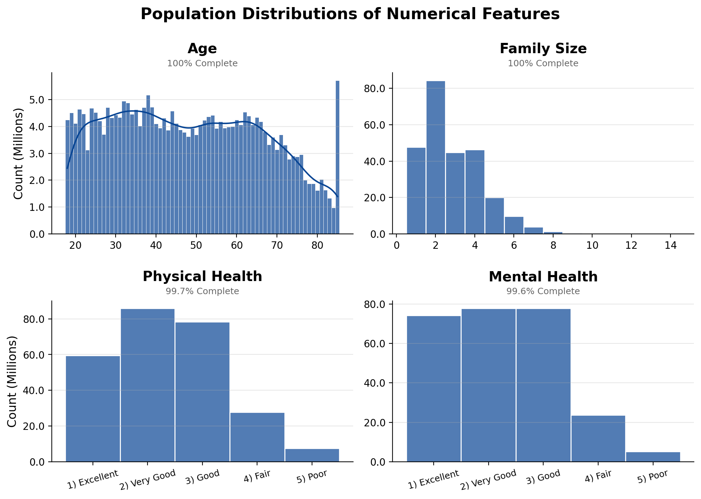

Table of population statistics for all numerical features:
| Feature         | Count       | Mean  | Std   | Min  | 25%  | 50%  | 75%  | Max  |
|-----------------|-------------|-------|-------|------|------|------|------|------|
| Age             | 259,681,066 | 48.32 | 18.54 | 18.0 | 32.0 | 47.0 | 63.0 | 85.0 |
| Family Size     | 259,568,347 | 2.88  | 1.59  | 1.0  | 2.0  | 2.0  | 4.0  | 14.0 |
| Physical Health | 258,917,544 | 2.37  | 1.04  | 1.0  | 2.0  | 2.0  | 3.0  | 5.0  |
| Mental Health   | 258,635,089 | 2.26  | 1.03  | 1.0  | 1.0  | 2.0  | 3.0  | 5.0  |

<p align="right">(<a href="#main-distributions">Back to EDA</a> | <a href="#readme-top">Back to Top</a>)</p>

<a id="categorical-distributions"></a>

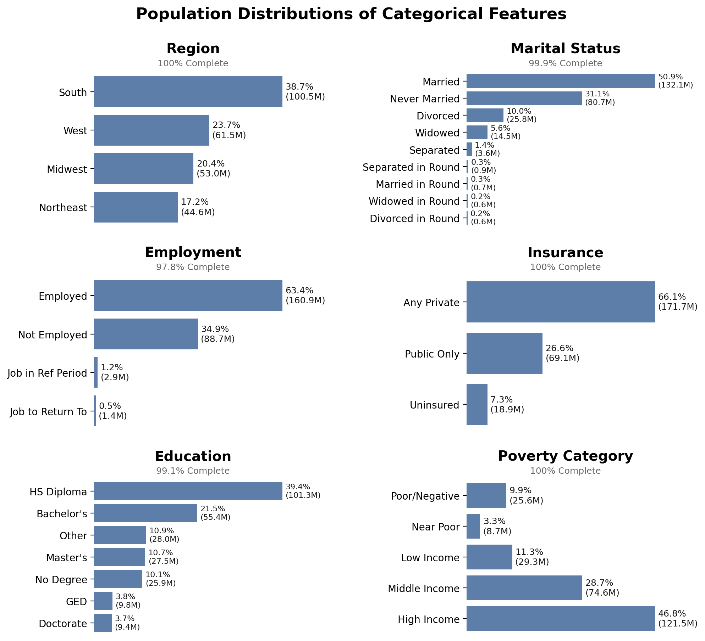
<p align="right">(<a href="#main-distributions">Back to EDA</a> | <a href="#readme-top">Back to Top</a>)</p>

<a id="binary-distributions"></a>

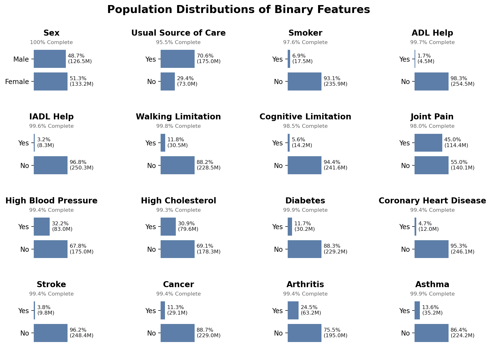
<p align="right">(<a href="#main-distributions">Back to EDA</a> | <a href="#readme-top">Back to Top</a>)</p>


### Feature-Target Relationships
<a id="numerical-feature-target-relationships"></a>

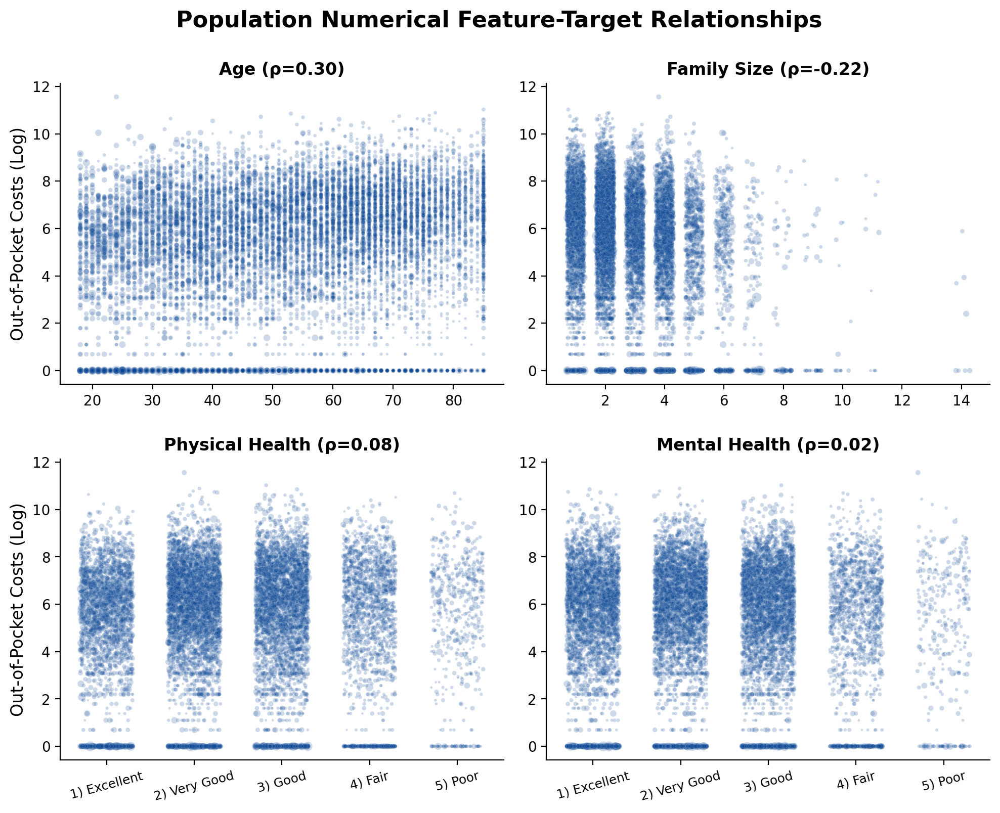
<p align="right">(<a href="#main-relationships">Back to EDA</a> | <a href="#readme-top">Back to Top</a>)</p>

<a id="categorical-feature-target-relationships"></a>

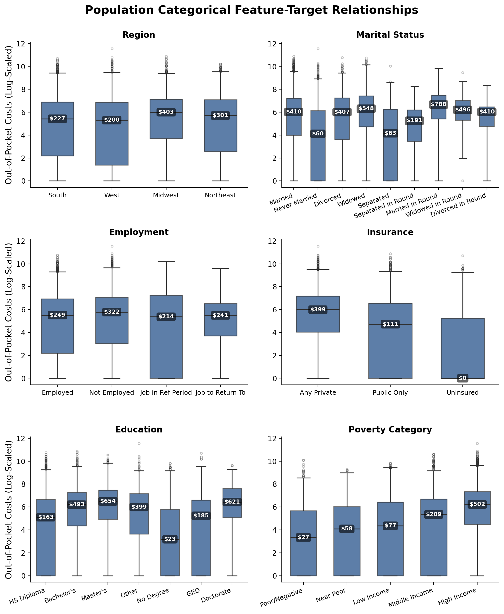
<p align="right">(<a href="#main-relationships">Back to EDA</a> | <a href="#readme-top">Back to Top</a>)</p>

<a id="binary-feature-target-relationships"></a>

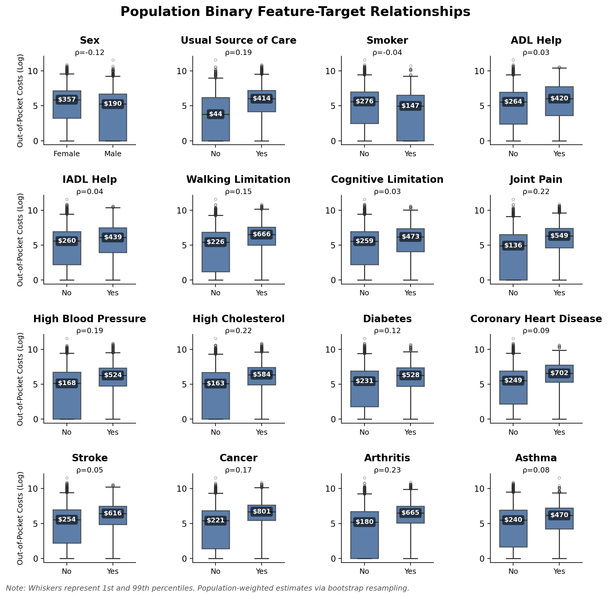
<p align="right">(<a href="#main-relationships">Back to EDA</a> | <a href="#readme-top">Back to Top</a>)</p>


### Outlier Analysis
**1. Outlier Detection:** Utilized an Isolation Forest (5% contamination) to identify multivariate outliers in training data.  
**2. Outlier Profiling:** Compared out-of-pocket costs and feature distributions between inliers and outliers.  
**3. Outlier Treatment:** Retained all outliers as legitimate "High Comorbidity" health profiles essential for robust tail-risk prediction.

**Cost Concentration**  
While outliers are only 1.1x more likely to cross the median cost threshold, they are **3.4x more likely** to be in the Top 1% of spenders.

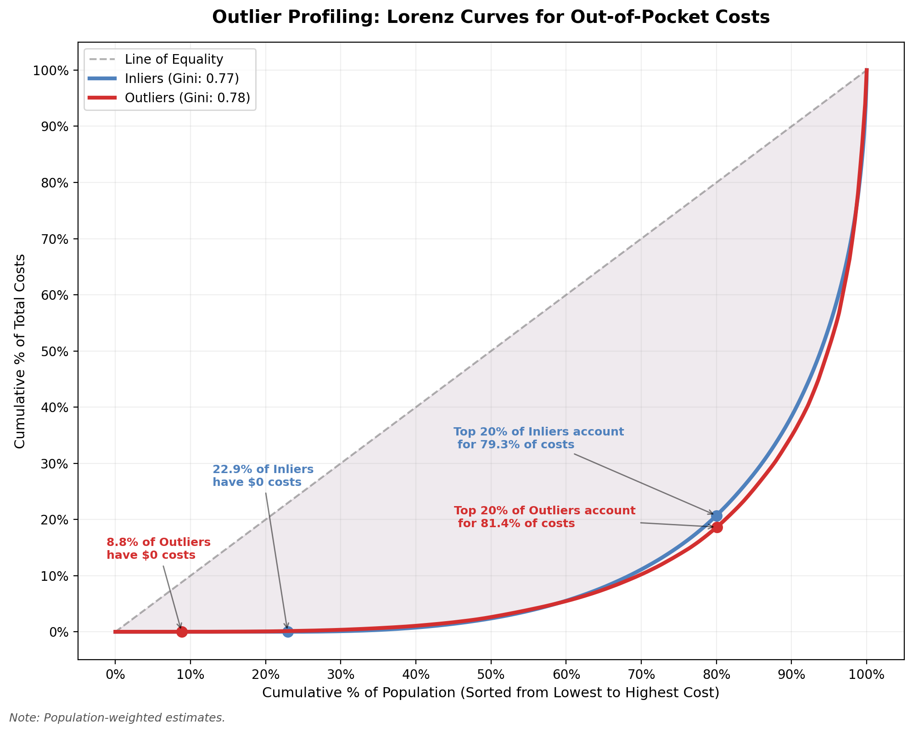
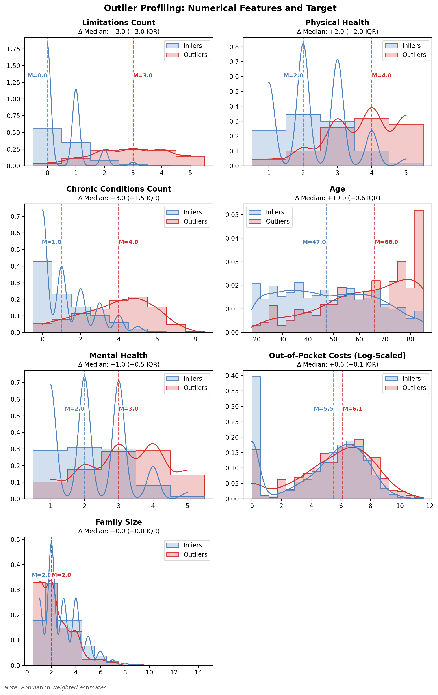
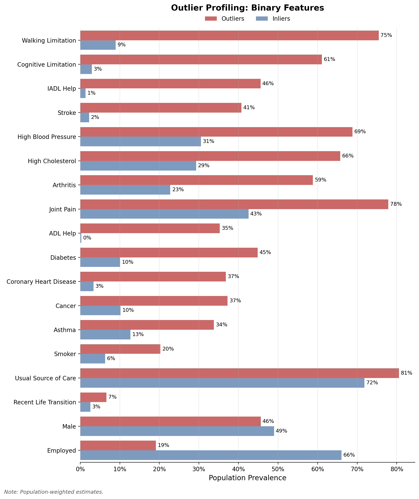
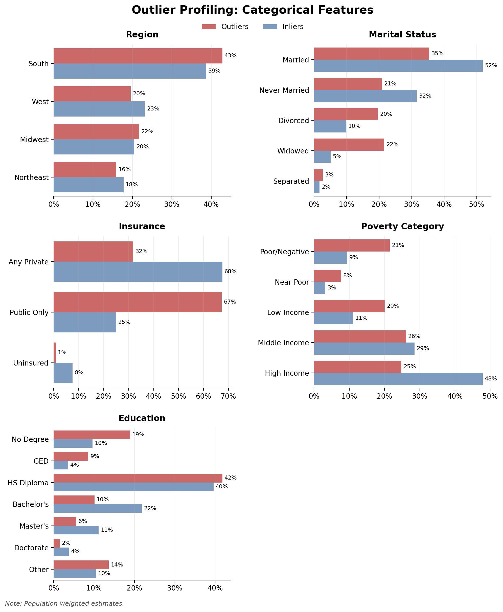

<p align="right">(<a href="#main-outliers">Back to Data Preprocessing</a> | <a href="#readme-top">Back to Top</a>)</p>


### LLM Benchmarking
To ensure a rigorous "High-Bar" benchmark, the LLM was evaluated using the following strategy:
- **Expert Prompting:** The LLM was provided with expert-level definitions of out-of-pocket costs (e.g., distinguishing copays from premiums) to evaluate purely on clinical-cost logic.
- **Natural Language Profiles:** Structured MEPS features were translated into cohesive "patient stories" to test the LLM’s ability to reason over holistic medical contexts rather than just raw tabular data.
- **Identical Validation:** Both the ML models and the LLM were evaluated on the same validation set (n=1,425) to ensure an absolute "apples-to-apples" metric comparison.

**Model Performance Comparison**  
The specialized ML models consistently outperformed the LLM across all predictive dimensions:

| Model | MdAE | MAE | R² |
| :--- | :--- | :--- | :--- |
| **LLM Benchmark (Gemini 3 Flash)** | **$518.00** | **$1168.23** | **0.04** |
| Median Benchmark | $248.00 | $1040.80 | -0.10 |
| Linear Regression | $219.21 | $997.77 | -0.06 |
| **Elastic Net (Best Baseline)** | **$163.17** | **$1043.55** | **-0.12** |
| Decision Tree | $271.00 | $971.44 | -0.03 |
| Random Forest | $231.59 | $958.46 | -0.04 |
| XGBoost | $280.81 | $961.00 | -0.00 |
| Support Vector Machine | $291.24 | $1026.52 | -0.03 |

To reproduce the LLM benchmark:
1. **Configure API Key:** Create a `.env` file in the root directory (refer to [`.env.example`](.env.example)).
2. **Run Script:**
   ```bash
   python scripts/benchmark_llm.py
   ```

<p align="right">(<a href="#-baseline-models">Back to Baseline Models</a> | <a href="#readme-top">Back to Top</a>)</p>


### Model Reliability & Fairness Audit
Performed stratified error analysis with Median Absolute Error (MdAE) to evaluate the reliability of all tuned models and detect algorithmic bias across 13 relevant dimensions.

**Model Reliability Analysis**
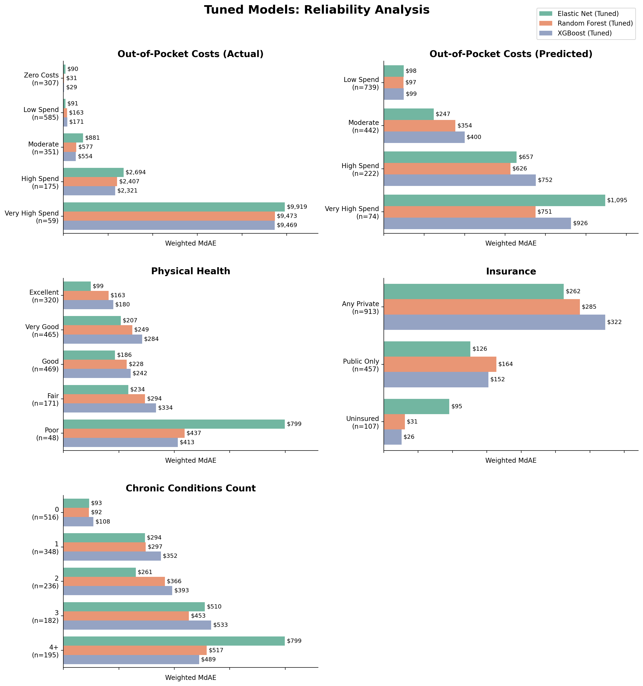
**Key Insights:**
- **Actual Costs:** Models converge at the Top 5% (~$9.5k MdAE), highlighting the data's noise limit. Elastic Net struggles with Zero Costs ($90 vs. ~$30 for tree models) due to linear assumptions.
- **Predicted Costs:** Random Forest is the most precise for "Very High Spend" predictions ($751 MdAE vs. $1,095 for Elastic Net), proving better calibration for high-risk identification.
- **Health & Chronic Conditions:** Error rises with clinical complexity. Tree models plateau around $500 MdAE for 4+ conditions, capturing the "cost saturation effect," while Elastic Net jumps to $799.
- **Insurance:** Elastic Net produces 3–4× the error of tree models for the Uninsured ($95 vs. ~$30), failing to capture near-zero spending constraints.

**Fairness Audit**
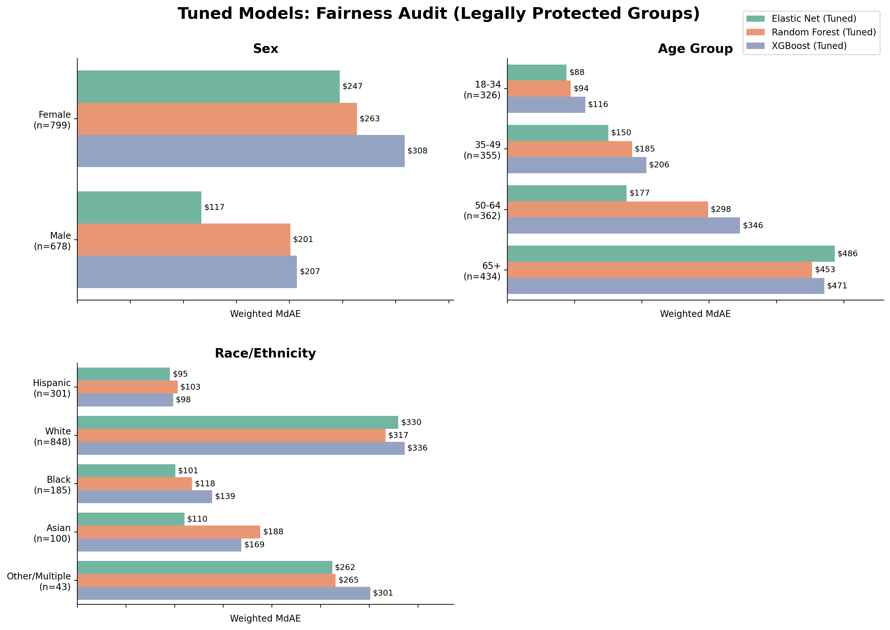
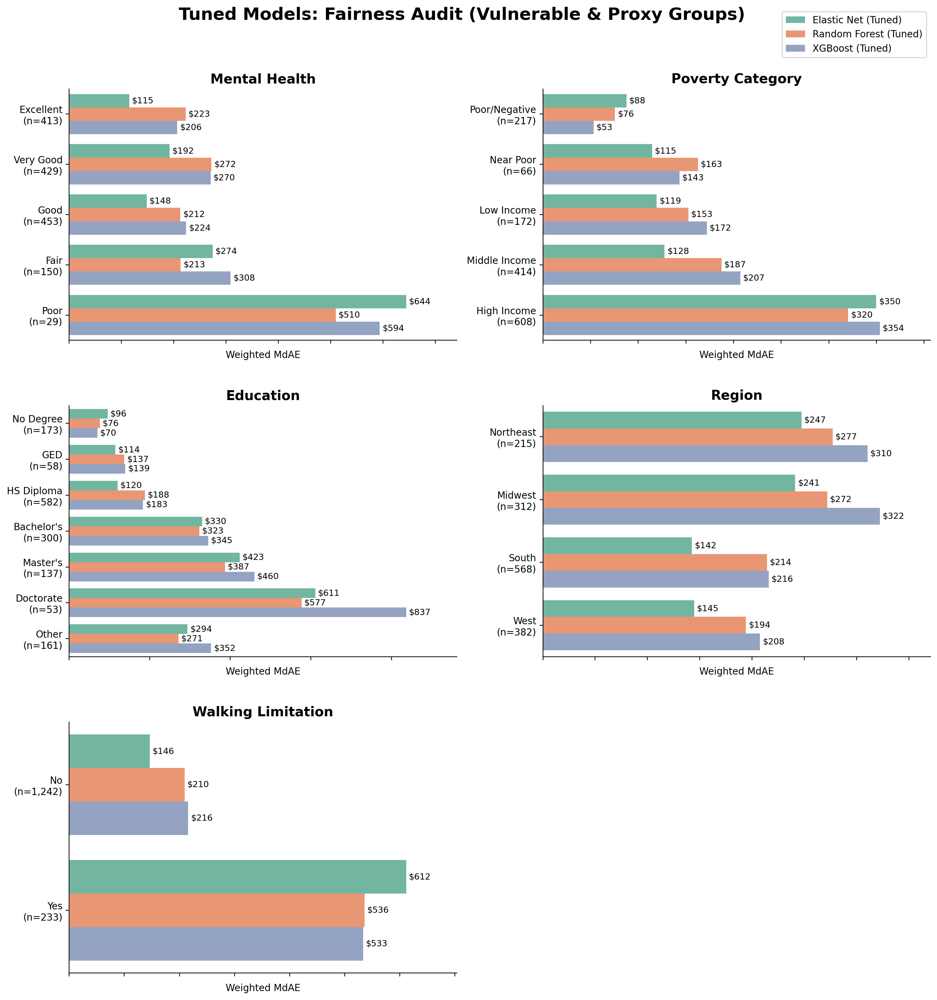
**Key Insights:**
- **Sex:** Consistent Female/Male disparity (~1.5×) across architectures reflects utilization variance (e.g., reproductive care), not algorithmic bias.
- **Age:** Error increases 4–6× for older compared to young adults, reflecting clinical complexity.
- **Race/Ethnicity:** Error is highest for White populations and lower for minority groups, naturally avoiding disparate impact against minorities.
- **Socioeconomic Status (Income/Education):** Models perform better for high compared with low education and income. This is likely due to larger spending variance and better insurance quality. 
- **Walking/Mental Health:** Higher errors for populations with walking limitations and poor mental health. Elastic Net performs better without limiations and for excellent mental health, tree models perform better in case of high clinical complexity.
- **Region:** Smallest disparity dimension, with slightly lower errors in South and West.
- **Audit Verdict:** No evidence of discriminatory disparate impact. The models achieve lower prediction error for several marginalized groups, avoiding the classic disparate impact trap. Where error is higher for vulnerable groups, it is justified by clinical complexity and utilization variance, satisfying the Legitimate Business Necessity defense under NIST/FTC guidelines.

<p align="right">(<a href="#main-fairness-audit">Back to Hyperparameter Tuning</a> | <a href="#readme-top">Back to Top</a>)</p>


<!-- MARKDOWN LINKS -->
[Python-badge]: https://img.shields.io/badge/python-3670A0?style=for-the-badge&logo=python&logoColor=ffdd54
[Python-url]: https://www.python.org/
[Pandas-badge]: https://img.shields.io/badge/pandas-%23150458.svg?style=for-the-badge&logo=pandas&logoColor=white
[Pandas-url]: https://pandas.pydata.org/
[Matplotlib-badge]: https://img.shields.io/badge/Matplotlib-%23DDDDDD?style=for-the-badge&logo=
[Matplotlib-url]: https://matplotlib.org/
[Seaborn-badge]: https://img.shields.io/badge/seaborn-%230C4A89.svg?style=for-the-badge&logo=seaborn&logoColor=white
[Seaborn-url]: https://seaborn.pydata.org/
[scikit-learn-badge]: https://img.shields.io/badge/scikit--learn-%23F7931E.svg?style=for-the-badge&logo=scikit-learn&logoColor=white
[scikit-learn-url]: https://scikit-learn.org/stable/
[DVC-badge]: https://img.shields.io/badge/DVC-13ADC7?style=for-the-badge&logo=dvc&logoColor=white
[DVC-url]: https://dvc.org/
[MLflow-badge]: https://img.shields.io/badge/MLflow-0194E2?style=for-the-badge&logo=MLflow&logoColor=white
[MLflow-url]: https://mlflow.org/

