<!-- anchor tag for back-to-top links -->
<a id="readme-top"></a>

<!-- HEADER IMAGE  -->


<!-- SHORT SUMMARY  -->


## 📋 Table of Contents
<ol>
  <li>
    <a href="#-summary">Summary</a>
  </li>
  <li>
    <a href="#-motivation">Motivation</a>
  </li>
  <li>
    <a href="#️-data">Data</a>
  </li>
  <li>
    <a href="#-exploratory-data-analysis">Exploratory Data Analysis</a>
  </li>
  <li>
    <a href="#-data-preprocessing">Data Preprocessing</a>
  </li>
  <li>
    <a href="#-modeling">Modeling</a>
    <ul>
      <li><a href="#-baseline-models">Baseline Models</a></li>      
      <li><a href="#️-hyperparameter-tuning">Hyperparameter Tuning</a></li>
      <li><a href="#-final-model">Final Model</a></li>
      <li><a href="#-feature-importance">Feature Importance</a></li>
    </ul>
  </li>
  <li>
    <a href="#-project-structure">Project Structure</a>
  </li>
  <li>
    <a href="#️-getting-started">Getting Started</a>
    <ul>
      <li><a href="#installation-and-setup">Installation and Setup</a></li>
      <li><a href="#production-deployment">Production Deployment</a></li>
    </ul>
  </li>
  <li>
    <a href="#️-license">License</a>
  </li>
  <li>
    <a href="#-credits">Credits</a>
  </li>
  <li>
    <a href="#-appendix">Appendix</a>
    <ul>
      <li><a href="#candidate-feature-details">Candidate Feature Details</a></li>
      <li><a href="#distributions">Distributions</a></li>        
      <li><a href="#feature-target-relationships">Feature-Target Relationships</a></li>      
      <li><a href="#outlier-analysis-details">Outlier Analysis Details</a></li>      
      <li><a href="#llm-benchmarking-details">LLM Benchmarking Details</a></li>
      <li><a href="#tuned-models-heteroscedasticity">Tuned Models: Heteroscedasticity</a></li>
      <li><a href="#tuned-models-reliability--fairness">Tuned Models: Reliability & Fairness</a></li>      
      <li><a href="#xgboost-quantile-regression-reliability--fairness">XGBoost Quantile Regression: Reliability & Fairness</a></li>      
      <li><a href="#shap-explanation-details">SHAP Explanation Details</a></li>
      <li><a href="#feature-importance-details">Feature Importance Details</a></li>
    </ul>
  </li>
</ol>


## 🎯 Summary

**Active Development:** Model training and evaluation are complete. The web app and API are next.

Machine learning project to help U.S. adults plan for annual out-of-pocket healthcare costs using accessible demographic and health information. Trained on MEPS 2023 survey data, **XGBoost quantile regression** was selected as the final MVP model. It provides a **plan-around estimate, typical range, and safety cushion** to help users budget for uncertain costs.

On the held-out test set, the model passes all predefined performance thresholds for launch, with a survey-weighted **median absolute error (MdAE) of $240** for the plan-around estimate. Compared with population-wide or age-group estimates, it provides better predictions, especially for typical ranges and safety cushions.

**SHAP explanations** show which answers contribute most to the plan-around estimate. Cost comparison benchmarks help users compare their estimate with typical spending for U.S. adults and their age group, while medical inflation adjustment expresses amounts in current dollars.

This README highlights the main findings. For details, see the [EDA/preprocessing](notebooks/1_eda_and_preprocessing.ipynb) and [modeling](notebooks/2_modeling.ipynb) notebooks.

🛠️ **Built With**  
[![Python][Python-badge]][Python-url]
[![NumPy][NumPy-badge]][NumPy-url]
[![Pandas][Pandas-badge]][Pandas-url]
[![Matplotlib][Matplotlib-badge]][Matplotlib-url]
[![Seaborn][Seaborn-badge]][Seaborn-url]<br>
[![scikit-learn][scikit-learn-badge]][scikit-learn-url]
[![XGBoost][XGBoost-badge]][XGBoost-url]
[![DVC][DVC-badge]][DVC-url]
[![MLflow][MLflow-badge]][MLflow-url]
[![pytest][Pytest-badge]][Pytest-url]

<p align="right">(<a href="#readme-top">Back to Top</a>)</p>


## 💡 Motivation
**The Problem:** Knowing the price of an individual treatment does not tell someone how much to budget for next year's out-of-pocket healthcare costs. Existing tools include procedure cost lookups, broad spending estimates, and calculators that ask users to enter their expected expenses. Planning remains difficult when future care needs are uncertain.

**The Approach:** The planned app will provide personalized annual budgeting guidance from questions people can answer from memory, including their age, insurance status, and specific health conditions. A plan-around estimate, typical range, and safety cushion will help users consider both typical spending and a more expensive year when planning their budget or FSA/HSA contributions, without needing medical records or a list of anticipated treatments.

<p align="right">(<a href="#readme-top">Back to Top</a>)</p>


## 🗂️ Data
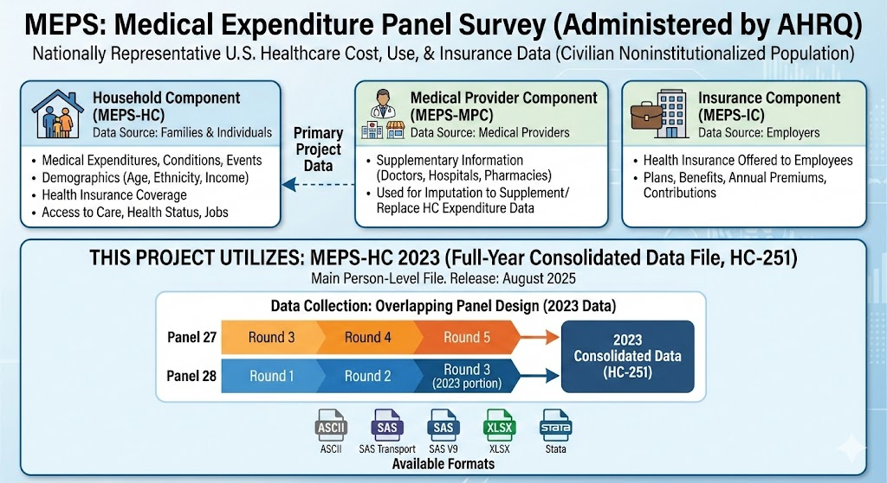

The **Medical Expenditure Panel Survey (MEPS)**, administered by **AHRQ**, is the gold standard for U.S. healthcare cost and usage data. It provides nationally representative estimates for the **U.S. civilian noninstitutionalized population**, combining household reports with validated medical provider and insurance data.

Utilized the **2023 Full-Year Consolidated Data File (HC-251)**:
- **Sample Size:** 18,919 individuals
- **Variables:** 1,374 variables

**Target Variable**  
The target variable is **total out-of-pocket healthcare costs in 2023** (`TOTSLF23`), including copays, deductibles, and uncovered services. The goal is to facilitate financial planning and healthcare budgeting. By estimating next year's out-of-pocket costs, users can make data-driven decisions about FSA/HSA contributions and better prepare for their financial exposure. For uninsured users, out-of-pocket costs approximate total costs.

<details>
<summary>ℹ️ <strong>U.S. Healthcare Costs Explained</strong> <i>(click to expand)</i></summary>

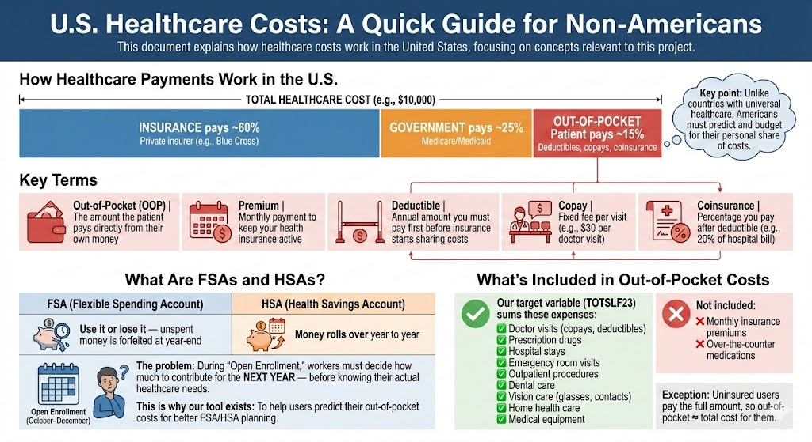
</details>
<br>

<a id="main-candidate-features"></a>**Candidate Features**  
Selected 26 features out of 1,374 MEPS variables based on consumer accessibility (no record-checking required), timing (beginning-of-year data to prevent leakage) and expected predictive power. 
- **Demographics:** Age, Sex, Region, Marital Status, Family Size.
- **Socioeconomics:** Education, Family Income, Employment Status.
- **Health Profile:** Insurance, Self-Rated Physical/Mental Health, Smoking Status, Usual Source of Care.
- **Chronic Conditions:** Hypertension, High Cholesterol, Diabetes, Heart Disease, Stroke, Cancer, Arthritis, Asthma.
- **Limitations:** Difficulties with Daily Living, Walking, Cognitive Tasks, Joint Pain.

[🔗 **See Candidate Feature Details**](#candidate-feature-details)

**Survey Weights**  
MEPS survey weights (`PERWT23F`) adjust for unequal sampling probabilities and nonresponse, so each respondent contributes according to how many people they represent in the U.S. adult population. The project uses them during EDA, model training, and evaluation. Scikit-learn accepts them through its `sample_weight` parameter.

**MEPS Resources**
| Resource | Description | Link |
| :--- | :--- | :--- |
| Data | MEPS-HC 2023 Full Year Consolidated Data File (HC-251). | [Visit Page](https://meps.ahrq.gov/mepsweb/data_stats/download_data_files_detail.jsp?cboPufNumber=HC-251) |
| Full Documentation | Technical details on data collection, variable editing, and survey sampling. | [View PDF](docs/references/h251doc.pdf) |
| Codebook | Variables, labels, coding schemes, and frequencies. | [View PDF](docs/references/h251cb.pdf) |
| MEPS Overview | Background on MEPS components and larger survey history. | [Visit Page](https://meps.ahrq.gov/mepsweb/about_meps/survey_back.jsp) |

<p align="right">(<a href="#readme-top">Back to Top</a>)</p>


## 🔍 Exploratory Data Analysis
Analyzed distributions and relationships to inform data preprocessing, feature engineering, and modeling decisions.  

<a id="main-distributions"></a>**Distributions (Univariate EDA)**  
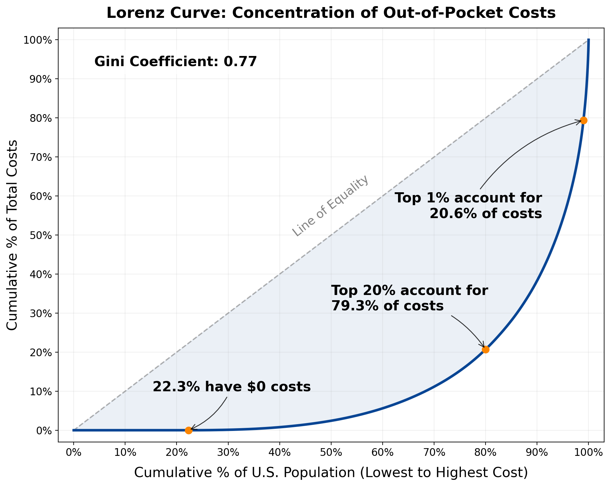
**Key Insights:**
- **Target Variable:** Identified a zero-inflated (22.3%) and extremely right-skewed distribution where the top 20% of spenders drive 79.3% of costs (see Lorenz curve above).
- **Survey Weights:** Verified survey weights represent ~260M adults and confirmed weighting is essential for population-level representativeness.
- **Numerical Features:** Visualized distribution of age, family size, and self-reported health, informing robust median-based imputation for right-skewed and discrete features. [🔗 **See Histograms**](#numerical-distributions)
- **Categorical Features:** Revealed 66% hold private insurance, suggesting costs will be driven by plan-specific cost-sharing. Identified oversampling of healthy and low socio-economic status individuals, confirming the importance of survey weights. [🔗 **See Bar Plots**](#categorical-distributions)
- **Binary Features:** Identified high prevalence of joint pain (45%), high blood pressure (32%), and high cholesterol (31%), while severe conditions such as cancer (11%), coronary heart disease (5%), and stroke (4%) are more sparse. [🔗 **See Bar Plots**](#binary-distributions)

<a id="main-relationships"></a>**Relationships (Bivariate EDA)** 
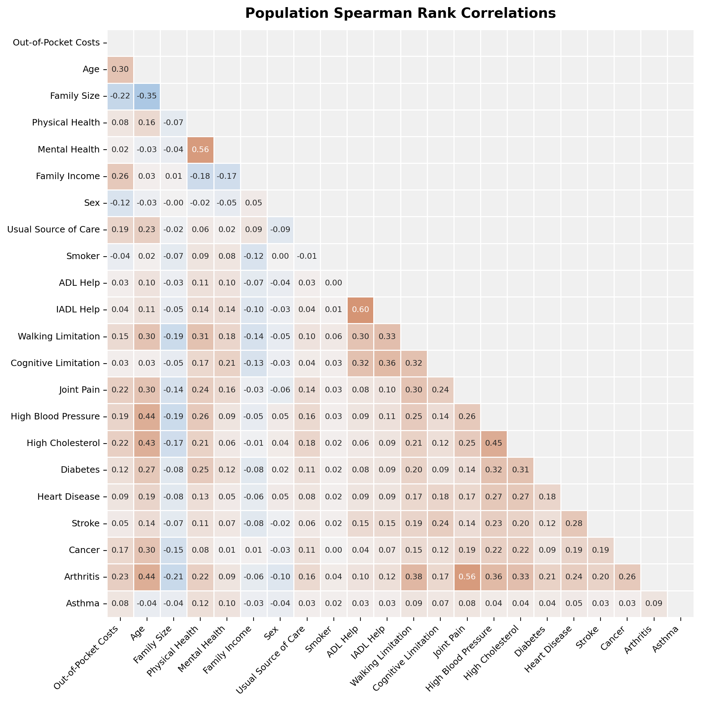
**Key Insights:**
- **Correlations:** Spearman rank correlations (see heatmap above) revealed age (0.30) and family income (0.26) as primary cost correlates, alongside arthritis, high cholesterol, and joint pain (~0.22).
- **Numerical Features vs. Target:** Visualized feature-target relationships, revealing age as the strongest numerical correlate of costs and a negative relationship with family size. [🔗 **See Scatter Plots**](#numerical-feature-target-relationships)
- **Categorical Features vs. Target:** People with higher income, higher education, or private insurance generally had higher out-of-pocket spending. [🔗 **See Grouped Box Plots**](#categorical-feature-target-relationships)
- **Binary Features vs. Target:** Arthritis was common and showed a stronger overall correlation with costs, while cancer was less common but showed a larger difference in median spending. Women and people with a usual source of care also had higher median spending. [🔗 **See Grouped Box Plots**](#binary-feature-target-relationships)

<a id="main-outliers"></a>**Data Quality & Outliers**
- **Duplicates**: Verified the absence of duplicate records based on the ID column, complete rows, and all columns except ID.
- **Outliers**: Detected univariate outliers using the 3-standard-deviation and 1.5×IQR methods, and multivariate outliers using isolation forest (5% contamination). Profiled outliers by comparing out-of-pocket costs and feature distributions between inliers and outliers. Outliers generally had more medical conditions, functional limitations, and higher costs. All were retained to preserve this variation rather than remove potentially valid high-cost cases. [🔗 **See Outlier Analysis Details**](#outlier-analysis-details)

**Modeling Strategy**  
The zero-inflated, heavy-tailed cost distribution motivated log-transforming the target to reduce the influence of extreme costs. MdAE was chosen as the primary evaluation metric to focus on typical prediction error. Where supported, absolute-error training objectives targeted median costs and were less sensitive to extreme errors than squared-error objectives. Polynomial features allowed Elastic Net to capture nonlinear relationships and feature interactions. Survey weights were used during training and evaluation.


## 🧹 Data Preprocessing
Preprocessing logic was prototyped in the [EDA/preprocessing notebook](notebooks/1_eda_and_preprocessing.ipynb) and moved to a dedicated [preprocessing script](scripts/preprocess.py) for automated runs. [DVC](https://dvc.org/) tracks this stage for reproducible reruns.

**Data Preparation Workflow**  
The preprocessing workflow converts raw survey data into datasets for model training and evaluation and saves the fitted preprocessor for reuse during prediction.

**Step 1: Data Preparation** (via `scripts/preprocess.py`)  
This stage converts the raw MEPS data to the clean format expected by the preprocessing pipeline. These steps are primarily for data cleaning and population filtering:
- **Data Loading:** Imports the MEPS-HC 2023 SAS data as a pandas DataFrame.
- **Variable Selection:** Filters 29 essential columns (target variable, candidate features, ID, survey weights) from the original 1,374 columns.
- **Target Population Filtering:** Filters rows for adults with positive survey weights (14,768 out of 18,919 respondents).
- **Data Type Handling:** Converts ID to string and sets as index.
- **Missing Value Standardization:** Recovers missing values from survey skip patterns and converts MEPS-specific missing codes to `np.nan`.
- **Binary Feature Standardization:** Standardizes binary features to 0/1 encoding.
- **Stateless Feature Engineering:** Collapses sparse marital and employment categories into stable groups (e.g., recently divorced → divorced), while recording recent transitions in a separate life transition feature.
- **Train-Validation-Test Split:** Splits data into training (80%), validation (10%), and test (10%) sets using a distribution-informed stratified split to balance zero-inflation and the extreme tail of the target variable.

**Step 2: Preprocessing Pipeline** (via `src/pipeline.py`)  
The preprocessing script fits a scikit-learn pipeline on the training set and applies it to all three splits. The same fitted pipeline will preprocess user inputs during prediction, keeping transformations at inference consistent with training.

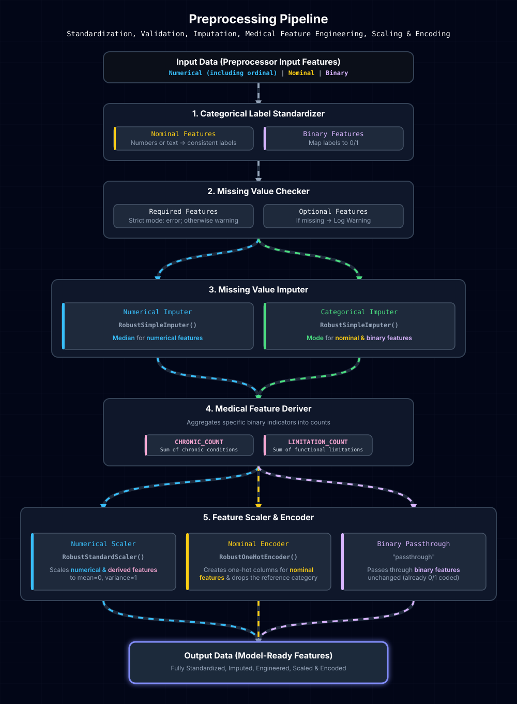

- **Standardization:** Normalizes categorical inputs. Accepts both numeric codes (e.g. 0/1) and string labels (e.g. no/yes). 
- **Validation & Imputation:** Checks for missing required inputs and fills missing values with medians for numerical features and modes for categorical features.
- **Medical Feature Derivation:** Calculates aggregate chronic condition and functional limitation counts to capture health burden.
- **Scaling & Encoding:** Standardizes numerical features and one-hot encodes nominal features, leaving binary features unchanged.


**Step 3: Data Persistence** (via `scripts/preprocess.py`)  
After checking row counts, unique IDs, and the absence of missing, infinite, or constant values in model-ready features, the script saves separate Parquet files for each training, validation, and test split:

- **Preprocessor Input Datasets:** The 27 cleaned input features before pipeline transformations, used for SHAP explanations and other analyses.
- **Model-Ready Datasets:** The transformed features used for model training and evaluation.

Both versions include the target and survey weights, with respondent IDs preserved as the index. The fitted preprocessing pipeline is saved separately for reuse during prediction.


<p align="right">(<a href="#readme-top">Back to Top</a>)</p>


## 🧠 Modeling
Dedicated [**scripts**](scripts/) run model training, tuning, and benchmarks, saving fitted models and results for later analysis. **DVC** tracks the preprocessing, baseline model and final model training stages for reproducible reruns. **MLflow** records runs so their parameters and results can be reviewed and compared. The [**modeling notebook**](notebooks/2_modeling.ipynb) loads those saved outputs for evaluation, visualizations, and documenting decisions.

Survey-weighted median absolute error (MdAE) is the primary evaluation metric because it reflects typical prediction error without letting rare, extreme costs dominate. Mean absolute error (MAE) and R² serve as supporting diagnostics because they are more sensitive to outliers in this heavy-tailed distribution.

### 📏 Baseline Models  
Evaluated a diverse set of baseline model architectures to identify candidates for hyperparameter tuning.

| Model | MdAE | Overfitting | MAE | R² |
| :--- | :--- | :--- | :--- | :--- |
| **Elastic Net** | **$163** | +6.6% | $1,044 | -0.12 |
| Linear Regression | $219 | +4.8% | $998 | -0.06 |
| Random Forest | $232 | +9.6% | **$958** | -0.04 |
| *Median (Benchmark)* | *$248* | *0.0%* | *$1,041* | *-0.10* |
| Decision Tree | $271 | **+1.5%** | $971 | -0.03 |
| XGBoost | $281 | +98.0% | $961 | 0.00 |
| Support Vector Machine | $291 | +190.7% | $1,027 | -0.03 |
| *LLM (Benchmark)* | *$518* | *N/A* | *$1,168* | **0.04** |

<sub>*Note:* Survey-weighted validation metrics. Overfitting is the percentage change in MdAE from training to validation.</sub>

**Key Insights:**  
- **Baseline Champion:** Elastic Net achieved the best median accuracy ($163 MdAE) with minimal overfitting (+6.6%).
- **Overfitting:** XGBoost and SVM exhibited extreme overfitting (+98% to +191%) out-of-the-box. Their configurations did not generalize well, motivating stronger regularization during tuning.
- **LLM Benchmark:** Compared performance of specialized ML models against a general intelligence LLM ("Why not just ask Gemini?"). Every specialist model showed better predictive performance than the general-purpose LLM (Gemini 3 Flash), with Elastic Net reducing MdAE from $518 to $163, a 3.2x improvement. This demonstrates added value of specialist ML models. 🔗 [**See LLM Benchmarking Details**](#llm-benchmarking-details)
- **Typical vs. Large Errors:** For most models, MdAE is near $200 but MAE is near $1,000, showing that some predictions miss by far more than the typical one. R² is near zero or negative across all models, partly because it heavily penalizes misses on rare, high-cost outliers in this heavy-tailed distribution.

**Selected Finalists:**  
1. **Elastic Net:** The baseline champion.
2. **XGBoost:** A promising candidate that can capture nonlinear feature interactions, though its large overfitting gap makes regularization a priority during tuning.
3. **Random Forest:** The lowest validation MAE among the baselines, with less overfitting than XGBoost.

<p align="right">(<a href="#readme-top">Back to Top</a>)</p>


### 🎛️ Hyperparameter Tuning  
Conducted hyperparameter optimization for the three selected finalists using a custom randomized search framework with 50 iterations per model, tracked via MLflow.

**Tuning Methodology**  
- **Search Strategy:** Manual loop with `ParameterSampler` (instead of `RandomizedSearchCV`) to ensure correct `sample_weight` routing through nested `TransformedTargetRegressor` and `Pipeline` wrappers.
- **Target Transform:** All models were trained on `log1p`-transformed costs via `TransformedTargetRegressor`, stabilizing the heavy-tailed distribution while predicting in raw dollars.
- **Scoring:** Selected each model's best configuration by the lowest weighted MdAE on the validation set.
- **Model-Specific Configurations:**
  - **Elastic Net:** `Pipeline` with second-degree `PolynomialFeatures` + `ElasticNet`. Tuned `alpha` (regularization strength, log-uniform 0.01–1.0), `l1_ratio` (L1/L2 penalty mix, uniform 0.0–1.0), and `interaction_only` (squared terms on/off).
  - **Random Forest:** `RandomForestRegressor` with `criterion="absolute_error"`. Tuned `n_estimators` (200–400), `max_depth` (8–25), `min_samples_split` (20–150), `min_samples_leaf` (10–80), `max_features` (sqrt/log2/30%–70%), and `max_samples` (60%–100%).
  - **XGBoost:** `XGBRegressor` with `objective="reg:absoluteerror"`. Tuned `n_estimators` (400–800), `max_depth` (3–10), `learning_rate` (log-uniform 0.01–0.2), `min_child_weight` (1–20), `subsample` (60%–100%), `colsample_bytree` (50%–100%), and L1/L2 penalties `reg_alpha`/`reg_lambda` (uniform 0–5).

| Model | MdAE | Overfitting | MAE | R² |
| :--- | :---: | :---: | :---: | :---: |
| *Median (Benchmark)* | *$248* | *0.0%* | *$1,041* | *-0.10* |
| *LLM (Benchmark)* | *$518* | *N/A* | *$1,168* | **0.04** |
| Elastic Net (Baseline) | $163 | +6.6% | $1,044 | -0.12 |
| **Elastic Net (Tuned)** | **$159** | +7.9% | $1,051 | -0.13 |
| Random Forest (Baseline) | $232 | +9.6% | $958 | -0.04 |
| Random Forest (Tuned) | $228 | **+3.8%** | $964 | -0.05 |
| XGBoost (Baseline) | $281 | +98.0% | $961 | 0.00 |
| XGBoost (Tuned) | $242 | +6.2% | **$954** | -0.02 |

<sub>*Note:* Survey-weighted validation metrics. Overfitting is the percentage change in MdAE from training to validation.</sub>

**Key Insights:**
- **Tuned Champion:** Elastic Net remains the overall leader in median accuracy ($159 MdAE), confirming that regularized linear models are extremely competitive for typical cost profiles.
- **Overfitting:** Tuning successfully brought the generalization gap below 10% for all three models. It lowered XGBoost's validation MdAE from $281 to $242 while narrowing its training–validation gap from +98.0% to +6.2%. 
- **Heteroscedasticity:** All models exhibit "fan-shaped" error spread. While Elastic Net is the median accuracy leader, its limited prediction range ($217 max) prevents differentiating high spenders. Tree models produce a wider range of cost estimates that generally align with typical actual costs, though they still underestimate some very expensive years. 🔗 [**See Heteroscedasticity Analysis**](#tuned-models-heteroscedasticity)

<a id="main-fairness-audit"></a>**Model Reliability & Fairness**  
To ensure responsible deployment, evaluated model reliability and fairness across subgroups using stratified error analysis (weighted MdAE) for all tuned models across 13 dimensions. The analysis included both protected demographic groups (e.g., sex, age, race/ethnicity) and vulnerable groups (e.g., mental health, family income, education levels).
- **Reliability:** While Elastic Net performs best overall and excels in low-complexity segments, tree-based models (XGB/RF) perform better in high-complexity segments (uninsured, poor physical health, 4+ chronic conditions), reducing prediction error by ~50% compared to Elastic Net for these populations.
- **Fairness:** All tuned models show similar subgroup error patterns across protected and vulnerable groups. This suggests the main disparities are driven by healthcare cost variance, utilization patterns (e.g., reproductive care, age-related complexity), and feature limits rather than one model architecture introducing a distinct algorithmic bias. Furthermore, the models actually perform better for several marginalized groups (e.g., Hispanic, Black, low income, low education). 

🔗 **[See Detailed Reliability & Fairness Analysis](#tuned-models-reliability--fairness)**

<p align="right">(<a href="#readme-top">Back to Top</a>)</p>

### 🏆 Final Model
Despite tuning, a model that provides a single estimate cannot convey how widely next year's out-of-pocket costs may vary. The final model therefore uses quantile regression to give users a typical range and safety cushion alongside the plan-around estimate, helping them prepare for higher-cost years.

**Decision:** Use **XGBoost Quantile Regression** as the final model for the MVP product release.

**Why XGBoost Quantile Regression?**  
While the tuned Elastic Net achieves the best point-estimate MdAE, heteroscedasticity analysis as well as subgroup reliability and fairness analysis revealed that Elastic Net's compressed prediction range ($217 max) offers little separation between people with lower and higher out-of-pocket costs, and all point-estimate models systematically underpredict extreme costs. Rather than selecting a single "best" point-estimate model, the final architecture shifts to multi-quantile prediction to communicate cost uncertainty directly to users.

**Model Architecture**  
The final model reuses the hyperparameters from the best tuned XGBoost point-estimate model, switching only the objective from `reg:absoluteerror` to `reg:quantileerror` with four quantile levels (`q25`, `q50`, `q75`, `q90`). Predictions are postprocessed to enforce non-negativity and monotonicity (`q25 ≤ q50 ≤ q75 ≤ q90`).

**User-Facing Outputs:**
- **Plan-around estimate** (`q50`): The median prediction (what users should budget for).
- **Typical range** (`q25`–`q75`): The interquartile range (how much costs typically vary).
- **Safety cushion** (`q90`): The 90th percentile (a conservative upper bound to help budget for a bad year).

**Release Gate Metrics (Test)**  
Release gates are the minimum test-set performance needed to launch. Product targets are more ambitious goals for how well model predictions support budgeting. Unlike the earlier point-estimate metrics, they assess not only plan-around error (MdAE) but also whether the typical range and safety cushion cover the intended share of actual costs without being too wide.

| Metric | Estimate (95% CI) | Release Gate | Product Target | Status |
| :--- | ---: | ---: | ---: | :---: |
| Plan-around MdAE (`q50`) | $240 [$215, $279] | < $500 | < $350 | Pass |
| Typical-range coverage (`q25`-`q75`) | 47.3% [44.0%, 50.6%] | 45%-55% | 50% | Pass |
| Safety-cushion coverage (`q90`) | 91.0% [89.2%, 92.6%] | 85%-95% | 90% | Pass |
| Typical-range width (`q25`-`q75`) | $912 [$875, $955] | < $1,500 | < $1,000 | Pass |
| Safety-cushion width (`q50`-`q90`) | $2,032 [$1,964, $2,108] | < $3,500 | < $2,500 | Pass |

**Launch Decision**
- **Decision:** Launch XGBoost quantile regression as the MVP model. It passes every release gate on the test set. Plan-around estimates are within $240 of actual costs for about half of the test population.
- **Value Over Simple Baselines:** The comparison tests XGBoost against giving everyone the same population-based plan-around estimate, typical range, and safety cushion, and against giving each person those estimates based only on their age group. XGBoost improves on both, most clearly for the typical range and safety cushion (versus the population baseline: q50 quantile skill 9.8%, typical-range interval skill 11.2%, and q90 quantile skill 15.6%).
- **Reliability & Fairness Audit:** The final subgroup audit supports launch. Predicted-risk tiers remain usable and there is no broad demographic fairness failure. The main limitation is rare actual tail spending that is only visible after the year is observed. Typical-range undercoverage appears for uninsured users, users with a doctorate degree, poor mental health, and low income.<br>🔗 [**See Final Model Reliability & Fairness Audit**](#xgboost-quantile-regression-reliability--fairness)
- **Launch Conditions:** Include prediction explanations, medical inflation adjustment, a scope disclaimer, planning notices for higher-uncertainty cases (such as high predicted costs or uninsured users, as in the example below), and privacy-preserving aggregate monitoring. Show the median cost for U.S. adults and for the user's age group alongside their plan-around estimate, so users can see how it compares with typical spending.

**Prediction Explanations (SHAP)**  
SHAP explains how a user's answers contribute to their plan-around estimate (`q50`). The planned app will highlight the five largest contributions and show their dollar amounts, so users can see which answers moved the estimate up or down. 🔗 [**See SHAP Explanation Details**](#shap-explanation-details)

**Example Prediction Output**  
High cost profile: 68-year-old, uninsured, multiple chronic conditions
>
> **Your Estimated Out-of-Pocket Costs for Next Year**
>
> - 💰 **Plan around:** $1,350
> - 📊 **Typical range:** $520-$2,400
> - 🛡️ **Safety cushion:** budget up to $5,200
>
> Use the plan-around number as a reasonable midpoint for budgeting. The typical range shows where about half of people with similar profiles fall. The safety cushion gives extra room for a higher-cost year.
>
> **Planning note**  
> Costs for profiles like yours can vary a lot from year to year. This estimate falls in a higher-cost range, and because you are uninsured, out-of-pocket costs can be harder to predict. The plan-around amount and typical range are useful starting points, but for budgeting decisions, plan closer to the safety cushion.
>
> <details>
> <summary><strong>Which answers shaped your estimate?</strong> <i>(click to expand)</i></summary>
> <p>These answers made the largest contributions to your plan-around estimate:</p>
> <table>
> <thead><tr><th>Your answer</th><th align="right">Contribution</th></tr></thead>
> <tbody>
> <tr><td><strong>Age:</strong> 68</td><td align="right">↑ +$480</td></tr>
> <tr><td><strong>Diabetes:</strong> Yes</td><td align="right">↑ +$370</td></tr>
> <tr><td><strong>Insurance:</strong> Uninsured</td><td align="right">↑ +$310</td></tr>
> <tr><td><strong>High blood pressure:</strong> Yes</td><td align="right">↑ +$180</td></tr>
> <tr><td><strong>Physical health:</strong> Good</td><td align="right">↓ −$90</td></tr>
> </tbody>
> </table>
> </details>
>
> <details>
> <summary><strong>How you compare to others</strong> <i>(click to expand)</i></summary>
> <table>
> <tbody>
> <tr><td>Your plan-around estimate</td><td align="right">$1,350</td></tr>
> <tr><td>Typical American</td><td align="right">$268</td></tr>
> <tr><td>Typical for ages 65+</td><td align="right">$657</td></tr>
> </tbody>
> </table>
> </details>
> <br>
>
> **About this estimate**  
> This is a planning estimate, not a bill estimate. It is based on 2023 national survey data and adjusted to current dollars. It does not include premiums, over-the-counter costs, family totals, or procedure prices. New diagnoses, accidents, hospitalizations, and plan-specific billing details can make actual costs higher.

**Medical Inflation Adjustment**  
The planned app will adjust all user-facing dollar amounts (plan-around estimate, typical range, safety cushion, national and age-group benchmarks, SHAP dollar impacts) from 2023 to current dollars using a medical inflation factor. The [medical inflation update script](scripts/update_medical_inflation.py) calculates and saves the factor from the [U.S. Bureau of Labor Statistics Medical Care Consumer Price Index](https://data.bls.gov/timeseries/CUUR0000SAM), which tracks changes in medical care prices over time.

<p align="right">(<a href="#readme-top">Back to Top</a>)</p>


### 🔎 Feature Importance
SHAP shows how the model's 27 preprocessor input features contribute to its plan-around (`q50`) estimates. These contributions explain the model's estimates, not actual costs, and should not be interpreted causally. They do not cover the typical range (`q25`–`q75`) or safety cushion (`q90`).

**Overall Importance**
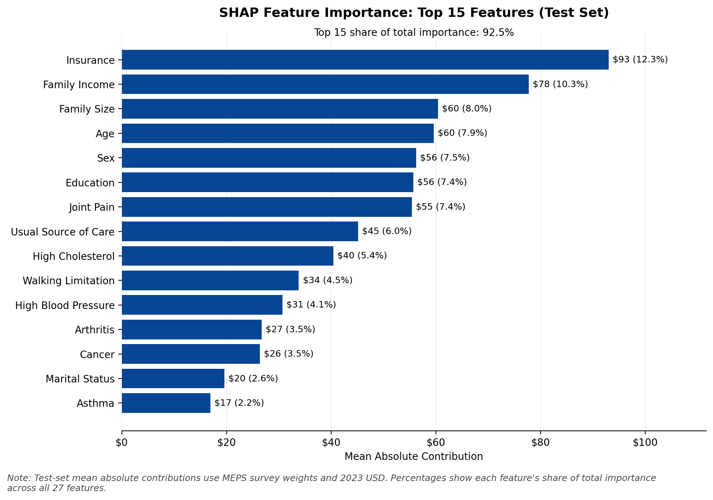
The plot ranks features by the average size of their SHAP contributions, regardless of direction. Insurance’s $93 means its contribution to plan-around estimates averaged $93 in size, moving estimates up for some people and down for others. Family Income follows at $78, and the top 15 features account for 92.5% of total importance.

**Contribution Distributions**
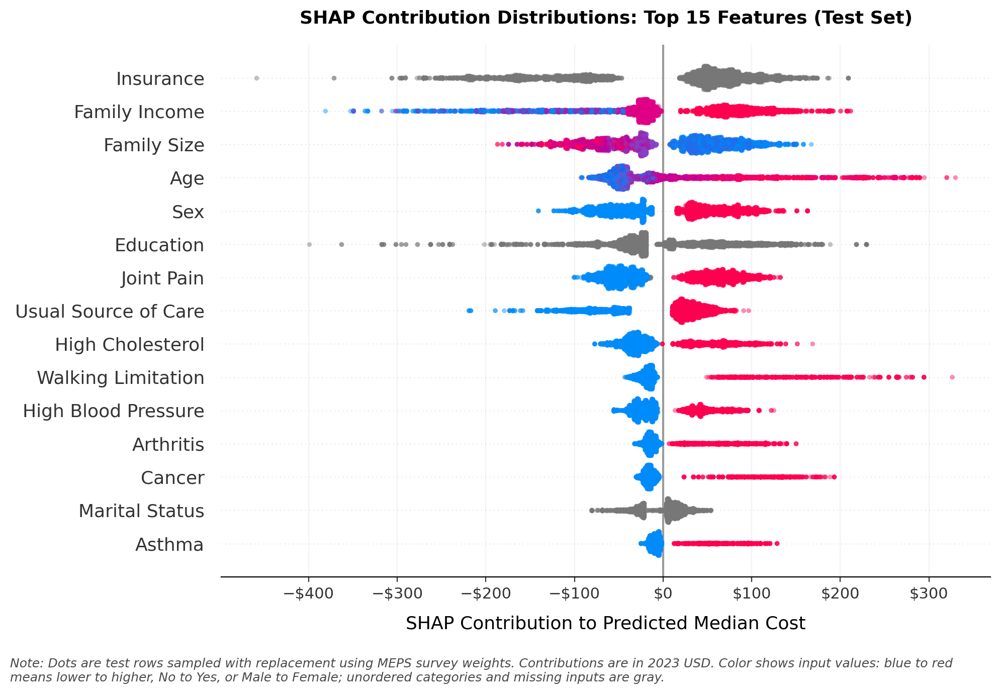
The beeswarm plot shows whether each feature moves the plan-around estimate up or down and how much that varies between people. Older age, higher family income, and medical conditions or limitations generally move estimates up; younger age, lower income, and the absence of medical conditions or limitations generally move them down. Insurance and Education show large contributions in both directions, but the plot does not show which categories move estimates up or down.

The appendix zooms in on [contributions by category](#shap-contributions-by-category) and [contributions across ordered values](#shap-contributions-across-ordered-values), then uses [XGBoost native feature importance](#xgboost-native-feature-importance) to show which features the model relied on most during training.

<p align="right">(<a href="#readme-top">Back to Top</a>)</p>


## 📂 Project Structure
```text
├── notebooks/                         # Jupyter notebooks 
│   ├── 1_eda_and_preprocessing.ipynb  # EDA, preprocessing, and pipeline development
│   ├── 1_eda_and_preprocessing.py     # Script version (generated via Jupytext)
│   ├── 2_modeling.ipynb               # Model evaluation, tuning results, and explainability
│   └── 2_modeling.py                  # Script version (generated via Jupytext)
│
├── scripts/                           # Data preparation, model training, evaluation, and app artifact generation
│   ├── preprocess.py                  # Data preparation and preprocessing
│   ├── train_baseline.py              # Baseline model training
│   ├── tune_elastic_net.py            # Hyperparameter tuning for Elastic Net
│   ├── tune_random_forest.py          # Hyperparameter tuning for Random Forest
│   ├── tune_xgboost.py                # Hyperparameter tuning for XGBoost
│   ├── train_xgboost_quantile.py      # Quantile model training
│   ├── benchmark_llm.py               # LLM prediction benchmark
│   ├── benchmark_shap.py              # SHAP configuration and latency benchmark
│   ├── audit_shap_feature_importance.py  # SHAP feature importance audit
│   ├── build_app_artifacts.py         # Generate cost benchmarks and prediction metadata
│   └── update_medical_inflation.py    # Update the medical inflation artifact
│
├── src/                               # Shared project modules
│   ├── constants.py                   # Feature lists
│   ├── data.py                        # Shared data-loading helpers
│   ├── display.py                     # Notebook and UI display labels/styles
│   ├── explainability.py              # SHAP explanation functions
│   ├── modeling.py                    # Core model training and evaluation functions
│   ├── params.py                      # Hyperparameter search configuration
│   ├── pipeline.py                    # Preprocessing pipeline
│   ├── prediction.py                  # Core quantile model inference
│   ├── stats.py                       # Weighted statistics and stratification helpers
│   └── transformers.py                # Custom scikit-learn transformers
│
├── app/                               # App data artifacts; web application planned
│   └── data/
│       ├── cost_benchmarks.json       # Cost comparison for app users
│       ├── medical_inflation.json     # Medical-cost inflation adjustment
│       ├── prediction_metadata.json   # Prediction warning cutoff
│       ├── shap_background.joblib     # SHAP background data
│       └── shap_metadata.json         # SHAP configuration and validation results
│
├── models/                            # Model and evaluation artifacts (ignored by Git)
│
├── data/                              # Raw and processed datasets (ignored by Git)
│   └── h251.sas7bdat.dvc              # DVC pointer for MEPS 2023 dataset (SAS V9 format)
│
├── figures/                           # Generated figures
│   ├── eda/                           # Distribution and relationship plots
│   ├── evaluation/                    # Model evaluation plots
│   └── outliers/                      # Outlier analysis plots
│
├── assets/                            # Images and other README assets
│   ├── header.png                     # Header image
│   ├── infographic_healthcare_costs.png  # U.S. healthcare cost explainer
│   ├── infographic_meps_data.jpg      # MEPS data overview infographic
│   └── preprocessing_pipeline.svg     # Preprocessing pipeline diagram
│
├── tests/                             # Unit tests; integration and end-to-end tests planned
│   ├── unit/                          
│   ├── integration/                   
│   └── e2e/                           
│
├── docs/                              # Project documentation and resources
│   ├── references/                    # MEPS documentation, codebook, and data dictionary
│   ├── research/                      # Background research
│   ├── specs/                         # PRD and tech specs
│   │   ├── product_requirements.md
│   │   └── technical_specifications.md
│   ├── git_conventions.md             # Commit message rules
│   └── responsible_ai.md              # Responsible AI assessment
│
├── pyproject.toml                     # Project configuration and dependencies
├── requirements.txt                   # Proxy for production dependencies
├── requirements-train.txt             # Training dependencies
├── requirements-test.txt              # Test dependencies
├── pytest.ini                         # Pytest configuration
├── run_jupyter_lab.sh                 # Launch the training notebook environment
├── run_mlflow_ui.sh                   # Launch the local MLflow UI
├── .env.example                       # Template for environment variables
│
├── .dvc/                              # DVC configuration
├── dvc.yaml                           # Preprocessing and modeling pipeline definitions
├── dvc.lock                           # Hash-based data lineage lockfile
├── .dvcignore                         # Files and directories excluded from DVC
│
├── README.md                          # Project overview
├── AGENTS.md                          # Instructions for AI agents
├── LICENSE                            # MIT License
└── .gitignore                         # Files and directories excluded from version control
```

<p align="right">(<a href="#readme-top">Back to Top</a>)</p>


## ⚙️ Getting Started

### Installation and Setup
This project uses three isolated virtual environments to keep application dependencies lightweight. In all three setups, the project is installed as a local package, ensuring that the `src/` module can be reliably imported from any folder.

**1. Training Environment (`.venv-train`)**
- **Purpose:** Model development (preprocessing, EDA, training, evaluation, tuning).
- **Setup:**
  ```bash
  python -m venv .venv-train
  source .venv-train/bin/activate  # or .venv-train\Scripts\activate on Windows
  pip install -r requirements-train.txt
  ```
- **Import Logic:** This environment uses an **editable install** (`-e .[train]`). Changes you make to `src/` are instantly available in your notebooks without re-installation.

**2. Application Environment (`.venv-app`)**
- **Purpose:** Run and test the web application.
- **Setup:**
  ```bash
  python -m venv .venv-app
  source .venv-app/bin/activate  # or .venv-app\Scripts\activate on Windows
  pip install -r requirements.txt
  ```
- **Import Logic:** This environment installs the project as a **regular package** (`.[app]`). This mirrors the production environment, allowing the app to reliably import from `src/` regardless of where it is launched.

**3. Testing Environment (`.venv-test`)**
- **Purpose:** Web App/API testing using unit, integration, and end-to-end tests with `pytest`.
- **Setup:**
  ```bash
  python -m venv .venv-test
  source .venv-test/bin/activate  # or .venv-test\Scripts\activate on Windows
  pip install -r requirements-test.txt
  ```
- **Import Logic:** This environment uses an **editable install** (`-e .[app,test]`). It combines both the application dependencies and the testing tools, allowing you to run tests against your latest code.

**4. Data Management (DVC)**
- **Purpose:** Version control for local data and reproducibility of preprocessing and modeling.
- **Workflow:**
  - **Run Full Pipeline:** To execute all stages (preprocessing through baseline modeling):
    ```bash
    dvc repro
    ```
  - **Run Specific Stages:**
    - `dvc repro preprocess`: Reproduce only the data preparation, feature engineering, and preprocessing.
    - `dvc repro baseline`: Reproduce baseline model training (will re-run `preprocess` if data or script changed).

#### Production Deployment 
The project is optimized for deployment on Hugging Face. When you connect your repository to Hugging Face Spaces (or any platform using `requirements.txt`), it automatically runs:
```bash
pip install -r requirements.txt
```
Because `requirements.txt` contains `. [app]`, the platform installs the project itself as a package. This ensures your application can always find the `src` module regardless of the working directory.

<p align="right">(<a href="#readme-top">Back to Top</a>)</p>


## ©️ License
This project is licensed under the [MIT License](LICENSE).

<p align="right">(<a href="#readme-top">Back to Top</a>)</p>


## 👏 Credits
This project was made possible with the help of the following resources:
- **Dataset**: [2023 Full Year Consolidated Data File (HC-251)](https://meps.ahrq.gov/data_stats/download_data_files_detail.jsp?cboPufNumber=HC-251) from the [Medical Expenditure Panel Survey (MEPS)](https://meps.ahrq.gov/mepsweb/), provided by the [Agency for Healthcare Research and Quality (AHRQ)](https://www.ahrq.gov/).
- **Medical Inflation Data**: The [U.S. Bureau of Labor Statistics (BLS)](https://www.bls.gov/cpi/) [CPI-U Medical Care series](https://data.bls.gov/timeseries/CUUR0000SAM) (all urban consumers, not seasonally adjusted) provides the data for the medical inflation adjustment.
- **Images**: 
  - Header: The [header image](./assets/header.png) was generated using [GPT Image 1.5](https://openai.com/index/new-chatgpt-images-is-here/) via the [ChatGPT app](https://chatgpt.com/) by OpenAI. 
  - Infographics: The [MEPS data infographic](./assets/infographic_meps_data.jpg) and the [U.S. healthcare costs infographic](./assets/infographic_healthcare_costs.png) were generated using [Gemini 3 Pro Image](https://deepmind.google/models/gemini-image/pro/) via the [Gemini app](https://gemini.google.com/app) by Google.
- **AI Coding Assistant**: [Codex](https://openai.com/codex/) by OpenAI and [Antigravity](https://antigravity.google/) by Google.

<p align="right">(<a href="#readme-top">Back to Top</a>)</p>


<!-- APPENDIX -->
## 📎 Appendix

### Candidate Feature Details
**Feature Selection**  
Candidate features were selected from MEPS-HC 2023 based on the following criteria:
- **Consumer Accessibility:** Users can answer from memory without looking up records, ensuring the model is usable in a consumer-facing app.
- **Beginning-of-Year Data:** To enable the app to be used during Open Enrollment for predicting *upcoming* costs, only variables measured at the beginning of the year (`31` suffix) or stable traits are used to prevent data leakage.
- **Predictive Power:** Features have established significance in healthcare cost literature.

Form completion in under 90 seconds is a soft goal. Feature reduction will be considered only if user testing shows that completing the form takes substantially longer and harms the user experience.

**Candidate Features**
| Label | Variable | Description | Data Type | Value Range |
| :--- | :--- | :--- | :--- | :--- |
| Age | `AGE23X` | Age as of Dec 31, 2023. | Numerical (Int) | 0–85 |
| Sex | `SEX` | Biological sex. | Binary (Int) | 1=Male, 2=Female |
| Region | `REGION23` | Census region. | Nominal (Int) | 1=Northeast, 2=Midwest, 3=South, 4=West |
| Marital Status | `MARRY31X` | Status at beginning of year. | Nominal (Int) | 1=Married, 2=Widowed, 3=Divorced, 4=Separated, 5=Never Married |
| Family Income | `POVCAT23` | Family income relative to poverty line. | Ordinal (Int) | 1=Poor/Negative, 2=Near Poor, 3=Low Income, 4=Middle Income, 5=High Income |
| Family Size | `FAMSZE23` | Number of related persons residing together. | Numerical (Int) | 1–14 |
| Education | `HIDEG` | Highest degree attained. | Ordinal (Int) | 1=No Degree, 2=GED, 3=HS Diploma, 4=Bachelor's, 5=Master's, 6=Doctorate, 7=Other |
| Employment Status | `EMPST31` | Status at beginning of year. | Nominal (Int) | 1=Employed, 2=Job to Return To, 3=Job in Ref Period, 4=Not Employed |
| Insurance | `INSCOV23` | Coverage status. | Nominal (Int) | 1=Any Private, 2=Public Only, 3=Uninsured |
| Usual Source of Care | `HAVEUS42` | Regular doctor or clinic. | Binary (Int) | 1=Yes, 2=No |
| Physical Health | `RTHLTH31` | Self-rated physical health. | Numerical (Int) | 1=Excellent, 2=Very Good, 3=Good, 4=Fair, 5=Poor |
| Mental Health | `MNHLTH31` | Self-rated mental health. | Numerical (Int) | 1=Excellent, 2=Very Good, 3=Good, 4=Fair, 5=Poor |
| Smoker | `ADSMOK42` | Currently smokes cigarettes. | Binary (Int) | 1=Yes, 2=No |
| ADL Help | `ADLHLP31` | Needs help with activities of daily living (personal care, bathing, dressing). | Binary (Int) | 1=Yes, 2=No |
| IADL Help | `IADLHP31` | Needs help with instrumental activities of daily living (paying bills, taking medications, doing laundry). | Binary (Int) | 1=Yes, 2=No |
| Walking Limitation | `WLKLIM31` | Difficulty walking or climbing stairs. | Binary (Int) | 1=Yes, 2=No |
| Cognitive Limitation | `COGLIM31` | Confusion or memory loss. | Binary (Int) | 1=Yes, 2=No |
| Joint Pain | `JTPAIN31_M18` | Pain/stiffness in past year. | Binary (Int) | 1=Yes, 2=No |
| Hypertension | `HIBPDX` | Diagnosed with high blood pressure. | Binary (Int) | 1=Yes, 2=No |
| High Cholesterol | `CHOLDX` | Diagnosed with high cholesterol. | Binary (Int) | 1=Yes, 2=No |
| Diabetes | `DIABDX_M18` | Diagnosed with diabetes. | Binary (Int) | 1=Yes, 2=No |
| Heart Disease | `CHDDX` | Diagnosed with coronary heart disease. | Binary (Int) | 1=Yes, 2=No |
| Stroke | `STRKDX` | Diagnosed with stroke. | Binary (Int) | 1=Yes, 2=No |
| Cancer | `CANCERDX` | Diagnosed with cancer or malignancy. | Binary (Int) | 1=Yes, 2=No |
| Arthritis | `ARTHDX` | Diagnosed with arthritis. | Binary (Int) | 1=Yes, 2=No |
| Asthma | `ASTHDX` | Diagnosed with asthma. | Binary (Int) | 1=Yes, 2=No |

<p align="right">(<a href="#main-candidate-features">Back to Candidate Features</a> | <a href="#readme-top">Back to Top</a>)</p>


### Distributions
<a id="numerical-distributions"></a>

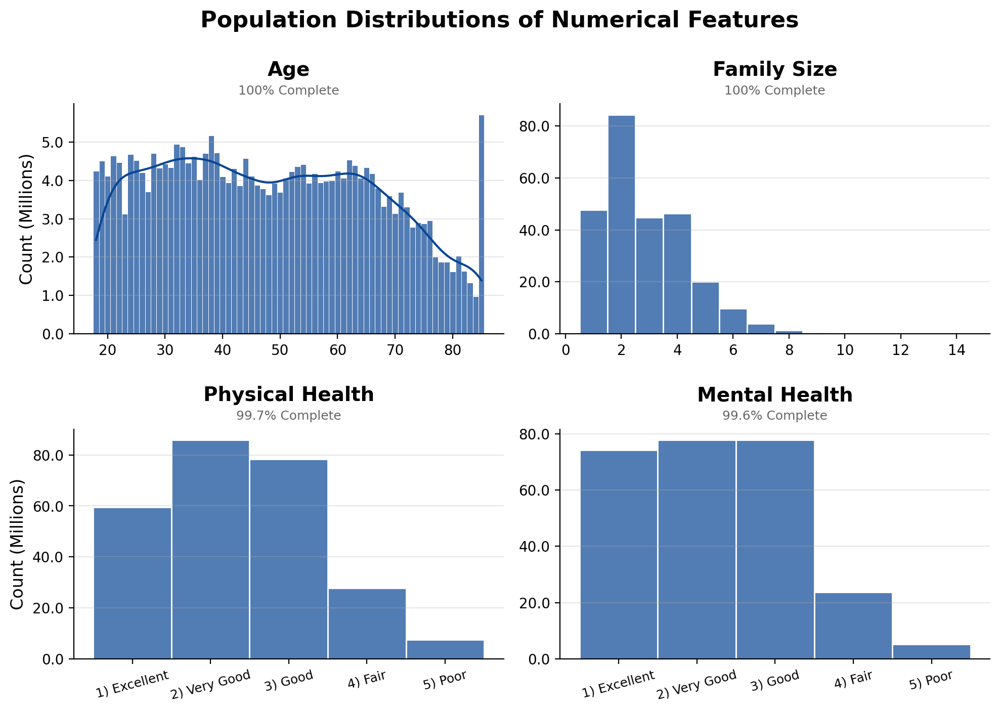

Table of population statistics for all numerical features:
| Feature         | Count       | Mean  | Std   | Min  | 25%  | 50%  | 75%  | Max  |
|-----------------|-------------|-------|-------|------|------|------|------|------|
| Age             | 259,681,066 | 48.32 | 18.54 | 18.0 | 32.0 | 47.0 | 63.0 | 85.0 |
| Family Size     | 259,568,347 | 2.88  | 1.59  | 1.0  | 2.0  | 2.0  | 4.0  | 14.0 |
| Physical Health | 258,917,544 | 2.37  | 1.04  | 1.0  | 2.0  | 2.0  | 3.0  | 5.0  |
| Mental Health   | 258,635,089 | 2.26  | 1.03  | 1.0  | 1.0  | 2.0  | 3.0  | 5.0  |

<p align="right">(<a href="#main-distributions">Back to EDA</a> | <a href="#readme-top">Back to Top</a>)</p>

<a id="categorical-distributions"></a>

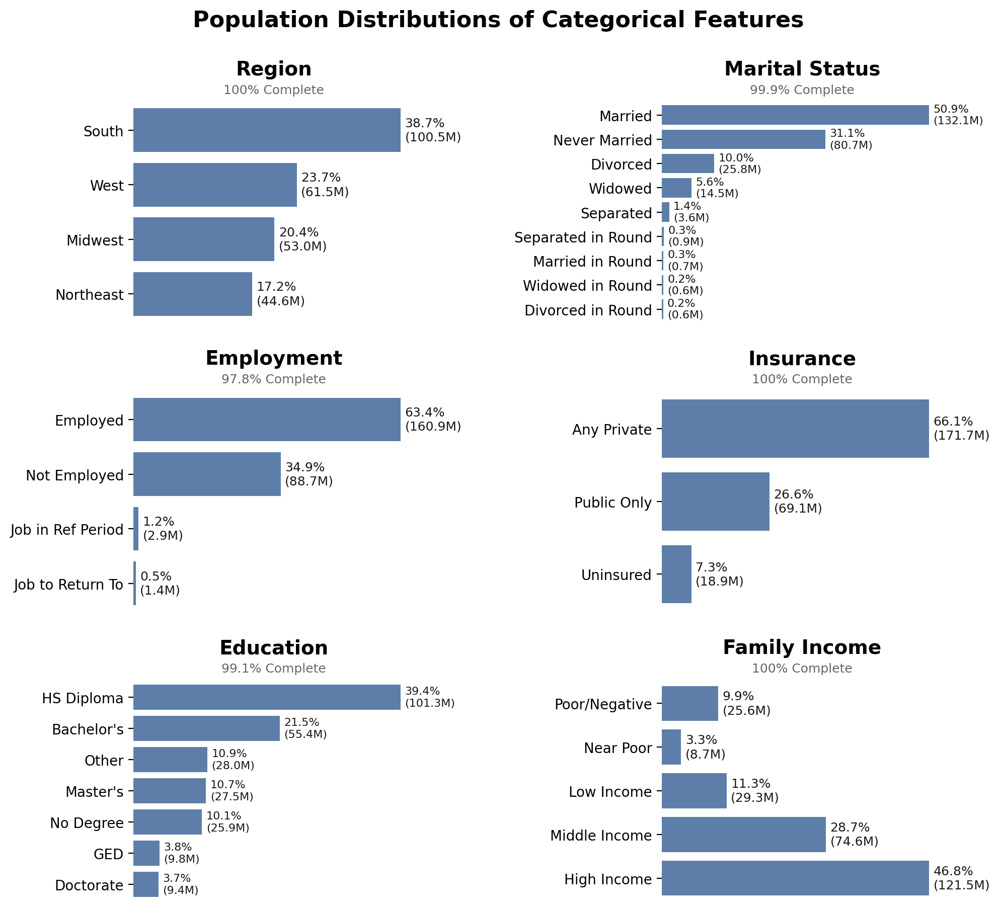
<p align="right">(<a href="#main-distributions">Back to EDA</a> | <a href="#readme-top">Back to Top</a>)</p>

<a id="binary-distributions"></a>

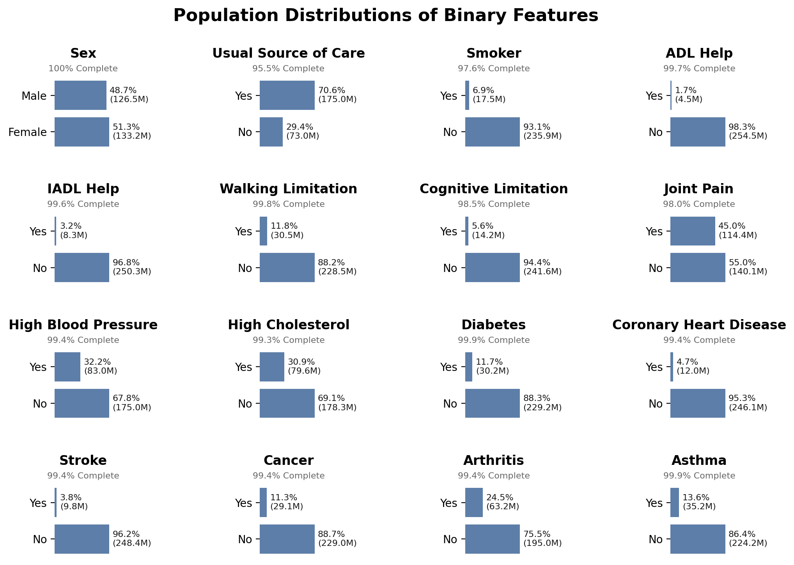
<p align="right">(<a href="#main-distributions">Back to EDA</a> | <a href="#readme-top">Back to Top</a>)</p>


### Feature-Target Relationships
<a id="numerical-feature-target-relationships"></a>

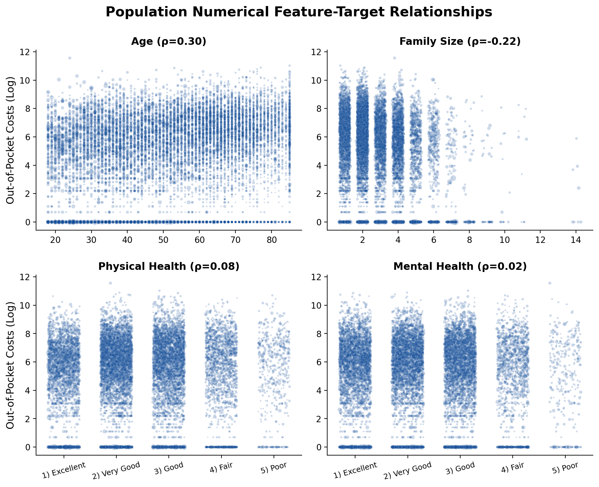
<p align="right">(<a href="#main-relationships">Back to EDA</a> | <a href="#readme-top">Back to Top</a>)</p>

<a id="categorical-feature-target-relationships"></a>

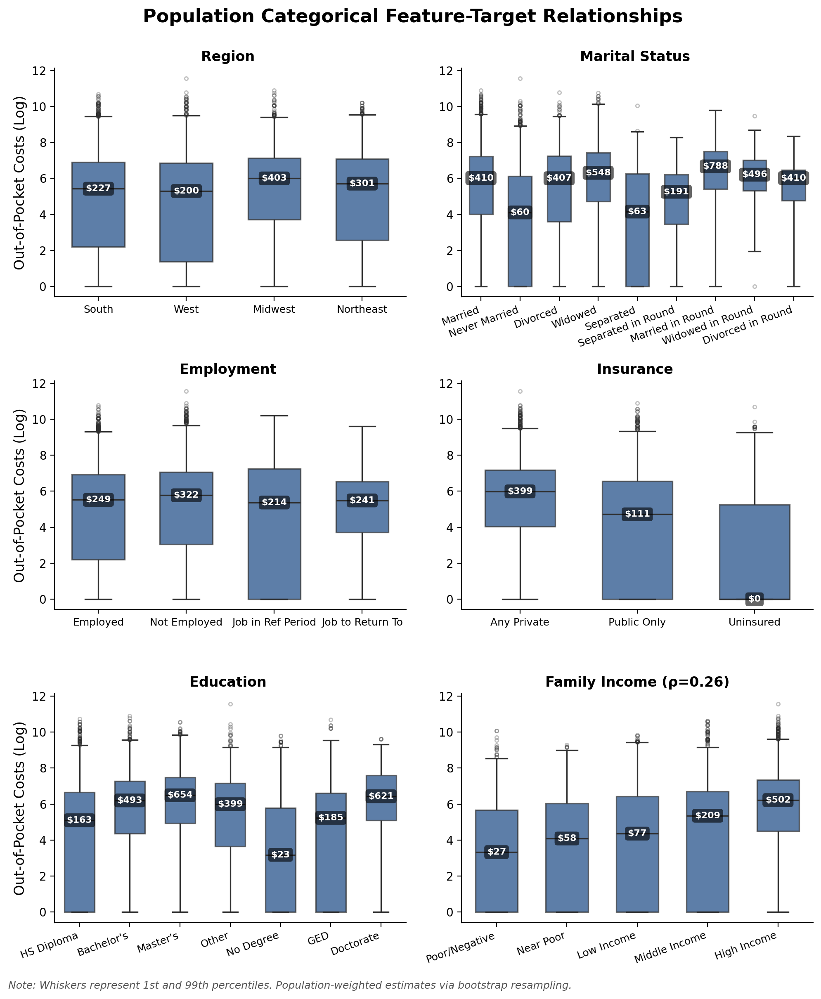
<p align="right">(<a href="#main-relationships">Back to EDA</a> | <a href="#readme-top">Back to Top</a>)</p>

<a id="binary-feature-target-relationships"></a>

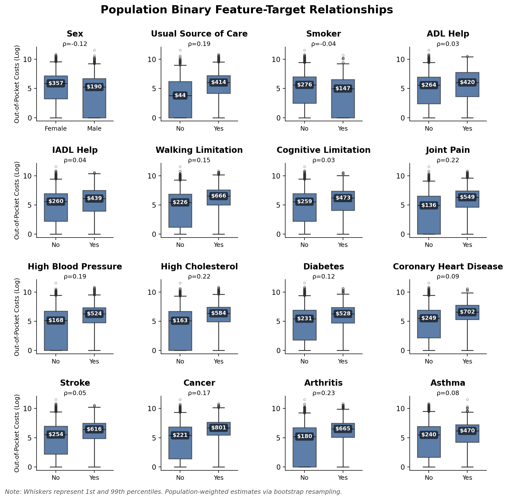
<p align="right">(<a href="#main-relationships">Back to EDA</a> | <a href="#readme-top">Back to Top</a>)</p>


### Outlier Analysis Details
**1. Outlier Detection:** Used an isolation forest (5% contamination) to identify multivariate outliers in the training data.  
**2. Outlier Profiling:** Compared out-of-pocket costs and feature distributions between inliers and outliers.  
**3. Outlier Treatment:** Retained all outliers because their profiles were consistent with potentially valid health needs and costs.

**Cost Concentration**  
Compared with inliers, outliers were 1.2× as likely to have costs at or above the overall median and **3.9× as likely** to be among the top 1% of spenders.

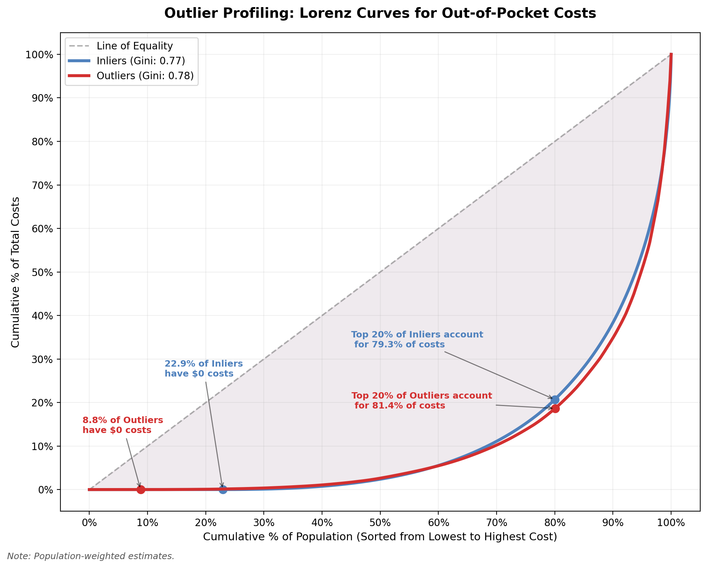
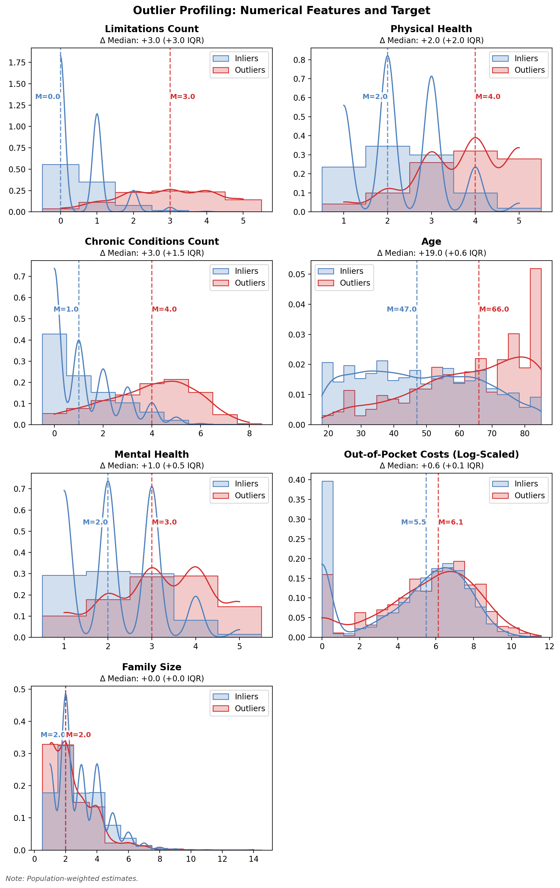
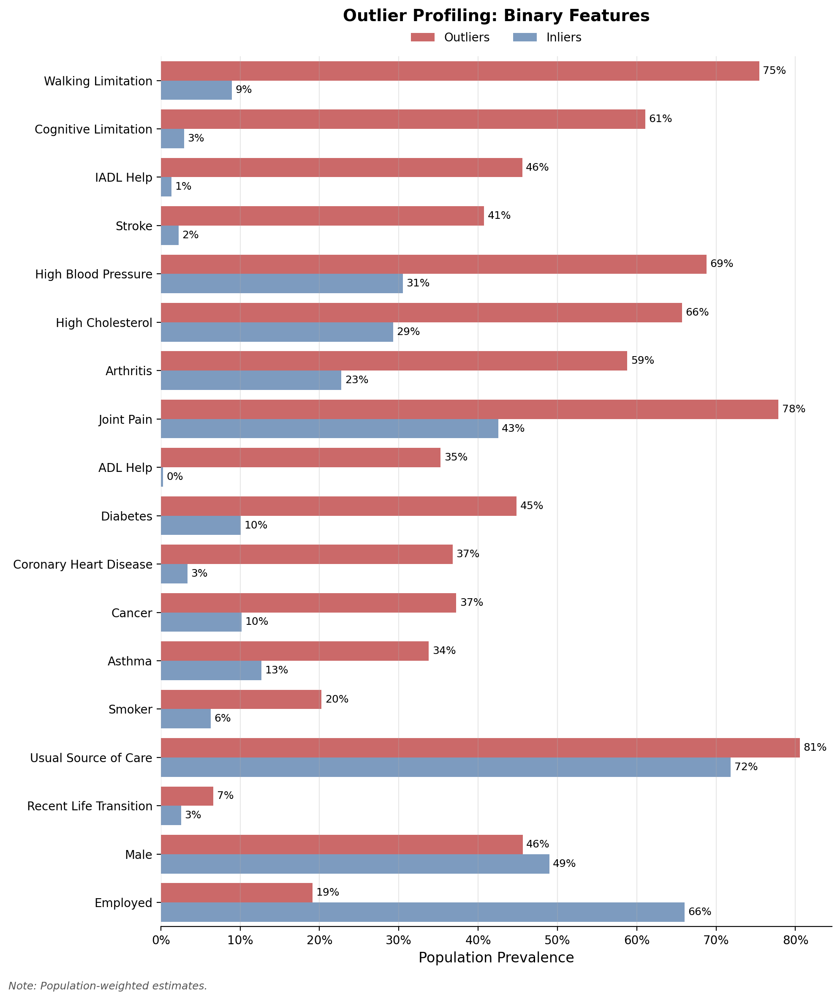
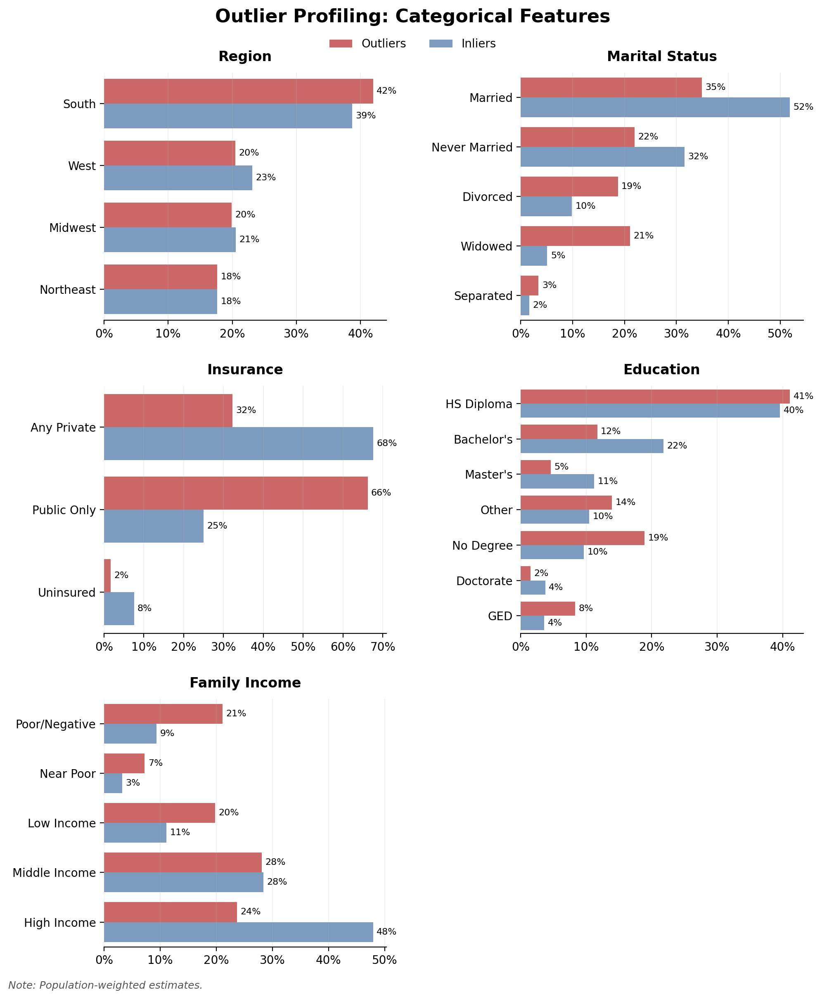

<p align="right">(<a href="#main-outliers">Back to EDA</a> | <a href="#readme-top">Back to Top</a>)</p>


### LLM Benchmarking Details
To ensure a rigorous "High-Bar" benchmark, the LLM (Gemini 3 Flash) was evaluated using the following strategy:
- **System Prompt:** Configured the LLM with a specialized expert persona and precise U.S.-specific medical cost definitions (explicitly distinguishing copays/deductibles from premiums) to evaluate out-of-pocket cost reasoning.
- **Unstructured Feature Profiles:** Translated tabular features into clear, bulleted profiles. To establish a fair baseline, missing values were intentionally omitted rather than imputed, testing the LLM's performance on the same "incomplete" data.
- **Prompt Batching:** Evaluated profiles in batches of 25 per prompt using structured JSON schema validation to ensure absolute metric consistency across the entire validation set (n=1,425).

To reproduce the LLM benchmark:
1. **Configure API Key:** Create a `.env` file in the root directory (refer to [`.env.example`](.env.example)).
2. **Run Script:**
   ```bash
   python scripts/benchmark_llm.py
   ```

<p align="right">(<a href="#-baseline-models">Back to Baseline Models</a> | <a href="#readme-top">Back to Top</a>)</p>


### Tuned Models: Heteroscedasticity
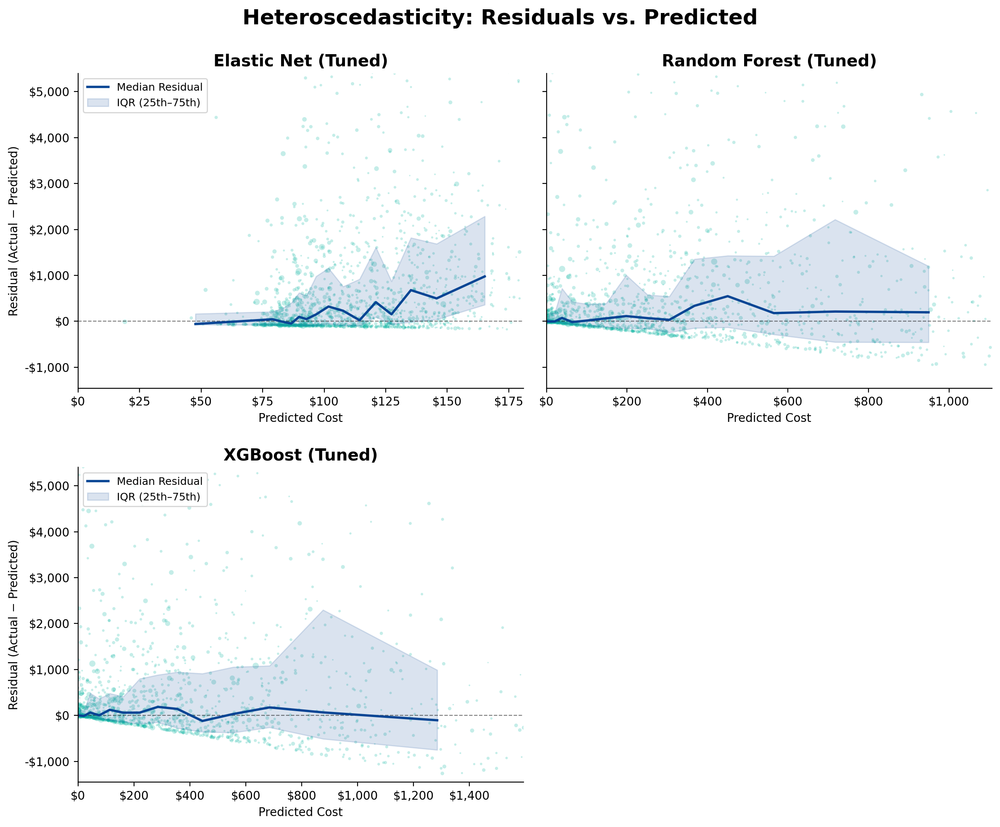
**Key Insights:**
- **Fan-Shaped Errors:** Error spread widens with predicted cost across all models, reflecting the inherent unpredictability of rare, expensive medical events. Residuals skew heavily upward, confirming systematic underprediction of extreme costs.
- **Elastic Net's Limited Range:** With a max prediction of only $217, Elastic Net treats the population as uniformly low-risk; its median residual trends upwards with its predictions, confirming systematic underestimation.
- **XGBoost Differentiates Best:** XGBoost predictions span up to $2,114 (~10× Elastic Net, ~1.7× Random Forest), demonstrating superior separation of low- and high-cost individuals.
- **Tree Model Calibration:** RF and XGBoost maintain near-zero median residuals across most predictions, with an inverted-U uncertainty pattern: the IQR peaks at mid-range, then narrows at the highest predictions, indicating well-calibrated high-cost estimates.

<p align="right">(<a href="#️-hyperparameter-tuning">Back to Hyperparameter Tuning</a> | <a href="#readme-top">Back to Top</a>)</p>


### Tuned Models: Reliability & Fairness
Performed stratified error analysis to evaluate model reliability across subgroups for all three tuned models (Elastic Net, Random Forest, XGBoost) and detect algorithmic bias. The audit uses weighted Median Absolute Error (MdAE) as the primary metric across 13 dimensions.

**Reliability**  
Reliability analysis examines whether models maintain consistent accuracy across subgroups like different cost tiers, health profiles, and insurance types. It identifies populations where one architecture outperforms others.

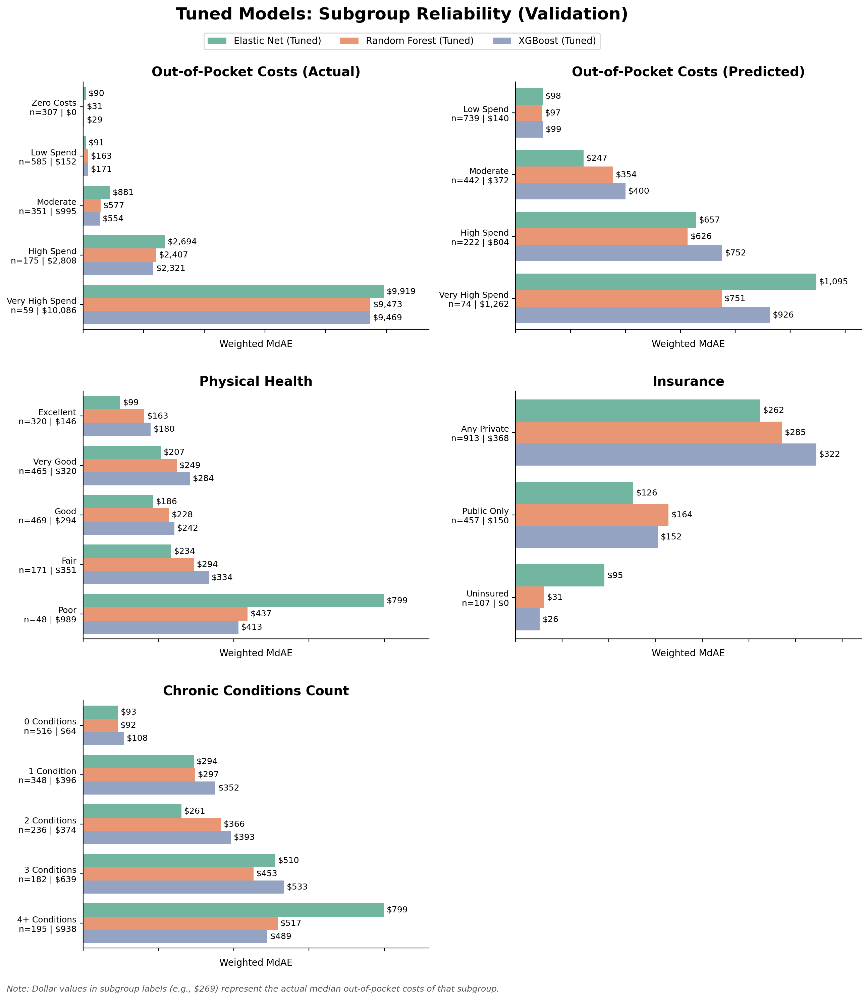
**Key Insights:**
- **Actual Costs:** Models converge at the Top 5% (~$9,500 MdAE), highlighting the data's noise limit. Elastic Net struggles with Zero Costs ($90 vs. ~$30 for tree models) due to linear assumptions.
- **Predicted Costs:** Random Forest is the most precise for "Very High Spend" predictions ($751 MdAE vs. $1,095 for Elastic Net), proving better calibration for high-risk identification.
- **Health & Chronic Conditions:** Error rises with clinical complexity. Tree models plateau around $500 MdAE for 4+ conditions, capturing the "cost saturation effect," while Elastic Net jumps to $799.
- **Insurance:** Elastic Net produces 3–4× the error of tree models for the Uninsured ($95 vs. ~$30), failing to capture near-zero spending constraints.

**Fairness**  
Fairness analysis evaluates whether models produce systematically different prediction errors for protected demographic groups (sex, age, race/ethnicity) and vulnerable populations (family income, education, mental health, walking limitation). The goal is to verify that no model architecture introduces algorithmic bias and that error patterns are driven by data characteristics rather than model algorithm.

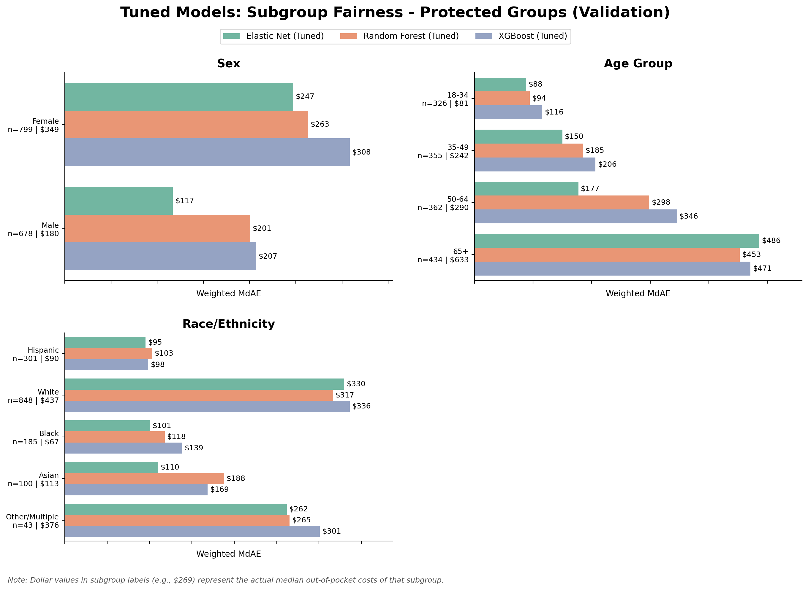
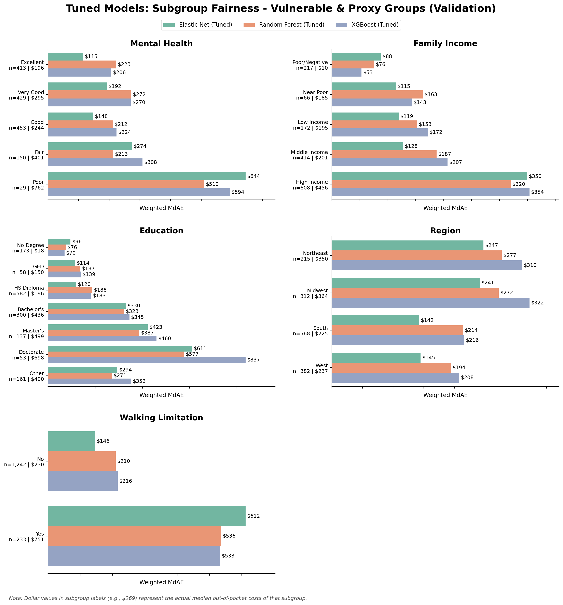
**Key Insights:**
- **Sex:** Consistent Female/Male disparity (~1.5×) across architectures reflects utilization variance (e.g., reproductive care), not algorithmic bias.
- **Age:** Error increases 4–6× for older compared to young adults, reflecting clinical complexity.
- **Race/Ethnicity:** Error is highest for White populations and lower for several minority groups, avoiding disparate impact against minorities.
- **Socioeconomic Status (Family Income/Education):** Models perform better for low compared with high education and family income. This is likely because higher socioeconomic groups have larger spending variance and more complex insurance cost-sharing structures.
- **Walking/Mental Health:** Higher errors for populations with walking limitations and poor mental health. Elastic Net performs better without limitations and for excellent mental health, tree models perform better in case of high clinical complexity.
- **Region:** Smallest disparity dimension, with slightly lower errors in South and West.
- **Cross-Model Pattern:** Similar subgroup error patterns appear across model architectures, which makes a model-specific fairness failure less likely. The models achieve lower prediction error for several marginalized groups. 

<p align="right">(<a href="#main-fairness-audit">Back to Hyperparameter Tuning</a> | <a href="#readme-top">Back to Top</a>)</p>


### XGBoost Quantile Regression: Reliability & Fairness
Extended the stratified error analysis to evaluate the final XGBoost Quantile Regression model on the untouched test set. Unlike the tuned model analysis (which uses point-estimate MdAE), this audit evaluates the quality of **prediction intervals** using coverage and width metrics. The audit checks the **typical range** (`q25`-`q75`) and **safety cushion** (`q90`) across the same reliability and fairness subgroups. Overall coverage uses release gates (45%-55% for the typical range; 85%-95% for the safety cushion), while subgroup review bands are wider diagnostic ranges (40%-60% and 80%-97%) for groups with sufficient sample size (`n >= 30`). Groups outside these bands are flagged for review.

**Reliability**  
Reliability analysis examines test set coverage and interval width across cost tiers, health profiles, and insurance types. It identifies where the model's prediction intervals are too narrow (undercoverage) or too wide (impractical for budgeting).

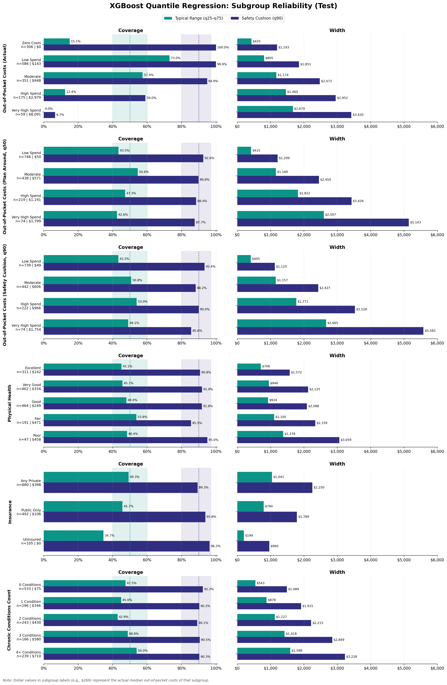
**Key Insights:**
- **Actual Cost Tiers:** Rare high-cost years remain the biggest predictability caveat. Actual High spenders have 12.4% typical-range coverage and 59.0% safety-cushion coverage; actual Very High spenders have 0.0% and 6.7%, respectively. Zero- and low-cost actual groups are heavily overprotected by the safety cushion (100.0% and 99.9%).
- **Predicted Cost Tiers:** Deployable risk tiers behave much better because they are known at prediction time. Predicted plan-around cost tiers keep typical-range coverage inside the subgroup review band (42.6%-54.6%), and predicted safety-cushion tiers keep `q90` coverage inside the review band (85.6%-93.4%).
- **Risk Communication:** Safety-cushion widths increase monotonically with predicted risk, from $1,125 in the predicted `q90` Low tier to $5,582 in the predicted `q90` Very High tier. This supports communicating wider uncertainty bands for higher-risk users.
- **Subgroup Reliability:** Physical health, chronic conditions, private insurance, and public insurance groups remain within subgroup review bands. Uninsured users are the main watchlist group: typical-range coverage is low at 34.7%, while safety-cushion coverage is conservative at 96.3%.

**Fairness**  
Fairness analysis evaluates whether the model's prediction intervals provide equal coverage and practical widths across protected and vulnerable demographic groups on the unseen test set.

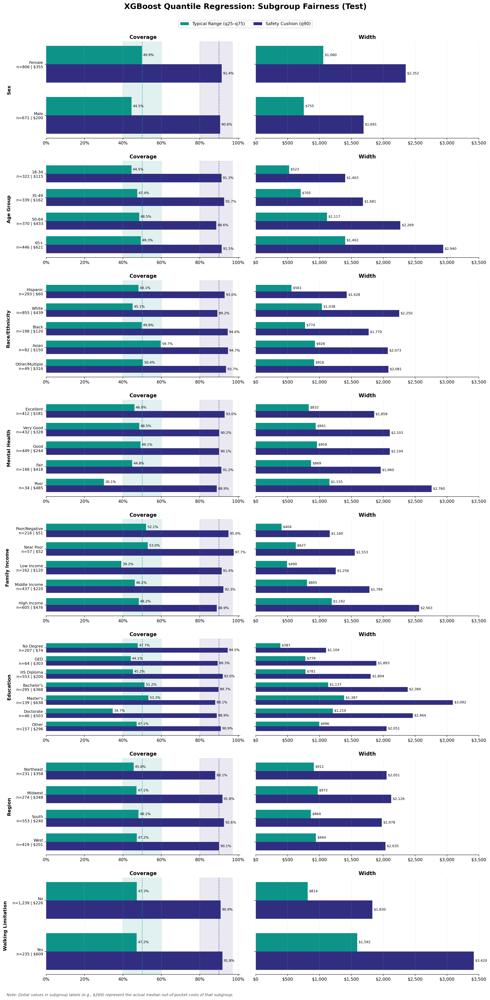
**Key Insights:**
- **Protected Groups:** Sex, age, race/ethnicity, region, and walking limitation groups do not show systematic undercoverage on the final test audit.
- **Coverage Limitations:** Poor mental health has low typical-range coverage (30.1%), as do low income (39.2%) and doctorate degree holders (34.7%). Near-poor income users show safety-cushion overcoverage (97.7%). These are reporting caveats and candidates for future validation on newer MEPS datasets, not evidence of broad demographic fairness failure.
- **Prediction Usefulness:** Several low-cost groups have wide prediction intervals despite in-band coverage, including good physical health, good mental health, Asian respondents, and the West region. This is a practical-budgeting caveat rather than a safety failure.
- **Planning Notice:** Show a planning note for predicted `q90` in the top 20%, uninsured users, and subgroups with typical-range undercoverage. Name high predicted costs and uninsured in the planning note, but use neutral generic wording to avoid stigmatization for poor mental health, low income, and doctorate degree subgroups: "Costs for profiles like yours can vary a lot from year to year. The plan-around amount and typical range are useful starting points, but for budgeting decisions, plan closer to the safety cushion." Near-poor income shows safety-cushion overcoverage, so it should not trigger safety-cushion guidance by itself.
- **Audit Verdict:** The subgroup audit supports launch. Predicted-risk tiers remain usable for deployment, and there is no broad demographic fairness failure. The main limitation is rare actual tail spending that is only visible after the year is observed.

<p align="right">(<a href="#-final-model">Back to Final Model</a> | <a href="#readme-top">Back to Top</a>)</p>


### SHAP Explanation Details

**Explained Prediction**  
SHAP explains the plan-around estimate (`q50`) through the full model inference process: preprocessing, quantile prediction, the inverse target transformation (from log-transformed costs back to dollars), and postprocessing (keeping quantiles non-negative and monotonic). This lets it assign contributions to the 27 preprocessor input features that correspond to the user's answers. These explanations cover the plan-around estimate only, not the typical range or safety cushion.

**How SHAP Calculates Contributions**  
The background data contains 225 training rows sampled using survey weights to approximate the U.S. adult population. The model's average `q50` prediction across these rows is the SHAP starting point, or baseline.

The project uses permutation SHAP: it reveals a person's answers one by one in a shuffled order, then masks them again. Masking replaces an answer with values from the background data. This sequence is one permutation round. At each step, SHAP averages predictions across the background rows and records how that average changes. These changes determine each feature's contribution in the context of other features. Additional rounds use different feature orders. The baseline plus all 27 contributions reproduces the person's prediction. The planned app will display only the five largest contributions.

**Benchmarking**  
The [SHAP benchmarking script](scripts/benchmark_shap.py) compared the size of the background data and the number of permutation rounds to find the lowest P95 explanation latency while meeting predefined quality control criteria. Candidate configurations were compared with a larger reference using 500 rows and 24 rounds. The selected setup uses **225 rows of background data and one permutation round** (`max_evals=55`) and passed all explanation quality checks.

- **Background Data Validation:** Its baseline differed by 8.8% from the average prediction across the full survey-weighted training data, within the predefined 10% quality control limit.
- **Explanation Stability:** On all 100 test rows, at least four of the five features with the largest contributions also appeared in the reference's top five. Ranking considers contribution size regardless of direction. For matched features with reference contributions of at least $25 in either direction, the contribution direction stayed the same. The median absolute difference between matched contributions was $6.47.
- **Prediction Reconstruction:** The baseline plus all contributions matched each prediction to floating-point precision.
- **Latency:** P95 core SHAP explanation time was 0.20 seconds after the separately measured first call. This measures the explanation calculation, but complete prediction-request latency still needs testing on the target Hugging Face hardware.

<p align="right">(<a href="#-final-model">Back to Final Model</a> | <a href="#readme-top">Back to Top</a>)</p>


### Feature Importance Details

<a id="shap-contributions-by-category"></a>**Contributions by Category**
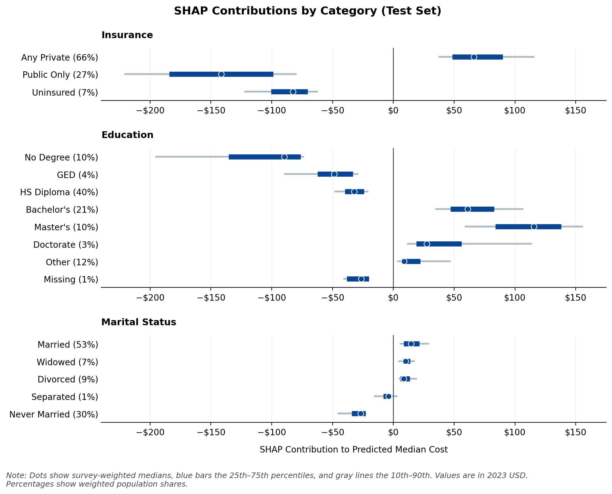
The interval plot shows which categories tend to move estimates up or down and how much contributions vary within each category. "Any Private" insurance generally moves estimates up, while "Public Only" and "Uninsured" move them down. No Degree, GED, and HS Diploma generally move estimates down, while a Bachelor's degree or higher generally moves them up.

<a id="shap-contributions-across-ordered-values"></a>**Contributions Across Ordered Values**
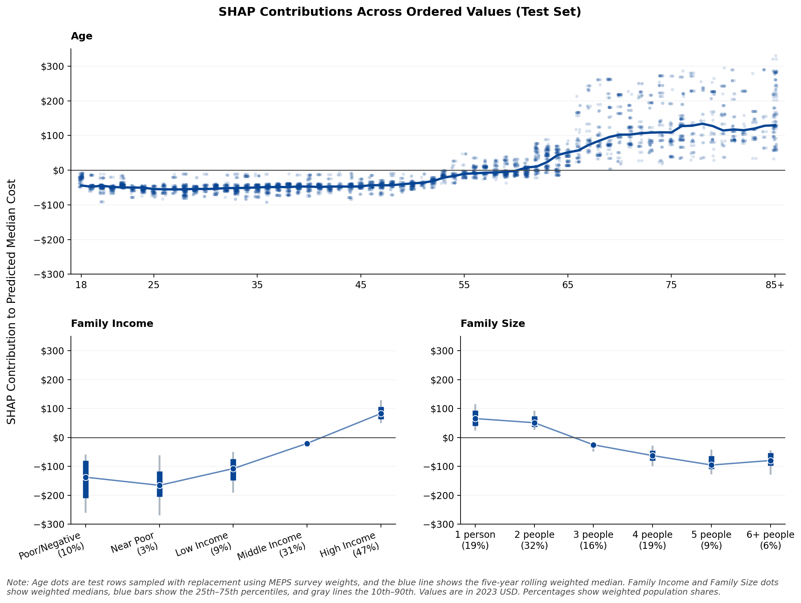
These plots show how contributions change across numerical and ordinal features. Age generally moves estimates down at younger ages and up from around age 60, with greater variation among older adults. High Income generally moves estimates up, while Poor/Negative through Middle Income move them down. Family sizes of one or two move estimates up, while three or more move them down.

<a id="xgboost-native-feature-importance"></a>**XGBoost Native Importance**
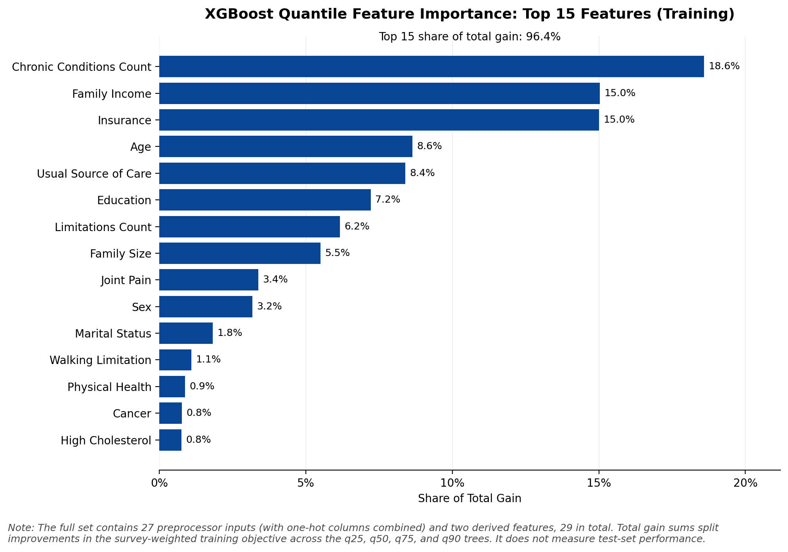
XGBoost native feature importance ranks model-ready features by total gain: the summed improvement in the training objective across splits for all four quantiles (q25, q50, q75, q90). Chronic Conditions Count ranks first (18.6%), followed by Family Income and Insurance (15.0% each). SHAP uses preprocessor input features, so Chronic Conditions Count is derived later during preprocessing and has no SHAP score. The top-15 lists share 12 features, but measure different things. Prioritize SHAP for interpreting the product’s plan-around estimates.

<p align="right">(<a href="#-feature-importance">Back to Feature Importance</a> | <a href="#readme-top">Back to Top</a>)</p>


<!-- MARKDOWN LINKS -->
[Python-badge]: https://img.shields.io/badge/python-3670A0?style=for-the-badge&logo=python&logoColor=ffdd54
[Python-url]: https://www.python.org/
[NumPy-badge]: https://img.shields.io/badge/numpy-%23013243.svg?style=for-the-badge&logo=numpy&logoColor=white
[NumPy-url]: https://numpy.org/
[Pandas-badge]: https://img.shields.io/badge/pandas-%23150458.svg?style=for-the-badge&logo=pandas&logoColor=white
[Pandas-url]: https://pandas.pydata.org/
[Matplotlib-badge]: https://img.shields.io/badge/Matplotlib-%23DDDDDD?style=for-the-badge&logo=
[Matplotlib-url]: https://matplotlib.org/
[Seaborn-badge]: https://img.shields.io/badge/seaborn-%230C4A89.svg?style=for-the-badge&logo=seaborn&logoColor=white
[Seaborn-url]: https://seaborn.pydata.org/
[scikit-learn-badge]: https://img.shields.io/badge/scikit--learn-%23F7931E.svg?style=for-the-badge&logo=scikit-learn&logoColor=white
[scikit-learn-url]: https://scikit-learn.org/stable/
[XGBoost-badge]: https://img.shields.io/badge/XGBoost-006600?style=for-the-badge
[XGBoost-url]: https://xgboost.readthedocs.io/
[DVC-badge]: https://img.shields.io/badge/DVC-13ADC7?style=for-the-badge&logo=dvc&logoColor=white
[DVC-url]: https://dvc.org/
[MLflow-badge]: https://img.shields.io/badge/MLflow-0194E2?style=for-the-badge&logo=MLflow&logoColor=white
[MLflow-url]: https://mlflow.org/
[Pytest-badge]: https://img.shields.io/badge/pytest-%23F0F0F0?style=for-the-badge&logo=pytest&logoColor=2f9fe3
[Pytest-url]: https://docs.pytest.org/
