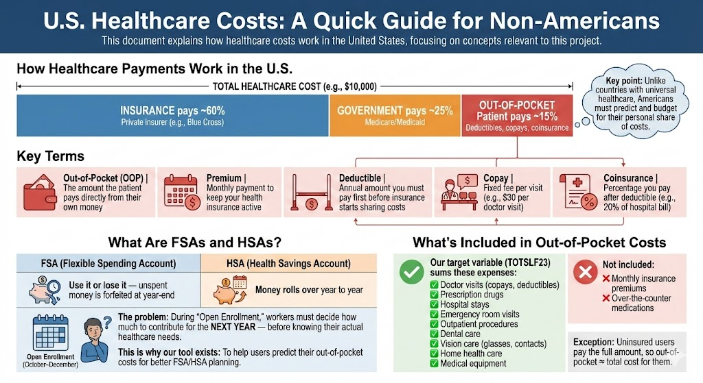

# U.S. Healthcare Costs: A Quick Guide for Non-Americans
This document explains how healthcare costs work in the United States, focusing on concepts relevant to this project.


## How Healthcare Payments Work in the U.S.
When an American receives healthcare, the **total cost** is typically split among multiple payers:

```
┌─────────────────────────────────────────────────────────────────┐
│              TOTAL HEALTHCARE COST (e.g., $10,000)              │
├─────────────────────────────────────────────────────────────────┤
│                                                                 │
│  ┌──────────────┐  ┌──────────────┐  ┌──────────────────────┐  │
│  │   INSURANCE  │  │  GOVERNMENT  │  │   OUT-OF-POCKET      │  │
│  │   pays ~60%  │  │  pays ~25%   │  │   Patient pays ~15%  │  │
│  └──────────────┘  └──────────────┘  └──────────────────────┘  │
│                                                                 │
│   Private insurer    Medicare/          Deductibles,           │
│   (e.g., Blue Cross) Medicaid           copays, coinsurance    │
│                                                                 │
└─────────────────────────────────────────────────────────────────┘
```

**Key point:** Unlike countries with universal healthcare, Americans must predict and budget for their personal share of costs.


## Key Terms
| Term | Definition |
|:---|:---|
| **Out-of-Pocket (OOP)** | The amount the patient pays directly from their own money |
| **Premium** | Monthly payment to keep your health insurance active |
| **Deductible** | Annual amount you must pay first before insurance starts sharing costs |
| **Copay** | Fixed fee per visit (e.g., $30 per doctor visit) |
| **Coinsurance** | Percentage you pay after deductible (e.g., 20% of hospital bill) |


## What Are FSAs and HSAs?
Americans can save money tax-free for healthcare through special accounts:

| Account | Full Name | Key Feature |
|:---|:---|:---|
| **FSA** | Flexible Spending Account | "Use it or lose it" — unspent money is forfeited at year-end |
| **HSA** | Health Savings Account | Money rolls over year to year |

**The problem:** During "Open Enrollment" (October–December), workers must decide how much to contribute for the **next year** — before knowing their actual healthcare needs.

**This is why our tool exists:** To help users predict their out-of-pocket costs for better FSA/HSA planning.


## What's Included in Out-of-Pocket Costs
Our target variable (`TOTSLF23`) sums these expenses:

- ✅ Doctor visits (copays, deductibles)
- ✅ Prescription drugs
- ✅ Hospital stays
- ✅ Emergency room visits
- ✅ Outpatient procedures
- ✅ Dental care
- ✅ Vision care (glasses, contacts)
- ✅ Home health care
- ✅ Medical equipment

**Not included:**
- ❌ Monthly insurance premiums
- ❌ Over-the-counter medications

**Exception:** Uninsured users pay the full amount, so out-of-pocket ≈ total cost for them.


## Infographic

